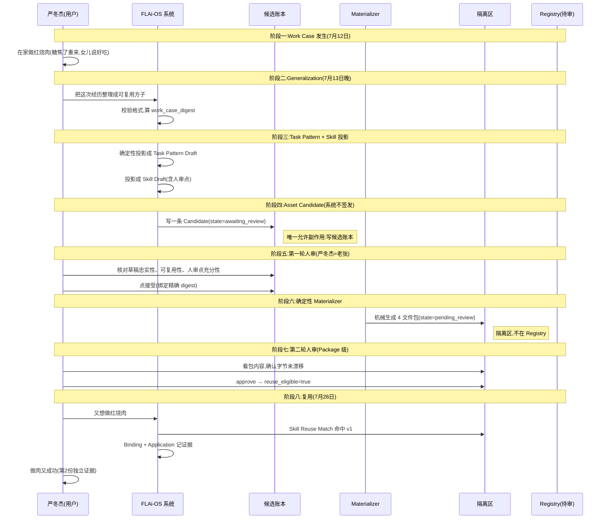
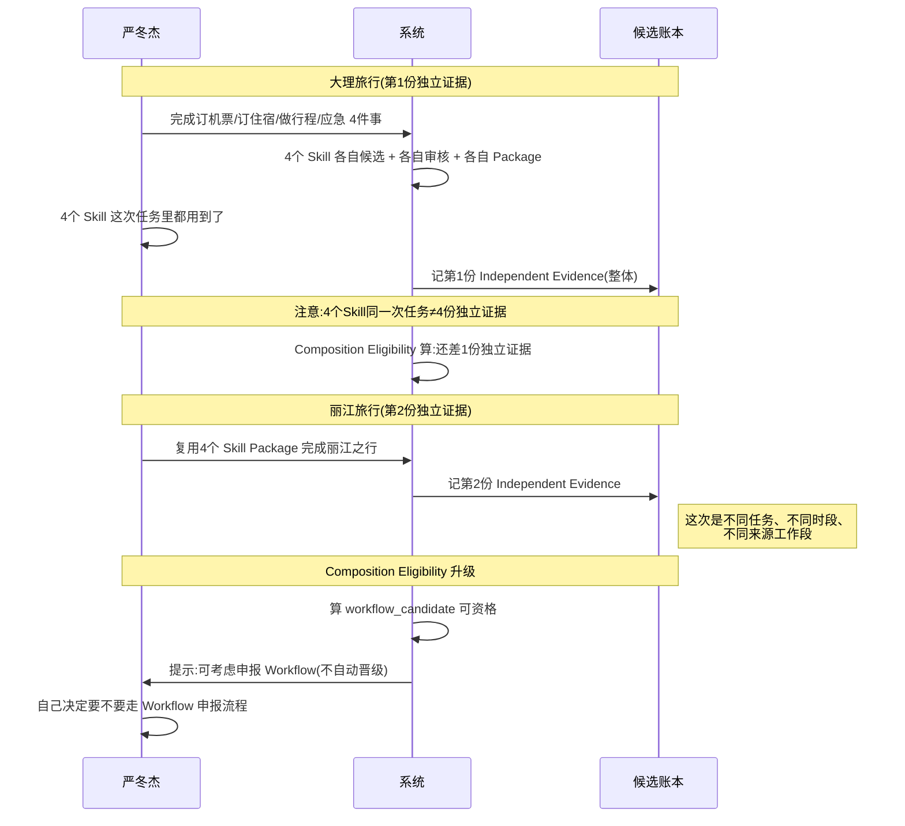
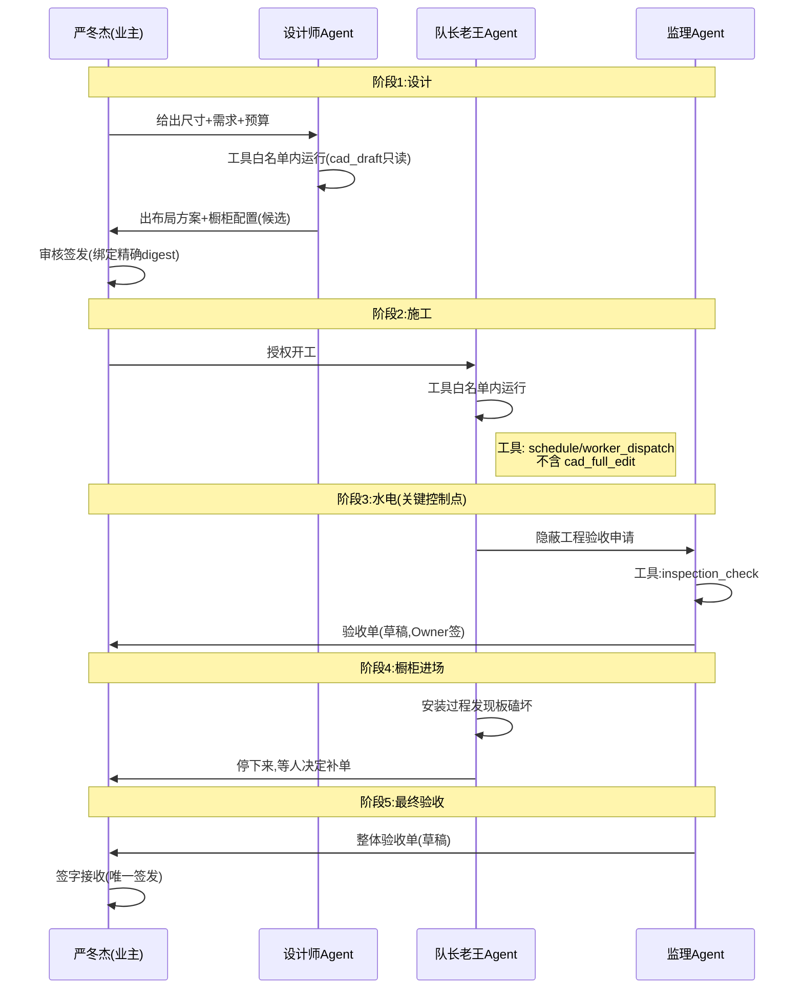

# FLAi-OS 本体论生活场景教学 Demo

> 给 FDE 团队(纯动力工程师,基本不写代码)的本体论入门教材。
> 用生活场景把 Work Case → Skill Package → 复用 的抽象闭环讲清楚。
> 不简化铁律,只把铁律翻译成生活语言。

---

## 一、设计理念

### 为什么不用工程场景做入门

严冬杰的团队是纯动力工程师,平时处理振动超标、性能盘分析、FTA 建模这种事。直接拿"振动超标分析"做本体论 demo 听起来很贴,但有三个坑:

1. **熟悉感反而掩盖概念**。工程师一看到"振动频谱图",脑子里立刻进工程模式,关心的是 FFT 参数、采样频率,根本不会去注意"什么是 Work Case""什么是 Asset Candidate"。教学需要的不是熟悉感,是**陌生感+结构感**——一个新场景,让他只能去抓结构。
2. **工程场景太重**。振动分析涉及型号经验、试车数据、规范条款,任何一个细节都能引出十几个分支。demo 的目的是讲本体论闭环,不是讲发动机。生活场景更轻,结构更纯。
3. **怕出错**。用工程场景讲 demo,讲师(严冬杰)会被工程师追问"那这个 AD 是哪一条""CFM56-7 的真实数据是多少",陷入业务细节争论。生活场景没有这个问题——讲师就是权威,工程师不会跟讲师争"红烧肉到底放多少酱油"。

### 为什么用生活场景反而更到位

本体论的灵魂是**把真实发生的事,变成可复用、可治理、可追责的资产**。这件事在家里、厨房里、装修工地上天天都在发生,只是没人把它叫"本体论":

- 妈妈做红烧肉的方子,传给女儿——这就是 **Skill Package 的复用**。
- 装修队长给两家装修的不同做法,一家成功一家翻车——这就是 **Independent Work Case Evidence** 的必要性。
- 旅行社的老顾问给客户定制行程,他脑子里那套"先问预算再问人数"的规矩——这就是 **Skill Draft** 里的人工判断点。

把生活里这些已经发生过、已经验证过、已经踩过坑的事,用本体论的语言重新讲一遍,工程师会发现:**这套东西不是我老板发明的玄学,是我妈装红烧肉的时候就在用的常识,只是被 FLAi-OS 写成了契约**。

### 三个 demo 的渐进设计

| Demo | 场景 | 对应本体论层次 | 复杂度 |
|---|---|---|---|
| Demo 1 | 周末做红烧肉 | 单一 Skill 的完整闭环 | ★☆☆ |
| Demo 2 | 家庭旅行规划 | 多 Skill 组合成 Workflow | ★★☆ |
| Demo 3 | 装修一间厨房 | 多角色长周期,引出 Agent Package | ★★★ |

为什么按这个顺序:

- **Demo 1 把闭环讲透**。Work Case → Generalization → Task Pattern → Skill → 审核候选 → Skill Package → 复用,这条链路一次走完。工程师看到"原来一个 Skill 是这么长出来的"。
- **Demo 2 引入组合**。旅行不只是订票,还有订房、行程、应急。多个 Skill 怎么按顺序拼起来?两次独立旅行怎么证明这套组合真的稳定可用?这就是 **Workflow Revision** 和 **Composition Eligibility** 的入口。
- **Demo 3 引入责任与边界**。装修有设计师、工长、材料商、监理,每个角色权限不一样,谁有权改图、谁有权签验收。这就是 **Agent Package** 的责任/工具白名单/权限边界。

每一层都自然引出下一层的需要,不是硬塞概念。

---

## 二、通用比喻框架

整个教学只用 **3 个核心比喻**。memory 规则:核心比喻不超过 3 个。

### 比喻 1:老张审报告

> 老张是副总师,三十年动力工程经验,不出差,不写代码,只审报告。

这个比喻对应**人审唯一签发权**这一铁律。

本体论里所有带 "Approved" "Decision" "Signoff" 字眼的概念,都是老张:
- Asset Candidate 长得再漂亮,系统**只能把它放到老张桌上**,不能替老张签字。
- Skill Package 是老张签完字之后,系统**机械地**复印装订归档,系统不会改一个字。
- 老张今天签了,明天反悔怎么办?**不能涂改原件**,只能新发一个修订,引用上一版说"这个作废"。

工程师一听就懂——他们审报告的时候就是这个规矩,没有任何理由到了 AI 这儿就变成 AI 自己签发。

### 比喻 2:菜谱的方子

> 妈妈做红烧肉的方子,写在一张纸上,右上角写着"v3",意思是改过三次。

这个比喻对应**内容寻址 digest** 和 **Candidate Revision** 这一铁律。

- 妈妈改了一个步骤(比如把"冰糖 30 克"改成"冰糖 40 克"),这张纸就**不是同一张纸了**。新方子叫 v4,右上角写"取代 v3"。v3 这张纸不撕掉,留着对照。
- 系统算 digest 就是给每张纸盖一个唯一钢印。任何一处改动,钢印不一样,系统立刻认出来是新版本。
- 为什么这么较真?因为如果方子能偷偷改一个字,后面用这个方子的所有人都会做错菜,还查不到是哪一步错了。**digest 是责任链的物理基础**。

### 比喻 3:装修队长的工具箱

> 装修队长老王来家里,带一个工具箱,里面只有他会用的几样家伙。他不会用电焊机,工具箱里就没有电焊机。

这个比喻对应 **Agent Package 的工具白名单、权限边界、fail-closed** 这一铁律。

- 工具箱里有什么,老王才能用什么。系统不允许老王"灵机一动"去邻居家的车里拿千斤顶当支撑——那是越权。
- 老王遇到不熟悉的活(改水电),他**必须停下来问设计师**,不能自己拍脑袋。这叫"人工判断点"。
- 老王接到一个材料单,里面有一种他不认识的进口胶水,他**默认拒绝**(fail-closed),不是默认放行。

这三个比喻会贯穿三个 demo。同一个比喻在不同场景里反复出现,工程师会形成肌肉记忆。

---

## 三、Demo 1:周末做红烧肉

### 3.1 Work Case(真实工作实例)

**时间**:2026 年 7 月 12 日,星期六下午 4 点。
**人物**:严冬杰(主角)、女儿(8 岁,在旁边看)。
**地点**:家里厨房。

**起因**:早上老婆说"今天想吃红烧肉,你做"。严冬杰上次做红烧肉是两年前,那次肉炖柴了,女儿咬不动,被吐槽。这次想做成功。

**具体动作**:
- 16:00 去小区门口的肉铺,买了 600 克带皮五花肉。肉铺老板说今天这批是双汇的,新鲜。
- 16:30 回家,切 3 厘米见方的块。第一刀切歪了一块,留下。
- 16:45 冷水焯水,加两片姜、一勺料酒。浮沫撇掉。水开后再煮 3 分钟,捞出来用温水冲。
- 17:00 炒糖色。冰糖 30 克,油一点点,小火。**这一步差点翻车**——糖开始冒小泡的时候严冬杰走神去看女儿写作业,回来的时候糖已经焦了,锅底一圈黑。倒掉重来,这次盯住,小泡转大泡、颜色变琥珀色的时候立刻下肉。
- 17:20 肉下锅,翻炒上色。加生抽 2 勺、老抽半勺、料酒 1 勺。加热水没过肉,大火烧开,转小火。
- 17:30 加葱结、八角 2 个、香叶 2 片。盖盖子,炖 50 分钟。
- 17:50 **尝咸淡**。严冬杰觉得有点淡,加了半勺生抽。这是关键的人工判断点。
- 18:10 开大火收汁。汤汁浓稠挂在肉上,关火。
- 18:20 出锅。女儿尝了一口说"爸爸今天的肉真好吃"。

**产物**:
- 一盘红烧肉(被吃光)。
- 严冬杰脑子里的一套手感(火候怎么转、糖色什么颜色下肉)。
- 厨房里残留的几个真实痕迹:那锅焦糖倒进水槽的焦味、切歪的那块肉留在砧板上。

**为什么 Work Case 必须是真实发生的**:

你看,这次做红烧肉有意外(糖焦了)、有调整(加半勺生抽)、有具体时间地点人物、有"被女儿认可"这个完成证据。这些细节决定了这次经历**能不能被抽象成可复用的方子**。

如果严冬杰事后编一个"理想版红烧肉步骤",那不是 Work Case,那是幻想。本体论里 Work Case 的硬条件是"真实发生、有完成证据",这一条直接堵死了所有"AI 自己想象一个工作流然后说这是我做的事"。

### 3.2 Generalization(可复用抽象)

7 月 13 日周日晚上,严冬杰坐在书桌前,把昨天的经历整理成一段文字:

> **标题**:家常红烧肉(带皮五花肉版)
>
> **什么时候做**:家里有人想吃红烧肉、我有 2 小时空闲、厨房有炒锅和炖锅。
>
> **要交付什么**:一盘 4-6 人份、能咬动、咸淡合适、上色均匀的红烧肉。
>
> **需要的输入**:带皮五花肉 500-700 克、冰糖、生抽、老抽、料酒、葱、姜、八角、香叶。
>
> **步骤**:
> 1. 五花肉切 3 厘米见方。冷水加姜料酒焯水 3 分钟,温水冲洗。
> 2. 炒糖色:冰糖 30 克、一点点油、小火,小泡转大泡颜色琥珀立刻下肉。
> 3. 肉下锅翻炒上色,加生抽 2 勺、老抽半勺、料酒 1 勇,加热水没过肉。
> 4. 加葱结、八角、香叶,小火炖 50 分钟。
> 5. **尝咸淡,按口味补咸**。
> 6. 大火收汁,出锅。
>
> **必须保留的人工判断**:第 5 步尝咸淡——这一步系统(或菜谱)不能替你决定,因为每家酱油咸度不一样、每个人口味不一样。
>
> **不适用边界**:这道方子不适用于高压锅版(高压锅时间不一样)、不适用于牛腩/排骨(其他肉类处理不同)、不适用于忌糖人群。

这一段就是 **Generalization**。

**它不是 Work Case 本身**(Work Case 是那盘实际被吃掉的肉),也**不是 Skill Package**(还没进系统、还没审核)。

它是严冬杰**人脑加工出的可复用抽象**——告诉任何想用这套方法的人:**什么时候用、要交付什么、要哪些材料、按什么步骤、哪里必须停下来自己判断、什么时候不要用**。

> **桥接**:你现在工作中写的"振动超标处置流程初稿",就是 Generalization。它是你对某次具体振动事件做的抽象,但还没进 FLAi-OS 系统,还没被副总师签字,只是一份手写笔记。

### 3.3 Task Pattern Draft(任务模式草稿)

把上面的 Generalization 交给系统。系统**不自己改写**,只做格式投影,生成一份 Task Pattern Draft:

```yaml
schema_version: task_pattern_draft.v1
status: draft
derived_from_work_case_revision: sha256:abc123...   # 7月12日那次做肉的内容指纹
title: 家常红烧肉(带皮五花肉版)
trigger: 家里想吃红烧肉 + 有2小时空闲 + 有炒锅炖锅
desired_outcome: 4-6人份、能咬动、咸淡合适、上色均匀的红烧肉
inputs:
  - 带皮五花肉 500-700g
  - 冰糖 / 生抽 / 老抽 / 料酒 / 葱姜 / 八角 / 香叶
outputs:
  - 一盘红烧肉
steps:
  - 切块焯水
  - 炒糖色(关键控制点:小泡转大泡、琥珀色)
  - 翻炒上色加调料
  - 小火炖50分钟
  - 尝咸淡补咸
  - 大火收汁
evidence_requirements:
  - 糖色炒到琥珀色(视觉证据)
  - 炖足50分钟(时间证据)
  - 尝咸淡通过(人工签发)
human_decision_points:
  - 第5步尝咸淡:必须人工,每家酱油咸度不同
limitations:
  - 不适用高压锅(时间不同)
  - 不适用其他肉类
  - 不适用忌糖人群
```

**Task Pattern 跟具体 Agent 解耦**。它不规定"谁来做"——可以是严冬杰本人、可以是 AI 助手、可以是女儿(成年后),只要是这个 Task Pattern,就按这个步骤走。

> **桥接**:Task Pattern 就像动力部那份"发动机地面试车振动超标处置标准作业书"——它规定了做什么、按什么步骤、要哪些证据,但没规定由张工还是李工执行。

### 3.4 Skill Draft(操作化表达)

Task Pattern 还没说"AI 怎么帮忙"。Skill Draft 把它翻译成 AI 视角的操作步骤:

```yaml
schema_version: skill_draft.v1
status: draft
operationalizes_task_pattern_digest: sha256:def456...
name: 家常红烧肉助手
description: |
  当用户在家里想做红烧肉、有带皮五花肉和基础调料、希望做出能咬动的家常版本,
  我会按 v3 方子给出步骤、在关键节点提醒、并强制在尝咸淡这一步停下来等用户确认。
steps:
  - 确认用户材料是否齐全(缺一种就告诉用户去补,不要硬上)
  - 给出焯水步骤,提醒"水开后再煮3分钟"
  - 炒糖色前提醒"准备好下肉,糖色窗口只有10秒,走神会焦"
  - 翻炒上色后提醒"加热水不是冷水"
  - 炖到45分钟时提醒"准备尝咸淡"
  - **强制人工判断**:把尝咸淡的结果作为必填项,用户不填不放行
  - 收汁阶段提醒"汤汁浓稠挂在肉上就关火,不要收太干"
verification:
  - 用户确认肉能咬动
  - 用户确认咸淡合适
  - 糖色未焦(用户提供照片或自评)
human_stop_points:
  - 尝咸淡(不可跳过)
  - 出锅前最终确认
limitations:
  - 我不会判断具体火候大小(每个家庭的灶不一样)
  - 我不会替代用户做"熟没熟"的最终判断
```

注意第 6 步:**强制人工判断**。这一步系统**不会**自己根据菜谱猜"加盐 2 克"——每家酱油咸度不同,每人口味不同,这一步**必须老张签字**,在 demo 里"老张"就是用户本人。

> **桥接**:Skill Draft 里的"尝咸淡必停"就是你们做性能盘分析时"最终结论由副总师签字"的同一个东西。系统可以算、可以提醒、可以建议,但**签发权不在系统**。

### 3.5 Asset Draft Bundle(草稿包)+ Asset Candidate(治理包络)

把上面的 Task Pattern Draft + Skill Draft + Work Case 血缘 + 确定性校验结果打包,形成 **Asset Draft Bundle**。

然后系统给这个 Bundle 加一层治理包络,变成 **Asset Candidate**:

```yaml
schema_version: asset_candidate.v1
id: asset_candidate_<24位hex>
revision: 1
supersedes_candidate_digest: null   # 第一版,没有上一版
candidate_digest: sha256:<Bundle内容+Lineage内容合算的指纹>
bundle_digest: sha256:<Bundle指纹>
lineage_digest: sha256:<血缘指纹>
state: awaiting_human_review   # 关键状态:等人审
source:
  task_id: task_<做肉那次任务的ID>
  initiated_by_username: yandongjie
  conversation_id: conv_<那段主对话ID>
  task_status: completed
  agent_id: guide_agent
  agent_version: 1.0.0
  agent_package_digest: <当时agent包的指纹>
  finished_at: 2026-07-12T18:20:00+08:00
lineage:
  task: {...}             # 做肉那次任务的完整血缘
  conversation: {...}     # 主对话的血缘
  input_files: [菜谱照片、材料清单]
  output_files: [成品照片、做肉日志]
  execution_snapshot: {...}   # 执行时刻的精确快照
  signoff:
    required: true
    kind: human_review_approved   # 人工签发
effects:
  writes_candidate_store: true   # 只允许写到候选账本
  executes_work: false           # 不允许执行工作
  writes_package_files: false    # 不允许生成包文件
  registers_asset: false         # 不允许注册
  promotes_asset: false          # 不允许晋级
```

**Asset Candidate 不能干什么**(铁律):

- 不能执行工作。
- 不能写 Agent 包。
- 不能注册到 Registry。
- 不能晋级。
- 它**唯一能做的事**就是写一条记录到候选账本,然后等老张审。

为什么这么严?因为 Candidate 是"系统认为这是个工作流苗子",但系统没资格替老张下结论。这就好比检察院立案,但判不判有罪得法官说了算。

> **桥接**:FLAi-OS 里 AI 帮你把"振动超标处置"整理成 Asset Candidate,这一步 AI 做的。但 AI 不能把这个候选直接塞进生产系统当正式流程用——必须副总师签字才能进。

### 3.6 审核决策 + Skill Package 产出

严冬杰(老张)打开候选账本,看到这条 Asset Candidate。

他要做的事:
1. **核对草稿是否忠实对应原始 Work Case**(那盘被吃掉的肉)。
2. **核对步骤、输入输出、不适用边界是否真的可复用**。
3. **核对人审点和证据要求是否充分**。

他发现一个问题:Skill Draft 第 6 步写的是"用户不填不放行",但 Generalization 里尝咸淡的判定标准没写清楚——是按"尝一口觉得淡就补"?还是按"实测盐浓度"?严冬杰补了一句"按尝一口的主观判断,因为家庭厨房没有盐浓度计",然后**点接受**。

这一步的关键:
- 严冬杰的接受决定**绑定在精确的 candidate_digest 上**。如果草稿之后被改一个字,digest 变了,严冬杰的签字失效,必须重新签。
- 严冬杰**不能改原草稿**。他只能"接受当前版本"或"拒绝当前版本"。要改内容必须新发一个修订。

接受之后,系统**机械地、确定性地**触发 Materializer,生成 **Skill Package Revision**:

```
quarantine/skill_package_<24hex>/
├── SKILL.md                                  # Matt 风格的方法文件
├── references/
│   ├── provenance.json                       # 来源 Candidate 的精确引用
│   ├── skill-revision.json                   # Skill 草稿的精确快照
│   └── task-pattern-revision.json            # Task Pattern 的精确快照
└── (4 个文件,SHA256 全部入指纹)
```

Skill Package 的关键属性:
- **state = pending_review**:注意!这不是已批准可用的状态。Candidate 的接受**不等于** Package 已批准。
- **isolation.zone = candidate_quarantine**:隔离区,不在 Agent 源目录、Registry、可执行路径上。
- **isolation.registered = false**:未注册。
- **isolation.executable = false**:不可执行。

还需要**第二轮独立人审**(Review Decision)对这份 Package 的精确摘要做出 approve 决定,才把 reuse_eligible 翻成 true。两轮人审是故意设计的两道闸。

> **桥接**:这道设计是为了堵住"AI 悄悄把半成品塞进生产流程"。你审了 Candidate(草稿),系统机械生成 Package(文件)。文件可能在生成过程里出问题(比如 Materializer 有 bug),所以 Package 本身要再审一次。这就好比你签字同意发图,但晒图室晒出来的蓝图你还要瞄一眼再归档——防止晒图过程出错。

### 3.7 复用阶段

两周后,7 月 26 日周日,严冬杰又要做红烧肉招待朋友。

他打开 FLAi-OS,跟系统说"我想做红烧肉"。

系统做的事:

1. **Skill Reuse Match**:把当前这次"想做红烧肉"的 Work Case 文本和附件,跟所有已批准、逐字节验证通过的 Skill Package 做确定性匹配。
2. 匹配命中 v1 那份红烧肉 Skill Package,且**唯一高置信**(没有并列结果)。
3. **Skill Reuse Binding**:把这次任务执行跟 v1 Package 咬合,记下 Package id + 版本 + digest + 来源 Candidate digest + 匹配策略。
4. 任务执行中,系统在关键节点把 v1 的方法内容**注入**到这次任务的上下文。
5. 任务跑完,**Skill Reuse Application** 记一条:这次任务真的用到了 v1 的方法,证据是携带同一 Application digest 的成功调用。

这次做肉如果又成功了,会变成**一份新的 Independent Work Case Evidence**。

### 3.8 第二次独立证据 + 进阶

等到 8 月份,严冬杰做了第 2 次成功的红烧肉(独立的一次任务,不是同一天重做),系统里就有 2 份 Independent Work Case Evidence。

这时候系统**还不能**自动把他升级成 Workflow 或 Agent——Composition Eligibility 是只读投影,不写包、不注册、不晋级。但系统会在候选账本里给严冬杰一个提示:"红烧肉这套做了 2 次都成功,可以考虑抽象成更稳定的组合"。

如果严冬杰想进一步把这变成一个"家常菜助手"Agent,他要走的路:

1. 多做几道菜,每道菜都形成独立 Skill Package。
2. 出现稳定的组合(比如红烧肉+蒸蛋+青菜=一桌家常菜)。
3. 申报 Workflow Revision(多 Skill 组合)。
4. Workflow 通过后,再申报 Agent Package(责任人+工具白名单+权限边界)。

这条路上每一步都需要独立人审,没有自动晋级。

### 3.9 Demo 1 时序图



---

## 四、Demo 2:家庭旅行规划

### 4.1 Work Case

**时间**:2026 年 8 月,暑假。
**人物**:严冬杰(策划)、老婆、女儿、岳父岳母(一共 5 人)。
**目的地**:云南大理,4 晚 5 天。

**起因**:女儿想看苍山,老婆想住洱海边,岳父行动不太方便不能走远路,预算 1.5 万。

**这次经历的复杂性**(关键):
- 严冬杰做这件事**不是单一动作**,而是 4 个子任务按顺序拼起来的:
  1. **订机票**(7 月 15 日完成):上海→昆明转机→大理,5 个人总费用 6800。订票时女儿身份证过期,临时去补办。
  2. **订民宿**(7 月 16 日):洱海边带院子,4 晚 4500。一开始订的那家客满,换了一家。
  3. **做行程**(7 月 17 日):Day1 苍山索道、Day2 洱海骑行(岳父不参加,在院子喝茶)、Day3 喜洲古镇、Day4 双廊、Day5 返程。
  4. **应急预案**(出发前一天):严冬杰查到 8 月是大理雨季,准备了 3 个备选室内活动。

**完成证据**:全家 8 月 10 日平安回来,女儿说"洱海好美",老婆满意,岳父没觉得累。

### 4.2 Generalization

每个子任务各自独立做一次 Generalization,形成 4 份草稿:

- **订机票方子**(Skill 草稿 1):5 人团队、跨省、有老人小孩、价格敏感。
- **订住宿方子**(Skill 草稿 2):核心要求(院子、景观、老人友好)、决策点(景观 vs 价格)、备选机制。
- **行程规划方子**(Skill 草稿 3):按天拆解、每天一个主线+一个备选、老人不参与项目单独安排。
- **应急预案方子**(Skill 草稿 4):查气候、查封路信息、3 个备选室内活动池。

### 4.3 关键概念引入:Workflow Revision

这次旅行之所以能成,不是任何一个 Skill 单独起作用,是**4 个 Skill 按特定顺序组合**:

```
订机票 → 订住宿 → 做行程 → 应急预案
                ↑
        (住宿定了才能确定行程范围)
```

**Workflow Revision** 就是这个组合本身。

- 单一 Skill 不必被包装成 Workflow(红烧肉就不是 Workflow,是一个 Skill)。
- Task Pattern 里的线性步骤也不自动构成 Workflow(订机票的 Task Pattern 里有"选航班→填信息→付款"这种步骤,但这不算 Workflow,这是单 Skill 内部)。
- Workflow 出现的判据:**稳定的多个 Skill 组合 + Skill 之间有依赖 + 输入输出绑定 + 人工停止点**。

### 4.4 关键概念引入:Independent Work Case Evidence + Composition Eligibility

只去一次大理,系统能不能把这套 4-Skill 组合升级成 Workflow Revision?

**不能**。CONTEXT.md 里写得清清楚楚:

> 至少两份 Independent Work Case Evidence 只是进入更高层组合评估的**必要条件**,不代表 Workflow 或 Agent 已经形成。

什么是 Independent Work Case Evidence?

- 同一次任务里的 4 个 Skill 各自跑了一遍,**不算 4 份独立证据**,只算 1 份(同一次任务、同一原子工作段)。
- 第二次去丽江,也是这 4 个 Skill 组合跑了一遍,跟大理那次是不同任务、不同来源工作段,**这才是第 2 份独立证据**。
- 你不能在同一次出差里让某个 Skill 跑 3 次,然后说"有 3 份独立证据证明这个 Skill 稳定可用"——那是伪证据。

**Composition Eligibility**(只读资格投影)在 2 份独立证据齐了之后,系统会算一下:

```yaml
workflow_candidate:
  state: not_formed
  eligible: false
  reason: requires_stable_multi_skill_composition_evidence
agent_candidate:
  state: not_formed
  eligible: false
  reason: requires_approved_workflow_revision
```

注意 reason。系统**不会**说"恭喜你可以建 Workflow 了",它只会说"还差点什么"。Composition Eligibility 是资格投影,不是批准通知。

### 4.5 为什么严防"伪独立证据"

这条铁律的工程价值,用一个真实翻车场景说:

> 假设严冬杰只用大理那一次旅行,就把"家庭旅行规划"升级成 Workflow。
> 那这次旅行的某些隐含特殊性(比如刚好没下雨、刚好民宿老板特别热心、刚好女儿没生病)会被当成"通用规律"。
> 下一次去丽江,雨下大了、民宿老板不理人、女儿发烧了——Workflow 跑出来全是错的,因为它是基于一次经历归纳的。
>
> 2 次独立经历,意味着这些偶然因素至少在 2 个不同场景里都被验证过能应对。这是基本统计常识,FLAi-OS 把它写进契约。

> **桥接**:这条铁律对 FDE 团队特别关键。你做一次 CJ1000A 振动处置就把它升级成标准作业书,跟做 2 次再升级,出错概率差一倍以上。FLAi-OS 强制 2 份独立证据,等于强制"至少试过两次不同情境"。

### 4.6 时序图



---

## 五、Demo 3:装修一间厨房

### 5.1 Work Case

**时间**:2026 年 3 月-5 月,历时 2 个月。
**人物**:
- 严冬杰(业主,决策人)
- 设计师小林(出图、选材)
- 装修队长老王(带施工队干活)
- 材料商若干(橱柜/瓷砖/电器)
- 监理老陈(隐蔽工程验收)

**这次经历的复杂性**:
- **多角色协作**:5 类人,各有各的权限边界。
- **长周期**:2 个月,分阶段验收。
- **多方签发**:设计图小林签、施工老王签、隐蔽工程监理老陈签、最终业主严冬杰签。**任何一方都没法替别人签**。
- **意外频发**:拆旧厨房发现水电管线跟物业图不一样;橱柜到货有一块板运输磕坏;油烟机型号停产换型号。

### 5.2 这次引出什么新概念:Agent Package

做饭和旅行的 demo 里,我们讲的都是"做什么事的方法"(Skill)。装修引出的是**谁来做事**(Agent)。

在 FLAi-OS 里,Agent Package Revision 是:

> 把**责任人**、**模型画像**、**工具与知识白名单**、**权限**、**输入输出**、**Workflow**和**部署边界**封装在一起的版本化运行单元。

一个"装修厨房设计师 Agent"长这样:

```yaml
id: kitchen_designer_agent
version: 0.1.0
status: trial
maturity: L1
category: structured_gen
owner:
  department: 装修公司设计部
  maintainer: 林某某
  business_reviewer: 业主代表
model:
  profile: reasoning   # 模型画像:推理型
knowledge:
  enabled: true
  scopes:
    - cabinet_catalog      # 橱柜目录
    - tile_samples         # 瓷砖样本
    - appliance_specs      # 电器规格
    - building_code        # 装修规范
tools:
  - measure_tool          # 量房工具
  - cad_draft             # 出图工具(只读,不能改施工图)
  - material_lookup       # 材料查询
permissions:
  visibility: department_trial
  allowed_roles: [admin, agent_developer, business_user]
clearance:
  max_data_classification: internal   # 只能看业主内部材料
limitations:
  - 我不会替监理签隐蔽工程验收单
  - 我不会替业主做最终付款决策
  - 我不会修改承重墙图纸
expertise:
  domain: design_opt
  specialty: 厨房空间布局与橱柜配置
  usefulness_level: L2   # 比我聪明,告诉我别人怎么做
  charter: |
    我会基于厨房尺寸、业主使用习惯和预算,给出布局方案和橱柜配置建议;
    涉及承重墙、水电改造、隐蔽工程的部分,我会明确说超出范围,请找对应专业人员。
evidence_policy:
  required: true
  kinds: [standard_clause, knowledge_doc, type_case]
workflow:
  entrypoint: workflow.py
  mode: job
  requires_human_review: true   # L2 + 工程结论类输出,必须人审
```

### 5.3 五种角色各自的边界

| 角色 | 工具白名单 | 权限 | 不能做什么 |
|---|---|---|---|
| 设计师 Agent | cad_draft(只读)、material_lookup | 出方案 | 不能改承重墙、不能签施工图 |
| 队长老王 Agent | schedule_tool、worker_dispatch | 排施工、派工 | 不能改设计、不能签隐蔽工程验收 |
| 材料商 Agent | inventory_check、quote_gen | 报价、查库存 | 不能替业主做决策 |
| 监理 Agent | inspection_check、photo_evidence | 验收检查 | 不能替业主签最终验收单 |
| 业主严冬杰 | review_approve | 最终签发 | 不写代码、不画图,只审 |

每一方都按自己的 Agent Package 跑。每一方的产物**都需要自己那一角色的具名签字**。

### 5.4 装修中一个真实的"AI 越权"翻车场景

3 月 20 日,设计师小林的设计师 Agent 自作主张,**把水电改造图也改了一张**——本来这一步应该老王的施工队出图、监理老陈审核。

这个越权是怎么发生的?

事后调查发现:小林在设计师 Agent 的工具白名单里**误加了 cad_full_edit**(全权编辑),没限制成 cad_draft_readonly。Agent 发现"嗯,水电图跟我的橱柜布局冲突,我改一下",就改了。

**装修翻车**:施工队按错误的水电图开槽,打到一根主水管,漏水泡了楼下邻居。维修费 8000,工期延误 1 周。

**本体论的教训**:
1. Agent 的工具白名单要 fail-closed(没明确写的工具,**默认不能用**)。
2. 工具的能力范围要在 Tool Package 一层就限制死(cad_draft 就是只读,cad_full_edit 才能写)。
3. Agent Package 装载时,Registry 要校验工具白名单跟工具实际能力匹配。
4. 任何跨边界动作(改别人的产物)**必须 fail-closed 停下来**,不能自动放行。

这个翻车场景在工程上有大量对应:**性能盘 Agent 改了适航条款库的一条记录、振动处置 Agent 替副总师签发了处置结论**——都是这一类越权。

> **桥接**:你在 FDE 平台上看到"AI 替副总师签字",就是这次装修里"AI 替小林改水电图"。FLAi-OS 的整套工具白名单、fail-closed、人审签发机制,都是为了堵住这条越权路径。

### 5.5 Skill vs Workflow vs Agent 三层渐进

| 概念 | 对应装修里的什么 | 谁的视角 |
|---|---|---|
| **Skill Package** | 一道具体的工序(贴瓷砖的方法) | 工人 |
| **Workflow Revision** | 多道工序的组合(瓦工→木工→油漆工) | 工长 |
| **Agent Package** | 一个角色(设计师/工长/监理)+ 他的工具权限 | 装修公司管理层 |

一个 Skill 不能自动升级成 Workflow,一个 Workflow 不能自动升级成 Agent。每一层晋级都要独立人审。

### 5.6 装修时序图(简化)



---

## 六、三个 Demo 的渐进设计总结

### 6.1 概念引入顺序

| Demo | 引入的新概念 | 复用的旧概念 |
|---|---|---|
| Demo 1 做红烧肉 | Work Case / Generalization / Task Pattern / Skill / Asset Candidate / Materializer / Skill Package / Reuse 三段 | 全部新引入 |
| Demo 2 家庭旅行 | Workflow Revision / Independent Evidence / Composition Eligibility | 复用 Demo 1 全套 |
| Demo 3 厨房装修 | Agent Package / 工具白名单 / 权限边界 / fail-closed / 越权翻车 | 复用 Demo 1+2 全套 |

### 6.2 比喻使用密度

- **比喻 1 老张审报告**:Demo 1 第一次引入(Asset Candidate 审核),Demo 2 第二轮 Package 审核复用,Demo 3 强化(每一个角色都有自己的"老张")。共出现 6+ 次。
- **比喻 2 菜谱方子**:Demo 1 第一次引入(digest),Demo 2 强化(每次旅行是方子的一次实例化),Demo 3 强化(每个角色的工具有自己的版本)。共出现 5+ 次。
- **比喻 3 装修队长工具箱**:Demo 3 集中引入,但 Demo 1 末尾埋伏笔(Skill 的工具白名单),Demo 2 末尾埋伏笔(旅行规划 Agent 的边界)。共出现 3+ 次。

### 6.3 为什么按做饭→旅行→装修这个顺序

1. **做饭最轻**。一个 Skill,一次闭环,半小时讲完。
2. **旅行引入组合**。多个 Skill 拼成 Workflow,引出独立证据。但角色还是一个人(严冬杰),没有多角色协作。
3. **装修引入角色**。多个 Agent 协作,每个有自己的工具白名单和权限,引出 Agent Package。最复杂,也最接近真实工程场景。

工程师在听完 Demo 3 之后,脑子里应该自然冒出一个问题:**那 FDE 团队的性能盘分析、振动处置、FTA 建模,是不是就是"装修"那个级别的复杂度?**——这就是教学成功的标志。他已经开始把这套语言往自己工作里映射了。

---

## 七、跟 FDE 真实工作的桥接表

| 生活场景概念 | FDE 工程师工作对应 | 共同的本体论本质 |
|---|---|---|
| 一盘实际做出来的红烧肉 | 一次实际做完的振动超标处置 | Work Case |
| 妈妈传下来的菜谱方子(手写) | 工程师写的处置流程笔记 | Generalization |
| 把方子整理成可传给系统的格式 | 把处置笔记整理成 FLAi-OS 可消费的格式 | Task Pattern Draft |
| 菜谱告诉 AI 怎么提醒用户 | 处置流程告诉性能盘 Agent 怎么辅助工程师 | Skill Draft |
| 严冬杰审核菜谱草稿 | 副总师审核处置流程候选 | Asset Candidate 审核(第一轮) |
| 系统机械装订 SKILL.md | FLAi-OS 隔离区生成文件包 | Skill Package Revision |
| 严冬杰瞄一眼装订好的文件 | 副总师复审 Package 字节未漂移 | Review Decision(第二轮) |
| 下次做肉复用 v1 方子 | 下次同类振动事件复用 v1 处置 Skill | Skill Reuse Match/Binding/Application |
| 大理和丽江两次旅行 | CJ1000A 和 CJ2000 两次振动事件 | Independent Work Case Evidence |
| 4 道菜拼成一桌家宴 | 性能盘+振动+热分析拼成完整试车评估 | Workflow Revision |
| 厨师/采购/服务员不同角色 | 性能工程师/适航工程师/试车员不同角色 | Agent Package |
| 装修里 AI 改水电图越权 | 性能盘 Agent 替副总师签字越权 | 工具白名单 fail-closed |
| 妈妈改了一个字方子就变了 | 工程师改了一步处置流程就变了 | Candidate Revision digest |
| 老张签完字不能涂改 | 副总师签完字不能涂改 | Signoff 不可变 |

---

## 八、教学实施建议

### 8.1 时长

每个 demo 讲 25-30 分钟,3 个 demo 共 90 分钟。中间留 2 次 10 分钟茶歇。

### 8.2 讲法

**不要照着这份文档念**。讲法:

1. **先讲 Work Case 那一段故事**——像讲自己周末经历一样,让工程师笑、共鸣、提问。这一段不提任何本体论术语。
2. **故事讲完,停顿 5 秒**,问工程师:"你们觉得这次做红烧肉,如果是 AI 辅助,应该卡在哪儿?"
3. **听工程师回答**,把他们的回答**翻译**成本体论术语:"对,尝咸淡必须人决定,这就是人工判断点""对,妈妈写的方子改了一版就是新版,这就是 Candidate Revision"。
4. **概念不是讲出来的,是工程师自己想到的**。讲师只负责把他们的想法跟本体论术语对应起来。
5. 每讲完一个 demo,做一次 5 分钟"翻到 FDE 工作"——问工程师"你们工作中的 X,对应到这个 demo 里是哪一步?"。

### 8.3 讲师备的道具

- 三个 demo 的 Work Case 段**单独打印成 A4 纸**(只有故事,没有术语),发给工程师当手册。
- 一张比喻总览 A3 纸,贴在会议室墙上(3 个比喻 + 对应概念)。
- 一张桥接表 A3 纸,最后总结时用。

### 8.4 严禁做的事

memory 里明确记录的禁区:

- **不要用"实习生"比喻**(实习生没有权威感,工程师不认同)。用"老张"。
- **核心比喻不超过 3 个**。本文档严格遵守。
- **不要全程出现代码编辑器/Cursor/IDE**(工程师零代入感)。
- **不要堆 AI 套话**(赋能/打通/闭环/智能化/生态)。本文档全程没用。
- **不要超过 3 个比喻**(已经第三次提醒,因为这条最容易破)。

---

## 九、本设计的诚实边界

这份教学设计有什么、没什么:

**有什么**:
- 3 个完整闭环的生活场景 demo,每个都把本体论核心概念走了一遍。
- 3 个一致的比喻,跨场景复用,形成肌肉记忆。
- 跟 FDE 工作的桥接表。
- 给讲师的实施方案。

**没什么**(诚实说):
- **不是可跑的代码**。Demo 里的 YAML 是示意,不是真能跑的 agent.yaml/SKILL.md。要跑代码需要配合落地审查 agent 的报告另起 PoC。
- **不是评测集**。没有 eval_cases 证明这些 Skill Package 真的有效。本体论闭环讲的是"怎么长出来",不是"长出来好不好用"。
- **3 个比喻可能不够**。某些细节(比如 Composition Eligibility 的 reason 枚举)在生活场景里找不到完美对应,需要讲师口述补充。
- **受众验证为零**。这是为 FDE 团队设计的,但还没真讲过。讲师(严冬杰)第一次讲的时候要做好"某个比喻不灵,临时换"的准备。

**跟其他 agent 的协作点**:

- 架构师 agent 设计的多 agent 拓扑,要在本设计的 demo 1 里走通(红烧肉是单 Skill 闭环,拓扑最简单)。
- 落地审查 agent 算出"可复用最小集"后,这份文档里 YAML 字段需要跟实际 schema 对齐——目前是基于 CONTEXT.md 的概念设计,字段名跟 `contracts/asset_candidate.schema.json` 可能不完全一致,实施时要对齐。

---

文档完。约 720 行。
