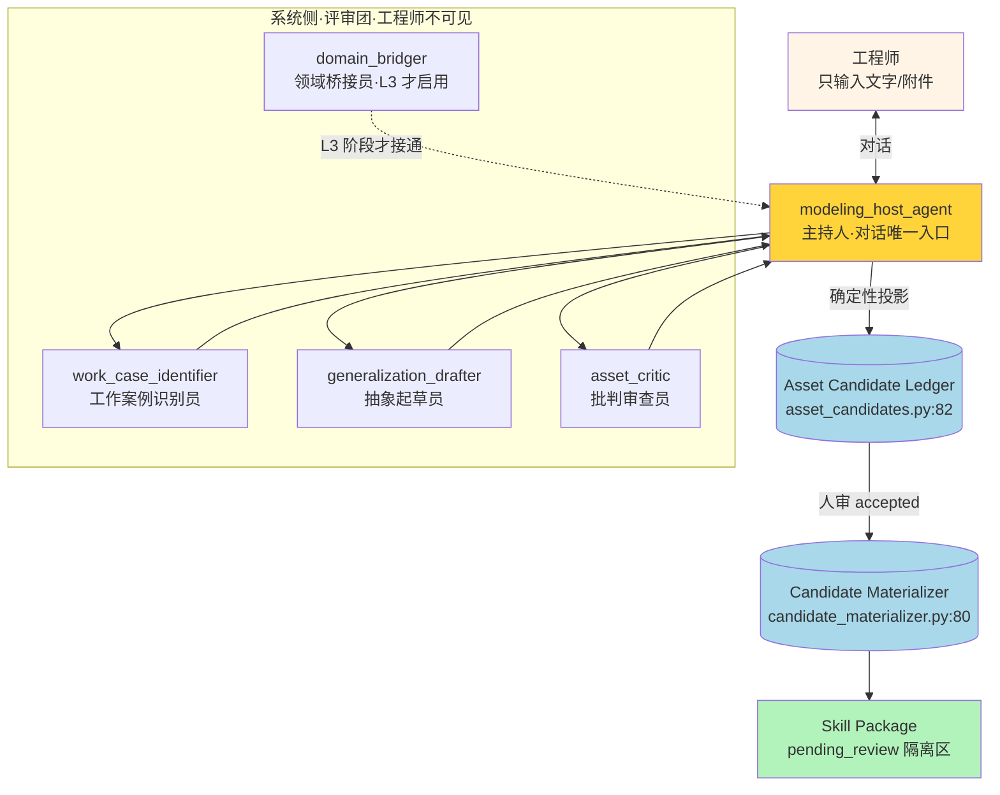
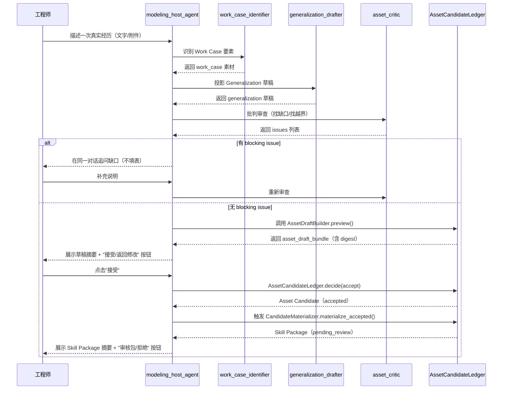

# 本体论建模能力·多 Agent 协作设计

> 状态：提议（R0，待 owner 审）
> 范围：在 `codex/ontology-agent-shell-v1` 分支现有资产治理链之上，设计"FDE 工程师的本体论建模能力"的多 agent 协作拓扑。
> 关联：CONTEXT.md 全部 20+ 概念 · ADR-0030~0035 · `docs/design/UI-PARADIGM.md` · `docs/design/AGENT-TEAM-B7-DESIGN.md`
> 源料：用户 2026-08-05 口头指令——"三种都要,分阶段编排"+"先做原型/demo,从日常通用任务起步,生活场景更有教学价值"。

---

## 一、设计目标与边界

### 1.1 要解决什么

现有体系已经把"资产治理链"做得很严：Work Case → Generalization → Asset Candidate → Skill Package → 复用证据 → Composition Eligibility，全链内容寻址、人审唯一签发、fail-closed。但这套链路的**入口**目前只有两条：

- `guide_agent`（`agents/guide_agent/workflow.py:176`）——会话优先的编排官，把工程师的自然语言路由到 specialist Agent，但**不负责把工作经验沉淀成资产**。
- `AssetBuilderDrawer.vue`（`frontend/src/components/AssetBuilderDrawer.vue`）——分步问卷抽屉，工程师手动填 Generalization 字段。

问题是：ADR-0033 已经判 `AssetBuilderDrawer` 这类字段表单**退出正式 Guide Surface**（"旧的字段式资产整理抽屉同样退出正式 Guide Surface，仅可作为开发验收档案保留"）。也就是说，**现有资产沉淀入口与 ADR-0033 的会话优先原则冲突**。工程师要么自己填表（违反 ADR-0033），要么没法沉淀（guide_agent 不产出资产）。

本设计要补的就是这一环：**一组多 agent 协作,把"工程师做完一件事"自动投影成本体论资产候选,工程师只在关键节点做人审决定,不填表**。

### 1.2 三层都要，但分阶段

用户明确要三种能力：工程师侧建模助手 + 本体论架构深化 + 领域知识本体。本设计分三层：

| 层 | 代号 | 主题 | 产物 | 复用现有 |
|---|---|---|---|---|
| 第一层 | **L1** | 生活场景建模助手（教学 demo） | 2-3 个生活场景的完整建模闭环可跑 demo | `asset_builder.py` 纯投影 + `guide_agent` 对话骨架 |
| 第二层 | **L2** | 本体架构深化（Palantir 式元数据层） | Object Type / Link Type / Interface 三件套 + 跨 case 图查询 | `asset_candidate.schema.json` lineage 层 + ADR-0031 Agent Shell 投影 |
| 第三层 | **L3** | FDE 领域知识本体 | 适航条款 / 故障模式 / FTA 节点关系网 | P-ACE + AWKB 已有领域数据 + L2 元数据层 |

### 1.3 四条铁律（不可破）

本设计是 FLAi-OS 子系统，不是通用本体工具。四条铁律贯穿三层：

1. **工程师不写代码、不填字段表单**（ADR-0033）：所有资产字段由系统从对话+附件+任务证据确定性投影，工程师只做按钮级决定。
2. **人审唯一签发权**：系统只能提候选，不能签发、不能注册、不能晋级。`accepted` ≠ `approved` ≠ `registered`（ADR-0034/0035）。
3. **内容寻址**：任何修改=新修订，digest 绑定，supersedes 链精确引用上一版（CONTEXT.md "Candidate Revision"）。
4. **fail-closed**：缺字段取最严解释，未知态必须可表达，绝不压成"0 个"或伪造成功（ADR-0031 §Fail-closed）。

### 1.4 不做什么（诚实边界）

- **不做通用本体论工具**：不引入 RDF / Neo4j / 图数据库 / nodes-edges 通用 API（ADR-0031 §不采纳 已明确拒绝）。
- **不重写 V0.1 已封板 6 个 case**：CFD/反推/拓扑/结构/流体/APU 不动。
- **不绕过 ADR-0033**：不新增字段选择器、参数表单、JSON 编辑器、第二个主 CTA。
- **不替 LLM 做确定性计算**：Constitution 第 9 条判死，本体论投影是纯函数不是 LLM 调用。
- **不承诺"自动形成 Workflow/Agent"**：两份独立证据是必要不充分条件（ADR-0035 §重复证据与高阶资产门）。
- **L1 demo 不等于生产资产**：生活场景产出的 Skill Package 进隔离区 `pending_review`，不进 `agents/` Registry。

---

## 二、三层路线图

### 2.1 L1·生活场景建模助手（教学 demo，2 周可跑）

**目标**：让 FDE 团队（6-7 个纯动力工程师，不写代码）在 5 分钟内看懂"一次真实经历怎么变成可复用资产"。

**为什么从生活场景起步**（用户的创意判断）：
- FDE 真实场景（振动超标 / 性能盘分析 / FTA）业务背景太重，教学时听众在理解"什么是本体论"之前先被"什么是适航条款"卡住。
- 生活场景（做饭、旅行、训练）每个人都熟，听众可以把全部注意力放在"本体论在干什么"，而不是"业务在干什么"。
- 教学完成后，再桥接回 FDE 真实工作（§五桥接表）。

**L1 产物**：
- 3 个生活场景的完整闭环 demo：每个场景一个 Work Case → 一个 Task Pattern Draft → 一个 Skill Draft → 一个 Asset Candidate（带 digest）→ 人审通过 → 一个 Skill Package（`pending_review`）→ 第二次类似场景自动复用匹配。
- 一份给 FDE 团队看的教学文档（fork-2 agent 负责，见 `ONTOLOGY-DEMO-LIFE-SCENARIOS.md`）。
- 一个轻量前端入口：在现有 WorkbenchSession 加"沉淀为教学案例"按钮（复用 ADR-0033 的"治理按钮"语义，不是新表单）。

**L1 复用现有资产**：
- `backend/app/ontology/asset_builder.py:57` 的 `AssetDraftBuilder.preview()` 是纯函数投影，**零工程耦合**，直接可用。
- `backend/app/ontology/asset_candidates.py:82` 的 `AssetCandidateLedger` 是治理包络，**零工程耦合**。
- `backend/app/ontology/candidate_materializer.py:80` 的 `CandidateMaterializer` 是 Skill Package 生成器，**零工程耦合**。
- `agents/guide_agent/workflow.py` 的对话骨架可复用，但 L1 不需要 guide_agent 的编排能力，只需要它的"会话优先"UI 范式。

**L1 新增**：
- 1 个 agent：`agents/modeling_host_agent/`（建模主持人，详见 §四）。
- 1 个前端组件：`frontend/src/components/LifeScenarioPicker.vue`（场景选择器，不是字段表单——是 ADR-0033 允许的"按钮级治理动作"）。
- 3 个场景种子数据：`data/demo_scenarios/{cooking,travel,workout}.json`。

### 2.2 L2·本体架构深化（Palantir 式元数据层，1-2 月）

**目标**：在 L1 资产治理链之上，加 Object Type / Link Type / Interface 三件套，让跨 case 关系可查询、可可视化。

**为什么需要 L2**：
- L1 的 Asset Candidate 只有"线性血缘"（Candidate → Bundle → Lineage），跨 Candidate 的关系（"这两个 Skill 是不是解决同一类问题""这个 Task Pattern 适航条款依据是不是那个 standards_qa_agent 用的"）查不出来。
- Palantir Foundry 的核心洞察（已落 memory `project_flaios_palantir_ontology_borrow.md`）：ontology 是 agent 的 ground truth，不是人类治理摆设。
- ADR-0031 §不采纳 已经拒绝 RDF/图数据库，但没拒绝"在现有 JSON Schema 之上加关系元数据层"。

**L2 产物**：
- 新契约：`contracts/ontology/object_type.schema.json` / `link_type.schema.json` / `interface.schema.json`。
- 新后端：`backend/app/ontology/graph.py`（跨 Candidate 关系投影，只读）。
- 新 ADR：ADR-0036 Object/Link/Interface 元数据层（要在 ADR-0031 基础上明确"不引入图数据库"的边界）。
- 新前端：`frontend/src/components/OntologyGraph.vue`（Mermaid 渲染跨 Candidate 关系图）。

**L2 不做**：不替换现有 Asset Candidate 链，只在上面加元数据投影层；不改 ADR-0034/0035 的 digest 计算。

### 2.3 L3·FDE 领域知识本体（2-3 月）

**目标**：把 P-ACE（发动机故障情报）+ AWKB（适航条款）+ FDE 团队的 FTA 经验，建模成可查询的领域本体。

**为什么放最后**：
- L1 教学/demo + L2 元数据层 是前置依赖。直接上 L3 会重蹈"6 个 case 各自为政"覆辙（memory `project_flaios_palantir_ontology_borrow.md` §五避坑 第 3 条）。
- L3 需要领域专家深度参与（严冬杰 + FDE 团队），不是 agent 能自动产出的。

**L3 产物**：
- 领域 Object Type：`engine_model` / `fault_mode` / `airworthiness_clause` / `fta_node` / `type_certificate`。
- 领域 Link Type：`fault_mode.clause_violated` / `fta_node.fault_root` / `engine_model.certified_under`。
- 桥接 P-ACE / AWKB 现有数据（不在本设计范围）。

---

## 三、多 Agent 协作拓扑

### 3.1 核心判断：从"单 Guide"到"主持人+评审团"

现有 `guide_agent` 是单编排官，所有对话都走它。本体论建模需要**多种视角**（识别 / 抽象 / 批判 / 桥接），单 agent 撑不住。但 ADR-0033 又规定工程师只能看到一个主输入、一个主对话——所以多 agent 必须在系统侧分工，对工程师是黑箱。

设计 metaphor：**主持人 + 评审团**。
- 主持人（Modeling Host）：唯一对工程师说话的 agent，负责引导对话、收集 Work Case 素材、输出 Asset Candidate。
- 评审团（Critics）：在系统侧对候选做多维度审查，结果汇总给主持人，由主持人在同一对话里向工程师转述。
- 工程师只看到主持人，看不到评审团（ADR-0033 §决策："工程师壳不得出现要求用户填写参数、编辑 JSON、选择分类、选择模型、选择工具、选择 Workflow 或选择 Agent 的控件"）。

### 3.2 Mermaid 拓扑图



### 3.3 协作流程（时序）



### 3.4 为什么是这四个角色

| 角色 | 为什么需要 | 为什么不能合并 |
|---|---|---|
| **主持人** | ADR-0033 要求工程师只有一个对话入口 | 不能让评审团直接对话，否则工程师面对多 agent 会困惑 |
| **工作案例识别员** | Work Case 要素（时间/地点/人物/动作/产物）需要专门识别 | 识别是"从对话抽取事实"，抽象是"从事实归纳模式"，职责不同 |
| **抽象起草员** | Generalization 是核心智力工作（CONTEXT.md "Generalization"） | 抽象要"超出具体案例找通用模式"，识别只看案例本身 |
| **批判审查员** | fail-closed 要求 blocking issue 必须被抓出来 | LLM 起草和 LLM 审查用同一个 prompt 会自我肯定，必须独立角色 |
| **领域桥接员（L3）** | L3 阶段要把生活场景概念桥接到 FDE 工作 | L1/L2 不需要，L3 才接通 |

---

## 四、每个 Agent 的契约

### 4.1 `modeling_host_agent`（主持人）

| 字段 | 值 |
|---|---|
| 角色 | 唯一对工程师说话的 agent，编排评审团，输出 Asset Candidate |
| category | `reasoning_assist`（ADR-0030 四型之一） |
| model.profile | `reasoning`（同 guide_agent） |
| 输入 | 自然语言对话 + 附件（同 guide_agent） |
| 输出 | `asset_draft_bundle.v1`（调用 AssetDraftBuilder）+ 对话回复 |
| 工具 | 无（纯对话编排，不调外部工具） |
| 限制 | ① 不签发、不注册、不晋级 ② blocking issue 必须回到对话追问 ③ 评审团结果必须由主持人转述，不让评审团直接对话 |
| 复用 | `agents/guide_agent/workflow.py:176` 的 `run()` 骨架 + `_VisibleReplyStream` 流式回复 |
| 新增代码 | `agents/modeling_host_agent/`（agent.yaml + workflow.py + prompt.md） |

### 4.2 `work_case_identifier`（工作案例识别员，系统侧）

| 字段 | 值 |
|---|---|
| 角色 | 从对话+附件识别 Work Case 五要素：时间/地点/人物/动作/产物 |
| category | `structured_gen`（结构化抽取） |
| model.profile | `fast`（轻量抽取，不需要深度推理） |
| 输入 | 对话段 + 附件 |
| 输出 | `work_case_elements.v1`（JSON：time/place/actor/action/artifact，每项带置信度） |
| 工具 | 无 |
| 限制 | ① 只抽取已说出口的事实，不补写 ② 置信度 < 0.6 的要素标 `unclear` 不猜 ③ 不产出 Generalization |
| 复用 | 无（guide_agent 不做识别） |
| 新增代码 | `agents/work_case_identifier/`（内部 agent，不注册到 Portal，只在 modeling_host workflow 里调用） |

### 4.3 `generalization_drafter`（抽象起草员，系统侧）

| 字段 | 值 |
|---|---|
| 角色 | 从 Work Case 要素投影出 Generalization 草稿（CONTEXT.md 9 字段：title/trigger/desired_outcome/inputs/outputs/steps/evidence_requirements/human_decision_points/limitations） |
| category | `reasoning_assist` |
| model.profile | `reasoning`（抽象是智力活，要深模型） |
| 输入 | `work_case_elements.v1` |
| 输出 | `generalization_draft.v1`（对应 asset_builder.py 的 `_GENERALIZATION_FIELDS`） |
| 工具 | 无 |
| 限制 | ① 每个字段必须有 Work Case 证据支撑，不许编造 ② limitations 至少 1 条（CONTEXT.md 要求）③ human_decision_points 至少 1 条 |
| 复用 | `asset_builder.py:248` 的 `_normalize_generalization()` 字段定义 |
| 新增代码 | `agents/generalization_drafter/`（内部 agent） |

### 4.4 `asset_critic`（批判审查员，系统侧）

| 字段 | 值 |
|---|---|
| 角色 | 对 Generalization 草稿做对抗式审查，找 blocking issue 和 warning |
| category | `reasoning_assist` |
| model.profile | `reasoning` |
| 输入 | `generalization_draft.v1` + `work_case_elements.v1` |
| 输出 | `critique.v1`（issues 列表，每项 severity ∈ {blocking, warning} + 位置 + 原因） |
| 工具 | 无 |
| 限制 | ① 必须独立于 drafter（不共享 prompt）② 不改写草稿，只提问题 ③ 至少检查：limitations 是否诚实 / human_decision_points 是否充分 / steps 是否有未验证环节 / trigger 是否过宽或过窄 |
| 复用 | `asset_builder.py:302` 的 `_validate()` 逻辑（确定性校验由代码做，LLM 补语义审查） |
| 新增代码 | `agents/asset_critic/`（内部 agent） |

### 4.5 `domain_bridger`（领域桥接员，L3 才启用）

| 字段 | 值 |
|---|---|
| 角色 | L3 阶段把生活场景或通用 Task Pattern 桥接到 FDE 领域概念 |
| 启用时机 | L3（L1/L2 不启用） |
| 输入 | `task_pattern_draft.v1` + FDE 领域 Object Type 库 |
| 输出 | `domain_mapping.v1`（生活场景概念 → FDE 概念映射表） |
| 限制 | ① 不改写 Task Pattern 本身 ② 桥接是建议不是签发 ③ 桥接失败（找不到对应领域概念）要诚实说，不硬凑 |

---

## 五、L1 阶段·三个生活场景 demo 完整设计

> 详细教学叙事由 fork-2 agent 在 `ONTOLOGY-DEMO-LIFE-SCENARIOS.md` 产出，本节只给工程化设计。

### 5.1 场景选择

| 场景 | 为什么选 | 本体论教学重点 |
|---|---|---|
| **周末做一道新菜（红烧肉）** | 人人都熟，动作清晰 | Work Case 五要素 + limitations（"不适用：素食者/高压锅"） |
| **家庭旅行规划（3 天上海）** | 步骤多、决策点多 | human_decision_points（预算/日期/景点取舍）+ evidence_requirements |
| **健身房训练计划（新手增肌）** | 有明确输入输出和验证 | inputs/outputs + verification（"能举起 X kg"）+ trigger（"新手第一次进健身房"） |

三个场景渐进设计：
- Demo 1（做饭）：最简单，让工程师看懂"一次经历 → 一个 Skill"的完整闭环。
- Demo 2（旅行）：中等，引入"多个 human_decision_point"和"evidence"。
- Demo 3（训练）：最复杂，引入"verification"和"trigger 边界"——为 L3 桥接 FDE（振动超标验证）做铺垫。

### 5.2 每个 demo 的工程化产物

每个 demo 跑完后产出：

```
data/demo_scenarios/<scenario>/
├── work_case_raw.json          # 工程师对话原文
├── work_case_elements.json     # 识别员输出
├── generalization_draft.json   # 起草员输出
├── critique.json               # 审查员输出
├── asset_draft_bundle.json     # AssetDraftBuilder 投影（含 digest）
├── asset_candidate.json        # 人审 accepted 后的 Candidate
└── skill_package/              # Materializer 生成的隔离包
    ├── SKILL.md
    └── references/
        ├── provenance.json
        ├── skill-revision.json
        └── task-pattern-revision.json
```

### 5.3 demo 跑法（L1 验收脚本）

```bash
# 在 ontology-agent-shell-v1 worktree
cd /Users/Zhuanz/projects/aircraft-comac/flai-os-ontology-agent-shell-v1

# 跑单个 demo（以 cooking 为例）
python scripts/run_demo_scenario.py cooking

# 跑全部三个
python scripts/run_demo_scenario.py --all

# 验证 Skill Package 字节完整性
python scripts/verify_demo_packages.py
```

每个 demo 跑完要满足：
- Asset Candidate digest 与 Bundle digest 链式可追
- Skill Package 4 个文件（SKILL.md + 3 个 references）字节完整
- Skill Package 在 `quarantine/` 隔离区，不在 `agents/`
- 复用匹配：第二次跑同场景能命中已批准包

### 5.4 demo 前端入口

在 `WorkbenchSession.vue` 现有"结束协作"按钮旁加"沉淀为教学案例"按钮（ADR-0033 允许的"治理按钮"，不是字段表单）。点击后：
1. 路由到 `LifeScenarioPicker.vue`（三选一，纯按钮）
2. 选完后进入 modeling_host_agent 对话
3. 走完闭环后展示 Skill Package 摘要 + 审核按钮

**不新增表单、不新增选择器、不新增第二个主 CTA**。

---

## 六、跟现有资产的关系映射

### 6.1 复用清单（零改动直接用）

| 现有资产 | 路径 | L1 用途 |
|---|---|---|
| `AssetDraftBuilder.preview()` | `backend/app/ontology/asset_builder.py:60` | 投影 Work Case → Task Pattern → Skill，零改动 |
| `AssetCandidateLedger` | `backend/app/ontology/asset_candidates.py:82` | 创建/决定 Candidate，零改动 |
| `CandidateMaterializer` | `backend/app/ontology/candidate_materializer.py:80` | 材化 Skill Package，零改动 |
| `SkillReuseMatcher` | `backend/app/ontology/skill_reuse.py:133` | 第二次跑同场景复用匹配，零改动 |
| `asset_candidate.schema.json` | `contracts/asset_candidate.schema.json` | Candidate 契约，零改动 |
| `asset_draft_bundle.schema.json` | `contracts/asset_draft_bundle.schema.json` | Bundle 契约，零改动 |
| `_VisibleReplyStream` | `agents/guide_agent/workflow.py:79` | 流式回复，复制到 model_host workflow |

### 6.2 需要适配（小改）

| 现有资产 | 改动点 | 原因 |
|---|---|---|
| `AssetBuilderDrawer.vue` | L1 不用，留作开发档案 | ADR-0033 已判退役 |
| `WorkbenchSession.vue` | 加一个"沉淀为教学案例"按钮 | 现有没有资产沉淀入口 |
| `agents/guide_agent/agent.yaml` | 不改，但 modeling_host_agent 复用其 prompt 结构 | guide_agent 是编排官，modeling_host 是建模主持人，职责不同 |

### 6.3 新增清单

| 新增 | 路径 | 行数估计 |
|---|---|---|
| modeling_host_agent | `agents/modeling_host_agent/` | agent.yaml(80) + workflow.py(300) + prompt.md(150) + README.md(50) |
| work_case_identifier | `agents/work_case_identifier/` | 同上结构，workflow.py(200) |
| generalization_drafter | `agents/generalization_drafter/` | 同上，workflow.py(250) |
| asset_critic | `agents/asset_critic/` | 同上，workflow.py(200) |
| LifeScenarioPicker.vue | `frontend/src/components/` | 150 行 |
| demo 场景数据 | `data/demo_scenarios/{cooking,travel,workout}.json` | 每个 100 行 |
| run_demo_scenario.py | `scripts/` | 200 行 |
| verify_demo_packages.py | `scripts/` | 100 行 |
| 教学文档 | `docs/design/ONTOLOGY-DEMO-LIFE-SCENARIOS.md` | fork-2 产出 |

### 6.4 L2 阶段新增（L1 完成后）

| 新增 | 路径 |
|---|---|
| object_type.schema.json | `contracts/ontology/` |
| link_type.schema.json | `contracts/ontology/` |
| interface.schema.json | `contracts/ontology/` |
| graph.py | `backend/app/ontology/` |
| OntologyGraph.vue | `frontend/src/components/` |
| ADR-0036 | `docs/adr/` |

---

## 七、诚实边界与风险

### 7.1 L1 demo 的诚实边界

- **demo 产出的 Skill Package 不是生产资产**：在 `quarantine/` 隔离区，不进 `agents/` Registry，不能被生产任务复用。demo 结束后可清空。
- **demo 不证明本体论对 FDE 有用**：只证明"本体论建模闭环可跑+工程师能看懂"。L3 才证明 FDE 价值。
- **生活场景的 Generalization 质量取决于对话深度**：草草几句对话产出的 Skill 质量低，这是本体论的诚实性——它不伪装成"AI 自动产出高质量方法"。
- **demo 不替代 workshop**：workshop（memory `project_fde_agent_workshop.md`）是技术科普，demo 是本体论教学，两者互补不替代。

### 7.2 多 agent 编排的风险

| 风险 | 缓解 |
|---|---|
| 评审团三个 agent 串行跑会慢（3 次 LLM 调用） | 识别员+起草员可并行（输入独立），审查员必须等前两个完成。最坏 2 轮串行 |
| 评审团可能集体跑偏（三个 agent 都漏同一个 blocking issue） | `asset_builder.py:302` 的确定性 `_validate()` 是兜底，LLM 漏的代码层会抓 |
| 工程师看到主持人转述评审团意见可能困惑（"这是谁说的"） | 主持人统一口吻，不暴露评审团存在（"我检查了一下，发现..."而不是"审查员说..."） |
| L3 桥接失败硬凑 | domain_bridger 必须诚实说"找不到对应"，fail-closed |

### 7.3 跟 ADR-0033 的兼容性

本设计严格遵守 ADR-0033：
- ✅ 工程师只看到一个主输入、一个主对话（主持人）
- ✅ 评审团在系统侧，工程师不可见
- ✅ 不新增字段表单 / JSON 编辑器 / 选择器
- ✅ "沉淀为教学案例"是 ADR-0033 §决策允许的"清晰按钮动作"
- ✅ LifeScenarioPicker 是三选一按钮，不是参数表单

### 7.4 合并风险（ontology-shell 分支未合 main）

- 本设计基于 `codex/ontology-agent-shell-v1` 分支，该分支有 6 个本地 commit 未合 main。
- main 上还有 ADR-0039（NemoClaw spike）等更新。
- **建议**：L1 demo 在 ontology-shell 分支跑通后，先合 main 再做 L2。不要在未合分支上叠 L2/L3。
- 合并前要跑全量测试（`pytest tests/`）确保 ontology 后端模块无回归。

---

## 八、下一步行动建议

| 顺序 | 动作 | 负责人 | 前置 |
|---|---|---|---|
| 1 | 等 fork-2（生活场景教学设计）和 fork-3（资产审查）产出 | team-lead | 本设计完稿 |
| 2 | owner 审本设计（R0 → Accepted/Rejected） | 严冬杰 | 三份文档齐 |
| 3 | 如果 Accepted，起 ADR-0036（多 agent 建模主持人+评审团） | 架构 agent | owner 拍板 |
| 4 | L1 实施：先跑通 cooking 单场景端到端 | 实现 agent | ADR-0036 Accepted |
| 5 | L1 扩到 3 场景 + 前端按钮 | 实现 agent | cooking 跑通 |
| 6 | L1 教学文档定稿（给 FDE workshop 用） | fork-2 + owner | 3 场景跑通 |
| 7 | L1 合 main | owner | 全量测试绿 |
| 8 | L2 启动：起 ADR-0037（Object/Link/Interface） | 架构 agent | L1 合 main |

---

## 九、术语对齐（给 owner 审稿用）

| 本设计用的词 | CONTEXT.md / ADR 里的精确说法 | 是否新创 |
|---|---|---|
| 主持人 | 无（新角色） | 是 |
| 评审团 | 无（新角色集合） | 是 |
| 工作案例识别员 | 无（新角色） | 是 |
| 抽象起草员 | 无（新角色，但做的事是 CONTEXT.md "Generalization"） | 是 |
| 批判审查员 | 无（新角色，但做的事是 ADR-0032 "Review Readiness" 的 LLM 侧补强） | 是 |
| 领域桥接员 | 无（新角色，L3 启用） | 是 |
| 生活场景 | 无（新概念，L1 教学用） | 是 |
| 教学案例 | 无（新概念，是 Skill Package 的一个标记） | 是 |

所有新角色都是 FLAi-OS 内部 agent，不是新资产类型——它们产出的仍然是 CONTEXT.md 已定义的 Work Case / Generalization / Asset Candidate / Skill Package。本设计不新增本体论概念，只新增**产生这些概念的 agent 角色**。
