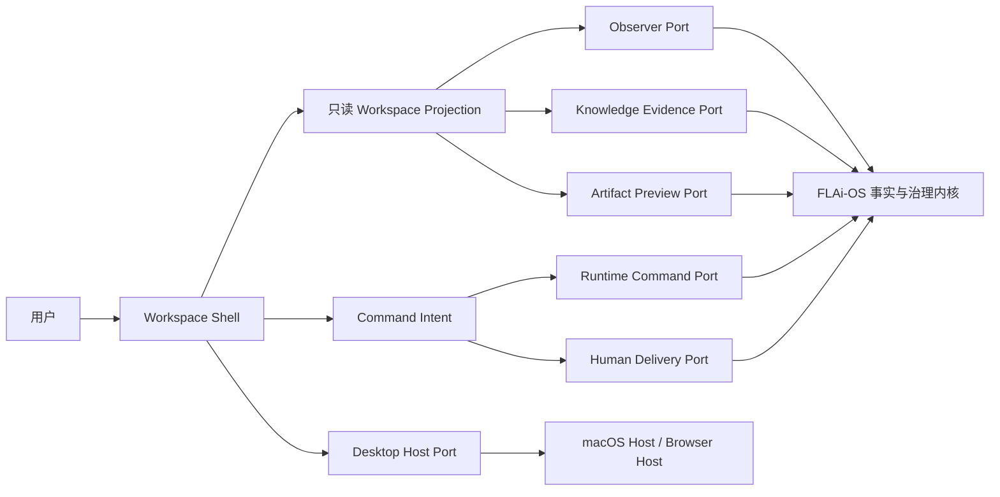

# FLAi-OS Workspace Shell V1 蓝图

> 状态：`PROPOSED / OWNER_REVIEW_REQUIRED`
> 基线：Stage C source candidate `0d095df8257ad369851e2a4a598fe5cb1a1cef14`
> 目标系统：macOS 优先；浏览器原型先行；Windows 暂不进入本工作项。

## 1. 北极星

用户首先看到和使用的是一个流畅、连续、可信的 Workspace，而不是 ExecutionRun、Artifact、ACL、
审批单或 Agent 拓扑。

这些一级治理对象仍然存在，但默认隐形。只有当它们能回答用户此刻最关心的问题时才进入界面：

1. Agent 现在在做什么？
2. 我能看到什么正在形成？
3. 它依据了什么？
4. 是否真的需要我现在介入？
5. 最终交付是否已经由真人签发？

V1 的产品句子是：

> 给出任务后持续工作；中途不要求用户填写治理表单；右侧始终展示当前最值得追踪的真实产物；
> 只有高影响动作到达执行边界时才就地请求最小必要授权。

## 2. 结构：一个 Shell，六个事实端口



UI 不读取数据库、不拼接后端事实、不验证自己的签名，也不拥有任务完成状态。未来的 Production
Adapter 负责把获准事实合同投影成 Shell 能消费的安全描述；当前仓库只有 prototype-only projector，
不能形成生产 REAL。

## 3. 最小外部接口

```ts
interface WorkspaceShellV1 {
  connect(input: OpenWorkspaceV1): Promise<WorkspaceSessionV1>;
}

interface WorkspaceSessionV1 {
  readonly initial: WorkspaceProjectionV1;
  updates(
    afterCursor: string | null,
    signal?: AbortSignal
  ): AsyncIterable<WorkspaceDeltaV1>;
  dispatch(
    command: WorkspaceCommandV1,
    signal?: AbortSignal
  ): Promise<CommandReceiptV1>;
  close(): void;
}
```

`connect()` 是 Shell 唯一入口。`WorkspaceSessionV1` 把读取和意图发送分开：

- `initial` 是有 cursor、revision 和 provenance 的初始投影；
- `updates()` 只消费顺序增量，发现 revision 跳跃、cursor 回退或 binding 不一致时 fail closed；
- `dispatch()` 返回“命令是否被接受”的 receipt，不代表任务已完成；
- `close()` 清空会话内敏感 projection/cache 并关闭客户端会话，但不取消后台任务。

这套接口不暴露模型 ID、Agent 内部拓扑、数据库主键、Open WebUI 会话或底层 Socket 事件。

### 3.1 最小消息合同

```ts
type ExactBindingV1 = {
  workspaceRef: string;
  taskRef: string;
  taskRevision: string;
  executionEpoch: string;
};

type WorkspaceCommandKindV1 =
  | "submit_intent"
  | "append_instruction"
  | "pause_execution"
  | "cancel_execution"
  | "resume_execution"
  | "request_delivery_review";

type TimelineDescriptorV1 = {
  itemId: string;
  sequence: number;
  observedAt: string;
  kind: "activity" | "attention" | "preview" | "failure" | "stopped" | "unknown";
  title: string;
  detail: string;
  motion: boolean;
};

type FocusDescriptorV1 = {
  kind: "artifact" | "runtime" | "diff" | "evidence";
  objectRef: string;
  sourceWitnessRef: string;
  title: string;
  digest: string;
  effectiveClassification: string;
  rendererKind: "docx" | "pdf" | "image" | "table" | "diff" | "cfd" | "unsupported";
};

type FocusGapV1 = {
  kind: "gap";
  reasonCode: string;
};

type DeliveryProjectionV1 =
  | {
      state: "NONE";
      bundleRef?: never;
      bundleDigest?: never;
      verifiedReceiptRef?: never;
    }
  | {
      state: "UNSIGNED";
      bundleRef: string;
      bundleDigest: string;
      verifiedReceiptRef?: never;
    }
  | {
      state: "VERIFIED";
      bundleRef: string;
      bundleDigest: string;
      verifiedReceiptRef: string;
    };

type OpenWorkspaceV1 = {
  contractVersion: "flai.workspace-shell.open.v1";
  workspaceRef: string;
  resumeCursor?: string;
  locale: "zh-CN";
  hostKind: "browser" | "macos";
};

type WorkspaceProjectionV1 = {
  contractVersion: "flai.workspace-shell.projection.v1";
  binding: ExactBindingV1;
  revision: number;
  cursor: string;
  factDigest: string;
  observedAt: string;
  source: "control-kernel" | "synthetic-fixture";
  reality: "REAL" | "MOCK" | "TEST" | "UNKNOWN";
  effectiveClassification: string;
  executionState:
    | "idle"
    | "running"
    | "waiting_review"
    | "completed"
    | "failed"
    | "cancelled"
    | "unknown";
  timeline: ReadonlyArray<TimelineDescriptorV1>;
  focus: FocusDescriptorV1 | FocusGapV1;
  allowedCommands: ReadonlyArray<WorkspaceCommandKindV1>;
  delivery: DeliveryProjectionV1;
};

type WorkspaceDeltaV1 =
  | {
      kind: "REPLACE";
      previousCursor: string;
      previousRevision: number;
      cursor: string;
      projection: WorkspaceProjectionV1;
    }
  | {
      kind: "REVOKE";
      previousCursor: string;
      cursor: string;
      terminal: true;
      publicCode:
        | "AUTH_REVOKED"
        | "WORKSPACE_SCOPE_REVOKED"
        | "CLASSIFICATION_REVOKED";
      clear: "ALL_SENSITIVE_PROJECTION";
    }
  | {
      kind: "STREAM_END";
      previousCursor: string;
      cursor: string;
      terminal: true;
      publicCode:
        | "PROJECTION_GAP"
        | "PROJECTION_CONFLICT"
        | "BINDING_CHANGED"
        | "TRANSPORT_UNTRUSTED";
      clear: "ALL_SENSITIVE_PROJECTION";
    };

type WorkspaceCommandV1 = {
  contractVersion: "flai.workspace-shell.command.v1";
  commandId: string;
  idempotencyKey: string;
  binding: ExactBindingV1;
  expectedRevision: number;
  kind: WorkspaceCommandKindV1;
  payload: Readonly<Record<string, unknown>>;
};

type CommandReceiptV1 = {
  contractVersion: "flai.workspace-shell.command-receipt.v1";
  commandId: string;
  binding: ExactBindingV1;
  status: "ACCEPTED" | "REJECTED" | "EFFECT_UNKNOWN";
  receiptRef: string;
  observedAt: string;
  publicCode?: string;
};
```

约束：

- `OpenWorkspaceV1` 不接受 actor、role、ACL 结果、classification 或 reality 覆盖；它们来自受信
  composition root 和服务端投影；
- V1 delta 是完整 `REPLACE`，不允许任意 JSON patch 遗留已撤权字段；
- `REPLACE.cursor` 必须等于 `projection.cursor`；`previousCursor`、`previousRevision`、binding
  和 digest 必须连续匹配；否则立即
  `STREAM_END + clear`；
- 认证撤销、ACL 收紧或 classification 变化发出 `REVOKE`，Shell 必须先清空 Artifact、Evidence、
  timeline、composer attachment preview 和本地缓存，再显示公共错误；
- receipt 只承认命令接收结果，`EFFECT_UNKNOWN` 禁止自动换 idempotency key 重放；
- `allowedCommands` 只是展示提示；服务端每次 dispatch 都必须重新认证、授权并核对
  classification/expectedRevision，客户端投影不是授权决定；
- `payload` 由 command-kind 的封闭 Schema 验证，未知字段、任意 action 字符串、HTML、脚本、
  actor/role/ACL/classification 覆盖一律拒绝。
- `motion` 由 Shell 按最新可信 execution state、freshness 和 terminal 状态再次 clamp；投影中的
  矛盾 `motion=true` 不能启动动画；
- `DeliveryProjectionV1` 使用精确 key 校验；`VERIFIED` 缺任一 bundle/receipt 字段或携带额外字段
  都 fail closed。

### 3.2 声明式 Extension Allowlist

V1 允许 extension 贡献的 slot 只有：

```text
nav.secondary
composer.suggestion
timeline.detail
focus.preview
focus.evidence
command.palette
```

贡献值只能是 text、list、badge、Artifact descriptor、Evidence descriptor 或注册动作 descriptor；
禁止函数、任意 HTML/CSS、脚本、iframe URL、网络回调、文件路径和 motion override。identity、
composer 提交、observer、信任槽和 delivery decision 是锁定 core slot，不可替换。

## 4. 六个 Port

| Port | 责任 | 现有 prototype projector | 未来 Production Adapter | 测试 Adapter |
| --- | --- | --- | --- | --- |
| `ObserverPort` | 任务阶段、reality、witness、错误和 cursor | observer-contract v2 + runtime observer adapter；纯函数、无 I/O、不能认证 source | `NOT_IMPLEMENTED / REAL CLOSED`；须经认证、ACL、classification、Assembler、witness 与 receipt | deterministic observer fixture |
| `RuntimeCommandPort` | 提交、补充、暂停、取消、继续等意图 | 无 | 后续独立生产工作项 | in-memory receipt adapter |
| `KnowledgeEvidencePort` | ACL 后可见的引用、版本、条款和缺口 | synthetic 投影 | 后续独立生产工作项 | synthetic evidence fixture |
| `ArtifactPreviewPort` | digest 绑定的预览描述与安全渲染 URL | synthetic 投影 | 后续独立生产工作项 | synthetic artifact fixture |
| `HumanDeliveryPort` | 请求真人审阅并读取可验签 receipt | 无 | 后续独立生产工作项 | deny-all / unsigned-only fixture |
| `DesktopHostPort` | 文件选择、通知、窗口、快捷键、深链 | Browser prototype | 后续 `MacDesktopHost` | fake host |

V1 原型只实现测试 Adapter 和 Presentation Adapter。现有 observer/runtime 文件明确是
prototype-only；冻结的 Production Snapshot Assembler 合同也明确当前事实不能形成
`READY + REAL`。Production Adapter、认证、ACL、Schema 和签发链路均不在 Kimi 写范围。

## 5. 默认界面

### 5.1 左侧：Workspace Rail

- 工作区、最近任务、固定项目和搜索；
- 默认不展示“Agent 管理”“权限矩阵”“ExecutionRun 列表”；
- 风险或证据缺口只在相关任务旁显示小型可信信号；
- 管理与治理视图通过二级入口进入。

### 5.2 中央：Continuous Work Surface

- 一个短标题、一个连续执行流、一个持续可用的 composer；
- 默认不显示模型、Agent、Tool 或 policy ID；高级路由设置进入角色化二级入口；
- 动态 glyph 表示搜索、读取、解析、计算、渲染、等待真人等动作；
- 以可验证事件驱动动画，不使用无限“思考中”掩盖停滞；
- 用户可以继续补充指令，队列保留每条指令的独立 ID、顺序和 receipt；
- 不把多条用户意图静默拼成一个不可审计字符串。

### 5.3 右侧：Focus Surface

右侧始终承载“此刻最值得看”的内容，优先级为：

1. 正在变化的 Artifact 或结果预览；
2. 当前步骤的真实运行输出；
3. 等待用户审阅的差异；
4. 阻塞执行的证据缺口或授权；
5. 与当前结论直接相关的知识依据。

依据列表不是右栏的默认唯一内容。用户应先看到进展的可视结果，再按需展开证据。

### 5.4 Just-in-time Gate

低风险、已授权范围内的连续工作不中断。只有当动作确实跨越边界时，最小 gate 才出现在当前上下文：

- 访问更高 classification 的资料；
- 运行高影响工具；
- 覆盖或删除受保护资产；
- 对外发送；
- 生产交付签发。

审批被拒绝、过期或证据缺失时，系统不得悄悄降级执行。

## 6. 不可破坏的信任不变量

1. `dispatch accepted` 不等于 `completed`。
2. `completed` 使用中性完成样式，不给绿色；绿色只属于可验证的 REAL 槽位。
3. teal 只属于真实、可验签的真人签发 receipt。
4. MOCK、TEST、synthetic fixture 与派生的 UNKNOWN projection 必须显式标注；UNKNOWN 不是合法
   execution reality。
5. witness、source binding、fact digest、revision、cursor 或 classification 缺失时 fail closed。
6. stale snapshot 停止动作动画，不继续制造“仍在执行”的错觉。
7. Artifact 必须与 digest、classification 和 source ref 绑定后才可预览。
8. 知识依据必须保留来源、版本/哈希、ACL 与引用位置；“内网可见”不等于“当前用户获权”。
9. UI 不能创建、伪造或缓存为真的 HumanDeliveryReceipt。
10. extension 不得执行任意 DOM、JavaScript、网络请求或绕过 Port；只能贡献声明式安全描述。
11. Open WebUI、ChatGPT 或 Claude 的状态与文案不能成为 FLAi 事实。
12. 无论视觉多流畅，都不能用“假绿”换取完成感。
13. 原型中的 synthetic/unsigned delivery 永不显示 teal；真人 teal 正路径留给未来受信投影测试。
14. 撤权或 classification 收紧先清空敏感投影，再显示公共错误，不能继续展示缓存预览。

## 7. Observer 到界面的投影

| 观察状态 | 中央动作 | 右侧焦点 | 用户动作 |
| --- | --- | --- | --- |
| `running` | 真实阶段 glyph + 最近事件 | 正在形成的预览/日志 | 可补充、暂停或取消 |
| `waiting_review` | 停在明确审阅节点 | 差异与证据摘要 | 审阅；不自动签发 |
| `completed` | 中性完成 | 最终 Artifact + digest | 下载或发起真人签发 |
| `failed` | 真失败红色 | 失败原因与安全重试边界 | 修改输入或受控重试 |
| `cancelled` | 中性停止 | 已保留产物与停止点 | 复制任务或重新开始 |
| `evidence-missing` | amber，动画停止 | 缺口原因码和所需证据 | 补证或结束 |
| `permission-denied` | amber/红色边界提示 | 被拒绝对象与 classification | 申请权限或改用获权资料 |
| invalid / unknown | fail-closed | 无法验证的字段与来源 | 刷新或报告，不继续执行 |

## 8. Open WebUI 模式的翻译规则

| 外部模式 | FLAi-OS 采用方式 | 必须改变的地方 |
| --- | --- | --- |
| Chat list / folders | Workspace Rail | 绑定 FLAi workspace/task，不用外部 chat DB |
| Message queue | 独立命令队列 | 每条命令有 ID、顺序、receipt 和审计事件 |
| Artifacts pane | Focus Surface | digest + classification + 安全 renderer |
| Tool activity | 动态动作 glyph | 仅由 observer 事实驱动，不执行浏览器代码 |
| Offline mode | 离线资产清单 | 构建全固定、验摘要、失败即停止 |
| Workspace tools | 不直接采用 | 工具必须进入 Sandbox、ACL、审批和审计 |

## 9. macOS 路线

### Phase 1：浏览器中的 Desktop-grade Shell

先用现有 Vue 3 技术栈完成视觉、键盘、动作、右侧焦点和 synthetic 场景验证。目标是确定产品体验，
不是对外发布新入口。

### Phase 2：`MacDesktopHost`

产品体验冻结后，再以独立工作项实现 macOS host，仅提供文件选择、通知、窗口状态、系统快捷键和
安全深链。业务事实仍经相同六个 Port，不在原生壳中复制 runtime。

`DesktopHostPort` 只能返回由用户手势产生的短期、受限 handle；不得返回任意路径或文件内容。
文件仍须经过受控 intake、digest、classification 和 ACL，深链只能定位既有 opaque ref，不能注入
任务、授权或交付事实。

### Phase 3：签名与内网包

在生产 Adapter、认证/ACL 和签发链路通过评审后，进入 macOS 签名、notarization 评估和内网
OfflineReleaseBundle。Windows 适配另开工作项。

## 10. 两周原型的验收边界

原型应证明：

- Workspace 是默认心智模型，治理对象默认退到背景；
- 1440px 和 1280px 无横向溢出；
- keyboard-only、IME、Ctrl/Cmd+Enter 和 reduced-motion 可用；
- 动态 glyph 只在可验证的 running 状态运动；
- 右侧会随任务状态选择正确 Focus Surface；
- queued instructions 保持顺序和独立 receipt；
- 三类黄金工作流可使用同一 Shell：Office 文档、会议纪要、CFD 辅助；
- REAL/MOCK/TEST/UNKNOWN 与所有异常状态均可通过 synthetic fixture 验证；
- 除固定 loopback HTML/module/static bootstrap 外，不发任何应用或外部网络请求，不接真实内网数据，
  不暴露生产入口；
- `npm run build` 后不存在 `dist/workspace-shell.html`。

## 11. 冻结前仍需 owner 决策

1. 是否批准路线 C：Open WebUI 只读参考 + Vue 独立 no-copy Shell；
2. 是否冻结 `flai-workspace-shell-kimi-001@1` 的 synthetic-only 写范围；
3. 原型验收后，macOS 采用 WebView host 还是原生 SwiftUI Presentation Adapter，需基于原型数据另行裁决。
