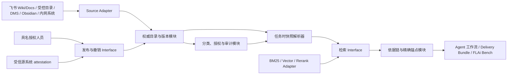

# 11｜权威知识基础（Authoritative Knowledge Foundation）

> 文档性质：V0.2 产品与架构设计读模型，不是新的决策真相源。
> 首要依据：[ADR-0057](../../adr/ADR-0057-authoritative-knowledge-foundation.md)。
> 相关依据：[ADR-0015](../../adr/ADR-0015-knowledge-kernel-service.md)、[ADR-0017](../../adr/ADR-0017-knowledge-qa-agent.md)、[ADR-0021](../../adr/ADR-0021-m11-b2-data-classification.md)、[ADR-0062](../../adr/ADR-0062-feishu-single-organizational-hub.md)、[知识与记忆标准 V0.1](../../06_Knowledge_Memory_Standard.md) 与 [CONTEXT.md](../../../CONTEXT.md)。
> 若本文与上述 ADR 冲突，以 ADR 为准；字段名与持久化格式仍需在实施规格中冻结。

## 1. 本文要解决的问题

FLAi-OS 不能把“检索到了相似文本”当成“找到了可执行的组织要求”。企业规章、正式条款、领导签发要求、决策命令和工程基线需要同时回答五个问题：

1. 这份材料是谁以什么权限发布的；
2. 任务发生时使用的是哪一个不可变版本；
3. 该版本当时是否有效、是否适用于当前对象；
4. 回答中的每项主张究竟来自哪一条、哪一页、哪一个单元格或哪一个工程字段；
5. 依据缺失、失效或冲突时，系统是否会诚实地停止确认，而不是让模型猜一个答案。

因此，本能力的产品定义不是“企业 RAG”，而是：

> 为所有 Agent 提供统一的权威目录、版本、有效性、适用范围、访问策略、任务时快照与精确出处；检索只负责找候选，权威性必须来自经过认证的具名人员签发。受信源系统只能提供可验证的上游签发凭据，不能代替本平台真人签发。

## 2. 状态口径

本文逐项使用以下状态，禁止把目标设计写成当前事实：

| 状态 | 本文含义 |
|---|---|
| `IMPLEMENTED-VERIFIED` | 当前精确范围、版本与环境有可复跑机械证据，绑定命令、结果引用和日期；不等于生产就绪 |
| `IMPLEMENTED-PARTIAL` | 已有可复用骨架，但语义或覆盖范围尚不足以满足 ADR-0057 |
| `ACCEPTED-NOT-IMPLEMENTED` | 已由 ADR 接受，尚未形成完整运行时实现与机械验收证据 |
| `DECLARED-NOT-VERIFIED` | 已声明方向或接入槽位，但真实内网环境、数据、性能或业务价值尚未验证 |
| `OUT-OF-SCOPE` | 本阶段明确不选型、不接入或不承诺 |

## 3. 当前基线：已经有什么，缺什么

### 3.1 可直接复用的实现

| 当前能力 | 状态 | 可复用事实 | 仍不能证明什么 |
|---|---|---|---|
| Knowledge Scope 契约与注册表 | `IMPLEMENTED-PARTIAL` | `scope_id/name/kind/source/confidentiality/owner` 已有 schema；Agent 只能引用已注册的具体 scope | scope 被注册不代表其中每份文件已获权威发布 |
| default-deny 白名单 | `IMPLEMENTED-PARTIAL` | 装配期对账与运行时 `_KnowledgeContext` 都拒绝未声明 scope；新增 scope 不会自动扩大旧 Agent 权限 | 尚不是知识项级、任务主体级的完整 capability 授权模型 |
| `file_dir × document` 摄取 | `IMPLEMENTED-PARTIAL` | 当前可离线摄取受控文件目录；路径异常、空语料、未注册 scope 以显式错误失败 | `obsidian_vault`、`mcp` 及其他物理来源尚未接入 |
| BM25 检索 | `IMPLEMENTED-PARTIAL` | jieba + 纯 Python BM25 返回相关候选；健康语料零命中与语料不可用被区分 | 相关性分数不是权威等级、正确性或适用性证明 |
| 文件级出处 | `IMPLEMENTED-PARTIAL` | `KnowledgeHit` 强制携带 `scope_id/chunk_id/source/fingerprint`；指纹是源文件字节 `sha256[:12]` | 12 位文件指纹不是完整不可变知识版本，也不是条款、页码或单元格级精确锚点 |
| 检索事件 | `IMPLEMENTED-PARTIAL` | 命中、未命中、拒绝和失败进入 `task_events.knowledge_search` | 现有事件不足以重建完整知识版本快照、发布证据和精确引用链 |
| Knowledge QA 零命中纪律 | `IMPLEMENTED-PARTIAL` | 零命中不调用 LLM；检索文本按数据而非指令进入受控 prompt；草稿带出处与水印 | 当前答案仍不能声称只使用“任务时有效的权威知识项” |
| 知识密级污点传播 | `IMPLEMENTED-PARTIAL` | 绑定 `restricted` scope 的任务产物与样本按 `sensitive` 传播；未知 scope/密级方向为 fail-closed | 当前是 scope/任务级粗粒度传播，不是每个知识项、引用片段和导出渠道的完整策略矩阵 |
| Job Runtime 注入 | `IMPLEMENTED-PARTIAL` | job 型 Agent 经 `context["knowledge"]` 使用唯一合法检索通道 | interactive 会话尚无同等知识挂载；不能据此宣称工作台内所有对话均已受控引用 |

### 3.2 ADR-0057 要补齐的承重能力

以下均为 `ACCEPTED-NOT-IMPLEMENTED`：

- 知识项级 authority class 与生命周期；
- 具名发布主体、责任人和批准证据；
- 不可变完整版本、完整内容摘要和追加式状态事件；
- 生效、失效、撤销、替代和任务时有效性判定；
- 适用对象、组织范围与工程范围判定；
- PDF、DOCX、Excel、纯文本和 CFD 工程文件的精确锚点；
- 任务级权威知识快照及历史重建；
- 显式的冲突发现与“无法确认”结果；
- 普通上传、会议材料与 AI 产物无法越权晋升的发布门；
- 联邦来源 Adapter、索引 Adapter 与逻辑权威目录之间的统一 Interface。

以下仍为 `DECLARED-NOT-VERIFIED`：

- 内网 Obsidian Vault、文档管理系统、MCP 资源或其他知识源的实际拓扑与接口；
- 真实规章、工程基线和领导签发材料的入库质量；
- 精确锚点在真实复杂 Office/PDF/扫描件上的稳定性；
- 真实知识规模下的召回率、延迟、并发与索引更新成本；
- 真实内网角色与密级矩阵的可用性和业务价值。

## 4. 核心原则

### 4.1 逻辑统一、物理联邦

平台只提供一个逻辑权威目录和一个受控查询 Interface；内容字节可以留在飞书 Wiki/Docs、受控文件目录、文档管理系统、Obsidian Vault 或其他内网系统中。物理位置改变不能改变权威等级，接入新的来源也不能产生第二个事实源。

逻辑统一至少保证：

- 同一知识项具有跨来源稳定标识；
- 每次发布绑定一个不可变版本和内容摘要；
- 生命周期、有效性、适用范围与替代关系由控制内核裁决；
- Agent 只能通过任务时快照解析权威内容；
- 每条输出依据可从任务追溯到知识项版本和精确锚点；
- 所有来源 Adapter 服从同一发布、访问、审计与 fail-closed 契约。

### 4.2 编辑器不是权威源

飞书 Wiki/Docs 可以成为统一的日常知识创作、协作和阅读入口，Obsidian 也可以是专业编辑、链接和策展界面，但两者都没有自动发布权。把文档放进 Wiki、修改 Docs、把 Markdown 放进 Vault、添加标签或建立双向链接，只能改变工作材料；只有受控发布动作才能产生权威知识项版本。

同样，Word、SharePoint 类文档系统或文件共享盘的“已保存”也不自动等于 FLAi-OS 的“已发布”。若某来源系统本身是组织认可的权威系统，则必须通过受信 Adapter 验证它的身份、版本、上游真人签发状态和审批证据，形成 `source_system_attestation`；随后仍由本平台具名授权人员对精确内容摘要签发发布事件。

### 4.3 索引不是权威源

BM25、向量数据库、Embedding、Rerank 和缓存都是可重建的派生索引：

- 索引只返回相关候选，不输出权威判决；
- 索引记录不能修改 authority class、生命周期或适用范围；
- 索引丢失可以重建，权威目录丢失不能靠索引反推；
- 索引内容与知识版本摘要不匹配时，该命中必须失效并触发重建或告警；
- 相似度再高，也不能让草稿、过期版本或越权内容进入权威回答。

### 4.4 AI 产物不能自我晋升

模型生成的摘要、报告、会议纪要草稿、规则候选和工程建议默认都是工作材料。AI 可以辅助提取元数据、提出候选锚点和发现可能冲突，但不能：

- 发布、撤销或替代权威知识项；
- 伪造发布主体、批准证据或生效时间；
- 把自己的答案反向写成新的事实依据；
- 在两个冲突来源之间作组织性裁决；
- 因“高置信度”跳过具名真人签发，或跳过受信源系统 `source_system_attestation` 的验证；源系统证明不是 FLAi-OS 签发。

## 5. 权威类别与生命周期

### 5.1 Authority Class

V0.2 目标契约至少区分以下类别。具体枚举值由实施规格冻结，语义不得合并：

| 权威类别 | 可以做什么 | 不可以做什么 |
|---|---|---|
| 权威知识项 | 由具名授权人员签发且当前有效时，可支撑组织要求和工程依据类主张；受信源系统仅提供可验证的上游签发凭据 | 不能脱离适用范围和有效期使用，系统 attestation 不能冒充真人签发 |
| 受控参考 | 可辅助解释、比较和形成建议 | 不能冒充正式要求、决策命令或工程基线 |
| 工作材料 | 仅在当前任务中提供上下文，如普通上传、会议笔记、转写稿、工作草稿 | 不能自动进入组织真相层，也不能成为跨任务默认依据 |
| AI 派生产物 | 可作为待审草稿、候选摘要或模型建议 | 不能引用自己证明自己，不能直接发布为权威知识 |

“来源看起来正式”“文件名含已批准”“放在领导目录”“模型认为可信”都不能替代 authority class 的发布证据。

### 5.2 生命周期

生命周期应以不可变事件表达，而不是覆盖一列后抹掉历史。建议的语义状态为：

```text
draft → in_review → published
                      ├─ future_effective
                      ├─ effective
                      ├─ expired
                      ├─ superseded
                      └─ revoked
```

其中：

- `draft`、`in_review` 不是权威知识；
- `published` 表示已完成合法发布，但是否可用仍由任务时刻、适用范围和后续事件共同决定；
- `future_effective` 在生效时间前不能回答为当前要求；
- `effective` 才能作为当前绑定依据；
- `expired`、`superseded`、`revoked` 只用于历史追溯，默认不得作为当前结论；
- 撤销、替代、更正和补遗必须产生新事件或新版本，不能覆盖既有发布字节。

有效状态必须由确定性策略从发布事件、时间和替代图推导。LLM 不参与生命周期判定。

## 6. 最小权威知识项契约

每个已发布知识项版本至少保留以下语义；字段名仅为说明，不在本文冻结数据库结构：

| 语义组 | 必需语义 | 不变量 |
|---|---|---|
| 身份 | 稳定知识项 ID、标题、权威类别 | 修订不更换稳定项 ID；版本另有唯一 ID |
| 发布 | 发布主体、责任人、批准证据、发布时间、发布通道 | 必须能验证主体身份与授权；AI 不能成为签发者 |
| 版本 | 不可变版本 ID、完整内容摘要、内容类型、来源系统版本 | 同一版本字节变化即完整性失败，不能静默重算后沿用旧版本 ID |
| 密级 | classification、访问策略引用 | 密级只能保持或升高传播，未知值按更严格方向处理 |
| 适用性 | 适用组织、对象、型号、专业域、工程阶段或等价范围 | 适用性不清时结果是“无法确认”，不是默认全局适用 |
| 时态 | 生效时间、失效时间、发布事件时间 | 回答必须使用任务时刻的状态，而不是查询时刻的最新状态 |
| 替代 | `supersedes`、`superseded_by` 或等价有向关系 | 替代链必须可验证、无悬空伪引用；历史版本仍可追溯 |
| 来源 | 来源系统、受控资源定位、来源版本 | 敏感路径不得作为普通展示字段泄露 |
| 锚点 | 文档级锚点策略、可验证的精确位置与片段摘要 | 泛化文件名或文末参考列表不构成精确依据 |

批准证据至少绑定：签发者身份、签发时授权事实、被签发版本摘要、动作类型、时间和结果。脱离内容摘要的“批准记录”不能证明当前字节获批。

## 7. 模块、Interface、Adapter 与 Seam

### 7.1 目标模块图



### 7.2 模块职责

| 模块 | Depth 与责任 | 禁止承担的责任 |
|---|---|---|
| 权威目录与版本模块 | 深模块：统一知识项身份、版本、authority class、生命周期、有效性和替代图 | 不解析自然语言问题，不做向量排序，不充当文档编辑器 |
| 发布与撤销模块 | 验证具名主体、权限、审批证据和版本摘要；追加发布状态事件 | 不允许 AI、自报用户名或普通文件写入触发发布 |
| Source Adapter | 把各物理系统的版本化内容与元数据映射到统一摄取 Interface | 不解释“是否权威”，不自行降密，不写任务结论 |
| Feishu Knowledge Surface | 在飞书内组织知识草稿、评审工作包、发布意图、目录投影和精确来源深链 | 不让 Wiki/Docs revision、Bitable 字段或卡片点击自动成为权威版本 |
| 任务时快照解析器 | 按主体、任务时刻、适用范围与策略版本冻结可用知识版本集合 | 不取“现在最新”替换历史任务实际依据 |
| 检索模块 | 在允许的快照内返回相关候选及检索诊断 | 不输出发布状态、权威优先级或最终工程判定 |
| 索引 Adapter | 封装 BM25、未来向量检索与 Rerank，可替换、可重建 | 不持有不可替代的权威元数据，不成为新 SSOT |
| 锚点 Adapter | 对不同格式生成、校验和解析精确位置 | 不只返回文件名或不可复现的自由文本描述 |
| 依据链模块 | 把输出主张连接到知识项版本、锚点和任务时有效状态 | 不把模型推理文字伪装成外部证据 |
| 分类、授权与审计模块 | 执行主体访问、污点传播、事件留痕和历史重建 | 不依据模型置信度放宽权限或密级 |

### 7.3 稳定 Interface

实施规格应先冻结语义 Interface，再选择存储或检索 Implementation：

| Interface | 输入 | 输出 | 必须 fail-closed 的情况 |
|---|---|---|---|
| `register_source` | 来源类型、Adapter、责任人、密级策略 | 可用来源声明 | Adapter 未认证、路径逃逸、密级策略缺失 |
| `publish_version` | 知识项、版本摘要、批准证据、适用范围、时态 | 不可变发布事件 | 身份/授权无效、摘要不匹配、必填语义缺失 |
| `revoke_or_supersede` | 目标版本、动作、原因、新版本关系、签发证据 | 追加式状态事件 | 目标不存在、权限不足、关系矛盾 |
| `resolve_snapshot` | actor、task、`as_of`、scope、策略版本 | 冻结的知识版本清单与快照摘要 | 时间、适用范围、授权或替代关系不明确 |
| `search_snapshot` | snapshot ID、query、top-k | 带版本和锚点候选的命中 | 快照不存在/漂移、索引版本不匹配、源不可用 |
| `resolve_claim` | 主张、候选依据、适用范围 | `confirmed / cannot_confirm / conflict` 与依据链 | 零依据、多个未裁决冲突、适用性不清 |
| `record_evidence` | task、output claim、version、anchor | 可审计依据边 | 版本或锚点不可验证、主体越权 |

这些 Interface 是 OpenClaw、其他执行后端和具体知识产品必须服从的 Seam。执行后端只消费冻结快照和回报使用证据，不能直接绕过控制内核查询任意物理知识源。

### 7.4 设计的 Leverage 与 Locality

- **Leverage**：同一份版本、有效性、锚点、访问和冲突语义同时服务智能办公、CFD、会议、FLAi Bench 与审计，不在每个 Agent 内重复实现。
- **Locality**：来源差异收敛在 Source Adapter，格式差异收敛在 Anchor Adapter，检索差异收敛在 Index Adapter；Agent workflow 只处理统一命中与依据链。
- **Replaceability**：更换飞书 Wiki/Docs、Obsidian、文档系统、向量库或执行后端，不改变权威目录及历史任务事实。
- **Auditability**：每次回答依赖的版本、策略和锚点都绑定任务，源系统后来变化也不能改写历史。

## 8. 发布知识绑定与任务时权威知识快照

能力发布包先冻结 `ReleaseKnowledgeBinding`：允许的 authority/scope、必需或禁止集合、版本选择策略、目录根摘要、检索/锚点策略和外部活态模式。完整 canonical 内容形成 `binding_digest`，任一组成变化必须改变 binding/release digest。它不包含 actor、任务时间或实际命中，因此可以在运行前参与 release digest。

每个使用知识的任务或自治会话随后按该 Binding 解析一个不可变 `TaskKnowledgeSnapshot`。它至少记录：

- snapshot ID 与完整摘要；
- 创建任务、actor、创建时间和任务 `as_of`；
- 使用的授权策略版本和 scope 白名单；
- 每个知识项版本 ID、内容摘要、任务时生命周期状态与适用范围判定；
- 实际检索过的锚点及其来源版本；
- 快照整体密级与污点推导结果；
- 缺失、冲突、源不可用和未决假设；
- 与任务、产物、Delivery Bundle、对应 ReleaseKnowledgeBinding 和 FLAi Bench 运行的关联。

任务时快照有两个关键效果：

1. 源文件修订后，旧任务仍能证明当时用了什么；
2. 每次评测与业务运行都记录实际 TaskKnowledgeSnapshot，证明它符合被冻结的 ReleaseKnowledgeBinding；actor/as-of/实际命中造成的快照差异属于运行证据与可比性边界，不反向形成新被评对象。只有 Binding、catalog root 或其他 release identity 成分变化才形成新 release digest。
3. Bench 可以验证 Task Snapshot 是否遵守 Release Binding，但 Task Snapshot 不能反向定义或改变能力发布包身份。

快照不要求复制所有受限内容到新数据库。可以保存版本摘要、受控引用和必要的防篡改证据，但必须能按授权重建；无法重建时应明确显示证据不可用，不能改用当前最新版补洞。

## 9. 精确锚点策略

精确锚点必须可机器校验、可由授权用户复核，并绑定内容版本。建议按格式设置 Adapter：

| 内容类型 | 首选锚点 | 完整性辅助 |
|---|---|---|
| Markdown / 纯文本 | 标题路径 + 行或字符区间 | 锚点片段摘要、前后文摘要 |
| PDF | 页码 + 文本块/坐标区间 | 页面摘要、OCR/原生文本来源标记 |
| DOCX | 文档部件 + 段落/表格/单元格稳定路径 | 节点内容摘要、邻近标题 |
| XLSX | 工作表稳定标识 + 单元格/命名区域 | 单元格值与公式摘要、工作簿版本 |
| 受控网页/DMS 记录 | 来源记录 ID + 来源版本 + block/section ID | 来源系统签名或 revision 摘要 |
| CFD/工程文件 | 算例相对路径 + 字段路径、字典键或行区间 | 文件完整摘要、解析器版本 |

锚点失效时不允许只凭“相似文本”迁移到新位置。系统可以提出重定位候选，但需生成新锚点记录并保留原始引用；涉及权威发布版本时，重定位不得改变原版本的历史证据。

## 10. 查询、冲突与“无法确认”

### 10.1 确定性门序

检索和回答至少按以下顺序执行：

1. 验证认证主体与 scope 白名单；
2. 冻结任务 `as_of` 和策略版本；
3. 排除主体无权访问的知识项；
4. 排除不是权威知识项的材料（若问题要求正式依据）；
5. 排除未生效、已过期、已撤销或已被替代的版本；
6. 校验适用对象与工程范围；
7. 只在剩余冻结版本上进行 BM25/向量/Rerank；
8. 校验每个命中的版本摘要和锚点；
9. 检查候选之间是否存在未被明确替代或优先级策略解决的冲突；
10. 生成逐项依据链，或返回“无法确认”。

若组织确有成文的权威优先级，必须把它做成具名发布、版本化、可审计的确定性策略。没有该策略时，不能让 LLM 以“级别看起来更高”自行裁决。

### 10.2 结果语义

| 结果 | 条件 | 面向用户的最低呈现 |
|---|---|---|
| `confirmed` | 至少一项当前有效、适用、可访问且锚点可验证的权威依据，无未解决冲突 | 结论、知识项版本、精确锚点、任务时有效状态 |
| `cannot_confirm` | 零依据、适用范围不明、版本/锚点不可验证或来源不可用 | 明确“无法确认”、缺口原因、已检查范围 |
| `conflict` | 多个当前有效且适用的权威依据仍互相矛盾 | 明确“存在冲突”、并列展示全部冲突来源和需谁裁决 |

Agent 可以在 `cannot_confirm` 或 `conflict` 下继续安全、只读的分析，但必须把未知项汇总进最终 Delivery Bundle；不得静默填默认值，也不得执行依赖这些未决事实的不可逆动作。

## 11. CFD 证据—假设—模型建议账本

CFD 工程助手必须维护与算例同任务绑定的结构化账本，避免把需求、工程师假设和模型建议混写成一段“专业回答”。每条记录至少包含：

| 字段语义 | 说明 |
|---|---|
| ledger entry ID | 不可混淆的记录标识 |
| statement | 需求、边界条件、模型选择或建议的具体陈述 |
| category | `authoritative_evidence / engineer_confirmed_assumption / model_suggestion / unknown / conflict` |
| source links | 知识项版本与精确锚点，或工程师确认事件 |
| applicability | 对象、工况、部件、阶段和适用条件 |
| impact | 受影响的文件、字段、设置、结论或待交付动作 |
| actor and time | 提出、确认或修改者及时间 |
| status | 当前、被替代、已解决或仍未决 |
| classification | 继承的最高密级与传播结果 |

强制规则：

- 有正式来源且当前有效的内容才标为 `authoritative_evidence`；
- 缺少来源的边界条件只能是 `unknown` 或待确认假设；
- 工程师确认假设必须产生具名事件，不能由模型把建议直接改名；
- `model_suggestion` 永远保留模型建议身份，即使后来被采用，也应追加人的确认或新的权威发布事件；
- 冲突条目并列保留来源，不覆盖其中一项；
- 首个 CFD 算例体检可不中断地完成只读检查，在末端一次呈现依据缺口、冲突、假设和建议；
- 账本分类传播到报告、图表、导出文件和 Delivery Bundle，摘要不能降密。

## 12. 分类污染传播与访问控制

V0.2 必须在现有 scope/任务级污点骨架上扩展为知识项与依据链级传播：

1. 任务快照分类取全部可访问且实际绑定内容的最高限制级；
2. 未知密级、版本不可验证、来源策略缺失时按更严格方向处理；
3. 命中片段、模型上下文、任务事件、派生产物、摘要、报告、Delivery Bundle 和评测记录继承污点；
4. 仅显示元数据也必须先经过字段级脱敏，不能泄露敏感路径、标题或组织关系；
5. 权限收回不改写历史审计，但会阻止无权主体再次读取受限内容；
6. 任何跨来源 Adapter 都必须携带来源 classification，禁止默认 `internal`；
7. 权威发布不能成为降密捷径，改密需独立、具名、可审计治理动作。

授权检查必须在控制内核执行。Index Adapter、Agent workflow、OpenClaw 或其他执行后端均无权自行放宽访问。

## 13. 发布、变更、撤销与策展体验

产品体验应把内容生产与权威发布分开：

- 普通用户可低摩擦提交材料或建议，但默认进入工作材料；
- 飞书 Wiki/Docs 是默认组织协作 Surface；Obsidian 等专业策展界面也可组织草稿、补元数据、建议分类与锚点；
- 系统集中展示缺失的发布主体、批准证据、适用范围、时态、替代关系和密级；
- 具名授权人员在飞书内审阅冻结的 doc revision、ACL/classification、内容 digest 和适用范围，通过 Hub prepare/commit 提交 `SignKnowledgeVersion`；只有 Knowledge Authority 返回的 `OwnerCommitReceiptV1` 才构成发布；
- 受信源系统只能提交包含上游签发身份、版本、内容 digest 与验证结果的 `source_system_attestation`；
- 更正、补遗、撤销、替代均走追加式事件，并要求原因；
- 发布后的内容变化必须形成新版本，旧签发不自动覆盖新字节；
- AI 可做差异摘要和冲突提示，但发布按钮与 `human_signer` 永远属于具名人员；源系统 attestation 只证明来源，不拥有本平台签发身份。

已签飞书文档后续编辑必须形成新的 source revision 和 drift event，只能成为新知识候选，不能静默覆盖旧 `KnowledgeVersion`。若飞书租户或目标空间未获准承载相应密级，飞书只显示脱敏目录、稳定引用或重新鉴权深链，正文不复制入飞书。

这一过程是治理 Interface，不应把每个 Agent 工作过程改造成逐步审批向导。Agent 在已授权的任务范围内持续工作，只在最终 Delivery Bundle 集中呈现依据缺口、冲突和需人签发的外部动作。

## 14. 与现有知识内核的演进关系

V0.2 不新建“真相知识库服务”与现有 Knowledge Service 并行。演进顺序为：

1. 扩展现有 `knowledge_scope` 语义或增加知识项级契约，但保持 Agent 的 scope 白名单入口；
2. 在现有 `ScopeRegistry` 之下加入联邦 Source Adapter，在其之上加入权威目录与版本解析；
3. 让现有 `KnowledgeService.search` 只接受冻结快照或其受控视图，而不是任意最新目录；
4. 把 `KnowledgeHit` 从文件级出处扩展为知识项版本 + 精确锚点，同时保留相关性诊断；
5. 扩展 `knowledge_search` 事件以绑定 snapshot、version、anchor 与 policy version；
6. 把现有知识密级污点传播扩展到知识项、引用片段、会话与全部导出通道；
7. 以 Adapter 增加飞书 Wiki/Docs、Obsidian/DMS/向量检索，不改变发布事实和历史任务事实的所有权。

迁移期间必须允许旧 scope 被明确标为“非权威参考”或“合成演示”。不得因为旧目录已经可以检索，就批量默认晋升为权威知识项。

## 15. 非目标

以下为 `OUT-OF-SCOPE`，除非另立 ADR：

- 在本文中选定 Obsidian、某个文档管理产品、向量数据库、Embedding 或 Rerank 模型；
- 把全部企业资料复制进一个中央数据库；
- 用 LLM 自动判定规章权威等级、组织优先级或最终冲突结果；
- 让会议笔记、普通上传、规则候选或 AI 产物自动发布；
- 用检索分数、模型置信度或用户点赞代替批准证据；
- 在当前混合工作树中导入真实内网知识；
- 首期处理所有扫描件、CAD 原生格式和实时外部知识同步；
- 以本设计包替代企业已有的法定档案、文控或签章系统。

## 16. 机械验收标准

实施只有在以下 invalid-first fixtures 与正向链路均通过后，才可把相应状态改为 `IMPLEMENTED-VERIFIED`：

1. 未发布的飞书 Wiki/Docs revision、Obsidian 文件、普通上传、会议笔记和 AI 产物即使被索引命中，也不能支撑正式结论。
2. Index Adapter 回传伪造的 authority class、生命周期或密级字段时，控制内核忽略或拒绝，不能污染权威目录。
3. 未认证主体、授权不足主体和 AI 均不能发布、撤销、替代或改密知识项，并产生审计事件。
4. 发布证据未绑定精确内容摘要、摘要不匹配或审批证据缺失时，发布必须失败且无半成品版本。
5. 同一版本 ID 对应字节被改变时，读取、检索和引用全部 fail-closed；系统不能静默重算摘要后沿用旧版本。
6. 未来生效、已过期、已撤销和已被替代版本不能回答为当前有效要求；历史 `as_of` 查询仍可定位当时版本。
7. 适用范围缺失或与任务对象不匹配时返回 `cannot_confirm`，不默认全局适用。
8. 两个当前有效且适用的权威来源冲突、且无版本化确定性优先策略时返回 `conflict`，并列展示两边精确依据；LLM 选择任一边均不能改变状态。
9. 权威问题零命中时不调用 LLM 生成事实答案，返回 `cannot_confirm` 并记录已检查 scope 与快照。
10. 每条 `confirmed` 主张都能机械解析到知识项版本、完整内容摘要、精确锚点和任务时有效状态；仅有文件名或文末参考列表视为失败。
11. 源系统内容在任务后更新，仍能从任务、快照和依据链重建当时实际使用的版本；不得用当前最新版替换。
12. BM25 与未来向量索引在同一冻结快照上可互换，切换 Index Adapter 不改变 authority class、生命周期、密级或发布证据。
13. Feishu Wiki/Docs、Obsidian、file_dir、DMS 等不同 Source Adapter 通过同一发布与快照 Interface；任何 Adapter 绕过目录直供 Agent 的路径有测试拒绝。
14. `restricted` 或未知密级知识经检索、摘要、报告、Delivery Bundle 和 FLAi Bench 运行后仍保持不低于源内容的分类；未授权读取与导出被拒绝。
15. CFD 账本能区分权威依据、工程师确认假设、模型建议、未知和冲突；模型建议不能通过字段更新变成权威依据。
16. CFD 首个只读体检在无中途审批的情况下完成，并在最终 Delivery Bundle 一次性列出全部来源缺口、假设与冲突；不得静默启动求解或修改原算例。
17. 发布、修订、替代、撤销、访问、检索、引用与拒绝都有追加式审计事件；删除或覆盖历史事件会使验收失败。
18. 故障注入证明：目录、来源 Adapter、索引或锚点解析器任一不可用时，系统明确标记不可用，不返回旧缓存伪装成功。
19. 飞书 doc revision 在 prepare 后变化、actor 撤权、ACL/classification 漂移或 `OwnerCommitReceiptV1` 无效时，发布 fail-closed；Bitable/卡片不能直接点为有效。
20. 飞书空间 ceiling 低于知识分类或分类 unknown 时，正文、标题和可反推存在性的元数据被抑制，不因“唯一中枢”而放宽。

## 17. 进入实现前仍需冻结的规格

ADR-0057 已确定方向，但编码前仍需形成可评审实施规格：

- authority class 与生命周期的最终枚举、状态转移和 CAS/不可变约束；
- 发布、撤销、替代、改密的角色与 capability 矩阵；
- 知识项、版本、状态事件、任务快照和依据边的数据模型；
- 各文档格式的锚点版本、解析器兼容与迁移策略；
- 适用范围表达式及确定性冲突/优先级算法；
- Source Adapter 与 Index Adapter 的错误、超时、重试和缓存契约；
- 任务、会话、Delivery Bundle、能力发布包与 FLAi Bench 的快照绑定方式；
- 真实内网知识入场前的分类、脱敏、备份、恢复和审计演练方案；
- 以上机械验收项对应的测试文件名、fixture 和通过命令。

在这些规格和 invalid-first 测试未冻结前，不应直接以某个向量库、Obsidian 插件或“知识中台”产品开始实现。正确的首个实现薄切片应是：一份合成规章从草稿经具名测试身份发布为不可变版本，绑定精确锚点，被任务时快照检索引用，并在失效、冲突、越权和篡改场景下全部 fail-closed。
