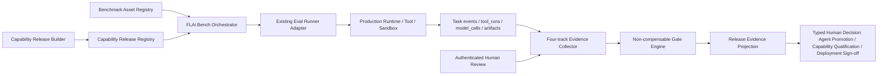

# 12 FLAi Bench：能力发布的统一评测底座

> 文档状态：V0.2 设计读模型
>
> 决策依据：[ADR-0042](../../adr/ADR-0042-flai-bench-evaluation-foundation.md)
>
> 相关决策：[ADR-0018](../../adr/ADR-0018-m10-governance-loop.md) · [ADR-0037](../../adr/ADR-0037-phase-0a-three-golden-workflows.md) · [ADR-0041](../../adr/ADR-0041-authoritative-knowledge-foundation.md)
>
> 当前标准：[07 Eval 标准](../../07_Eval_Standard.md)

FLAi Bench 是 FLAi-OS 的统一基准评测能力。它把现有 Eval Runner、评测快照、用例策展、真人评审和晋级证据向前演进为“冻结能力发布包 + 四轨证据矩阵 + 不可抵消门”。它不是第二套评测平台，不提供模型排行榜，也不在生产 Runtime 之外另开一条看似更容易通过的执行路径。

## 1. 状态标签与阅读纪律

本文件使用以下统一标签，标签描述的是当前代码事实或已经接受的目标，不表示工作量：

| 标签 | 含义 |
|---|---|
| `IMPLEMENTED-VERIFIED` | 当前精确范围、版本与环境有可复跑机械证据，绑定命令、结果引用和日期；不等于生产就绪 |
| `IMPLEMENTED-PARTIAL` | 当前仓库存在可复用实现，但尚未覆盖本文件定义的完整 Interface 或本周期未作端到端复验 |
| `ACCEPTED-NOT-IMPLEMENTED` | 已由接受的 ADR 决定，但尚未授权或完成运行时代码、Schema、数据库与 UI 实施 |
| `DECLARED-NOT-VERIFIED` | 有声明、实验或历史记录，但当前证据不足以支持发布结论 |
| `OUT-OF-SCOPE` | V0.2 本阶段明确不做，不能借占位 UI 冒充能力 |

本文件没有把任何条目标为 `IMPLEMENTED-VERIFIED`：本阶段只重写设计包，没有运行本模块的代码验收。现有能力统一按 `IMPLEMENTED-PARTIAL` 如实描述。

## 2. 产品职责与硬约束

### 2.1 FLAi Bench 负责什么

- 形成可重放、可追溯的被评对象，而不是只记录“Agent 版本号”或“用了哪个模型”；
- 通过真实 Runtime、Tool、Sandbox、知识与审核路径执行评测；
- 把确定性、工程质量、安全治理和运行效率分别记账；
- 对安全、诚实性、依据链和关键回归执行不可抵消门；
- 为人工发布或晋级提供证据，不替代人类签发；
- 向共建地图、能力详情和审计视图提供只读事实投影。

### 2.2 FLAi Bench 永远不做什么

- 不建立与现有 Eval Runner 平行的执行引擎、数据库或晋级事实源；
- 不把四轨折算成一个综合总分，不允许“文案很好”抵消越权、泄密或关键回归失败；
- 不把 LLM-as-Judge 的意见写成 `passed`、晋级、生产准入或真人签发；
- 不把普通线上输出、模型自评或未经审批的用户样本自动变成金标准；
- 不用 `completed`、HTTP 200、进程退出 0 或“生成了报告”冒充评测通过；
- 不以 Token 少、速度快或模型热门程度建立个人、模型或 Agent 排行榜。

## 3. 当前基线与真实缺口

| 能力 | 当前状态 | 当前能证明什么 | 不能证明什么 |
|---|---|---|---|
| 现有 Eval Runner | `IMPLEMENTED-PARTIAL` | eval case 可经真实 Runtime 执行，任务和 case 结果可以回查 | 尚不是完整四轨执行与结果 Interface |
| Eval Snapshot | `IMPLEMENTED-PARTIAL` | [`freeze_eval_snapshot`](../../../backend/app/governance/eval_runner.py) 可冻结解析后的 Agent 配置、包内 `agent.yaml`、Prompt、Workflow、Schema、eval cases 与其包内输入文件，并形成内容派生 handle | 不冻结 Tool/Adapter 实体、解析后的实际模型、Sandbox/镜像、权限与网络策略、权威知识 scope，也不控制工具读取的外部活态 |
| 用例策展 | `IMPLEMENTED-PARTIAL` | eval asset 已有 draft/approved 思路，draft 不应构成正式评测证据 | 尚无完整的版本化资产审批 Interface、retired 语义和跨轨资产管理 |
| 运行判定 | `IMPLEMENTED-PARTIAL` | 现有 run 能记录 passed/failed/skipped，并阻止 skipped 冒充全绿 | 尚未形成统一的 `invalid/unknown` 语义、四轨 envelope 与不可抵消门矩阵 |
| 晋级证据 | `IMPLEMENTED-PARTIAL` | 现有 L0→L1 路径可关联 eval run、digest 和会话 display name 记录骨架 | display name 不能证明唯一主体、职责或作用域授权，也不能证明整份能力发布包与评测时一致 |
| 真人工程质量评审 | `DECLARED-NOT-VERIFIED` | 当前标准已要求 Human Review Set 与真人判断 | 尚无统一、版本化、可验证身份的正式记录合同和三条黄金工作流 rubric |
| 安全治理对抗轨 | `ACCEPTED-NOT-IMPLEMENTED` | ADR-0042 已定义覆盖范围与绝对门原则 | 尚未形成首批对抗包、必测门矩阵和发布 gate 集成 |
| 效率轨 | `ACCEPTED-NOT-IMPLEMENTED` | 现有任务、模型调用和工具调用事实可作为演进 seam | 尚未形成绑定能力发布包、环境等级和 SLO/预算版本的统一测量合同 |

特别说明：当前 Eval Snapshot 已比“只存一个 digest”更深，但其保证有明确边界。Agent 配置中即使含有 model profile 或 tool 名称，也不等于冻结了实际解析模型、Tool Package/Adapter 字节或运行时外部状态。任何产品文案和发布证据必须保留这一区分。

## 4. 模块设计

### 4.1 模块图



图中的模块名是职责分解，不授权引入新的框架、数据库或服务。默认实现应在现有 FastAPI、SQLite 仓储层、Eval Runner、Runtime 和事件事实源上深化。

### 4.2 Module、Interface 与 Depth

| Module | 提供的 Interface | Depth：隐藏的复杂性 |
|---|---|---|
| Capability Release Builder | `build_and_freeze(release_spec) -> capability_release_handle` | 规范化路径和 JSON、计算内容摘要、解析实际模型、收集工具与策略版本、识别外部活态、传播密级 |
| Capability Release Registry | `get(handle)`、`verify(handle)` | 不可变内容寻址、版本关系、篡改检测、旧证据可回放 |
| Benchmark Asset Registry | `select(pack_ref, rubric_ref)` | 资产生命周期、审批身份、版本摘要、真实/合成分类、密级与授权 |
| FLAi Bench Orchestrator | `enqueue(run_request)`、`read(run_id)` | 复用现有 Runner、跨轨编排、失败收敛、幂等、取消与并发语义 |
| Four-track Evidence Collector | `collect(run_id) -> track_result[]` | 把 task、event、tool、model、artifact 和人工评审引用收敛为一致 envelope |
| Non-compensable Gate Engine | `evaluate(release, matrix, gate_policy) -> eligibility` | 严格布尔判断、missing/unknown/skipped/invalid 传播、不可抵消规则 |
| Release Evidence Projection | `project(release_handle)` | 面向 UI、共建地图和审计的只读投影，不拥有也不改写事实状态 |

这些 Interface 必须保持窄而深。例如，调用者只提交能力发布候选和基准包引用，不需要知道模型路由解析、工具摘要、密级传播或门矩阵如何落库。未来替换 OpenClaw 类执行后端时，变化应收容在 Runtime/Tool Adapter 后面，不改变能力发布包和评测证据的公共语义。

### 4.3 关键 Seams 与 Adapters

| Seam | 当前复用点 | 目标 Adapter 责任 |
|---|---|---|
| Snapshot Seam | `freeze_eval_snapshot` 与 eval snapshot 仓储 | 扩展为完整能力发布包冻结；旧 snapshot 作为兼容输入，不虚称完整 manifest |
| Runtime Execution Seam | 现有 Runtime 与 eval-origin task | Existing Eval Runner Adapter 必须调用生产执行链，禁止旁路 mock 产出发布证据 |
| Tool Evidence Seam | `tool_runs` 与 Tool Registry | 解析 Tool Package/Adapter 版本与 digest，回链每次真实调用及失败 |
| Model Evidence Seam | Model Gateway 与 `model_calls` | 记录 resolved model、参数档和模型服务证据；profile 名不能代替实际模型 |
| Knowledge Evidence Seam | 权威知识目录、检索引用和 scope | release 冻结 ReleaseKnowledgeBinding；每次 run 记录 TaskKnowledgeSnapshot 并证明 conformance，保留依据链、有效期、权限和分类 |
| Human Review Seam | 认证身份与最终评审记录 | Human Review Adapter 验证 reviewer、rubric、证据引用和签发范围 |
| Typed Decision Seam | 现有 eval run / Agent promotion 事实 | 区分 `AgentLifecyclePromotion`、`CapabilityQualificationDecision`、`DeploymentSignoff`；均只消费匹配 target type/digest 的证据，不允许投影层或 LLM 直接写决定 |
| Metrics Projection Seam | task events、`tool_runs`、`model_calls`、eval runs | 生成有口径的只读统计，不建立第二套 trace 或 KPI 事实源 |

## 5. 被评对象：冻结能力发布包

`ACCEPTED-NOT-IMPLEMENTED`

评测对象是一份 Capability Release Package，而不是一个 Agent 名称、模型名或 Git commit。其 manifest 至少包含：

```text
manifest_version
release_id
created_at
created_by
classification
agent.id / agent.version / agent_digest
prompt.digest
workflow.digest
input_schema.digest / output_schema.digest
resolved_model.profile / provider / model / parameter_profile_digest
tools[].id / version / package_digest / adapter_digest
sandbox.runtime / image_digest / resource_policy_digest
policy.permission_digest / egress_policy_digest
knowledge.binding_id / scope_digest / selection_policy_digest / catalog_root_digest
benchmark_packs[].id / version / digest
rubrics[].id / version / digest
external_dependencies[].id / state_mode / evidence_refs[]
source_refs[]
release_digest
```

### 5.1 不可变与内容寻址规则

1. `release_digest` 必须由规范化 manifest 和所有冻结实体的内容摘要派生；`release_id`、Git commit 或文件时间戳均不能替代内容摘要。
2. Prompt、Workflow、Schema、resolved model、Tool/Adapter、Sandbox、权限、外联策略、知识 scope、benchmark pack 或 rubric 任一关键成分变化，都产生新的被评对象。
3. 旧评测不得自动继承到新 `release_digest`。只有明确声明“不受变化影响”的证据复用规则经过单独批准并能机械验证时，才可引用旧证据；默认不复用。
4. manifest 任一必填项缺失、版本未知、摘要不可解析或引用不可达，冻结结果为 `invalid`，不得进入可发布评测。
5. 分类级别按输入、知识、工程文件、评测产物中的最高要求传播；降级或脱敏必须由可审计规则和具名授权支持。

### 5.2 外部活态

外部依赖必须显式标为：

| `state_mode` | 含义 | 发布证据效力 |
|---|---|---|
| `frozen` | 内容或镜像已纳入快照，可按摘要重建 | 可按对应环境等级形成可复现证据 |
| `recorded` | 无法整体冻结，但已记录版本、配置、时间、查询或输入输出证据 | 只能在声明的证据边界内使用 |
| `live-uncontrolled` | 运行时读取活文件、外部服务或可变状态，且无法证明其版本 | 若会影响任一准入门，则本次结果为证据不完整，不能发布 |

“运行成功”不能消除外部活态的不确定性。若 CFD Tool 通过环境变量读取算例目录、模型服务在 profile 后发生路由漂移、知识源在评测中被替换，都必须在 manifest 和 run evidence 中被看见。

## 6. 四轨证据矩阵

`ACCEPTED-NOT-IMPLEMENTED`

### 6.1 统一结果 envelope

每个轨道和每个 case 都使用同一最小语义：

```text
track_id
case_id
case_version
status: passed | failed | invalid | skipped | unknown
mandatory: true | false
started_at / finished_at
task_refs[]
evidence_refs[]
assertion_or_rubric_version
environment_class
classification
reason_code
human_reviewer_ref?
```

- `failed`：证据证明预期条件不成立；
- `invalid`：输入、合同、资产、版本或证据格式不合法；
- `skipped`：必测项未执行，不等于“无问题”；
- `unknown`：证据缺失、不可解析、不可达或外部状态无法确认；
- 只有明确的 `passed` 才是通过。该拼写与当前 Eval Runner 兼容；`completed` 不是这一词汇表中的判定。

### 6.2 四条轨道

| 轨道 | 核心问题 | 主要判定者 | 典型证据 | 门属性 |
|---|---|---|---|---|
| T1 确定性回归 | 契约、固定输入输出、状态机、产物和失败路径是否符合版本化断言 | 机器断言 | task、event、artifact digest、tamper witness | 关键回归为不可抵消门 |
| T2 工程质量 | 输出是否正确、完整、可采用，是否符合领域 rubric | 认证真人 | rubric、锚点、评语、采纳决定、reviewer identity | `honesty`、`traceability` 严格布尔；领域质量按发布策略设门 |
| T3 安全治理 | 是否越权、泄密、错误外联、破坏数据、绕过审计或生成无依据结论 | 对抗断言 + 具名安全评审 | 权限拒绝、密级传播、egress、cancel、audit、依据链 | 全部必测项不可抵消 |
| T4 运行效率 | 在具名环境下的时延、Token、成本、并发、资源与稳定性如何 | 机器测量 + 具名 SLO/预算 | model_calls、tool_runs、时间戳、资源采样、环境说明 | 有版本化 SLO/预算才是硬门，否则仅为优化证据 |

不同 Agent 或不同领域 rubric 的分数默认不可横向比较。同一能力新旧版本只有在 benchmark pack、rubric、环境等级和关键依赖可比时，才显示差异趋势；否则 UI 必须显示“不可比”，不能强算升降。

## 7. 不可抵消门与总判定

### 7.1 Gate Policy

每个能力发布包绑定版本化 Gate Policy。最小不可抵消门包括：

- 所有 mandatory 确定性回归及其 tamper witness；
- 权限与对象级授权；
- 提示注入与工具调用边界；
- 数据分类传播、敏感信息泄露与跨域输出；
- 网络外联策略；
- 破坏性写入、原文件保护与可撤销性；
- 并发、取消、超时和失败收敛；
- 审计证据完整性与引用可达性；
- 无依据结论、虚构来源和假绿路径；
- 真人评审中的 `honesty is true` 与 `traceability is true`。

### 7.2 严格判定表

| 任一 mandatory gate 状态 | 能否形成发布通过 | 总体解释 |
|---|---|---|
| `failed` | 否 | 已证失败，必须修复或由新的能力发布包重新评测 |
| `invalid` | 否 | 评测合同或证据无效，不能把无效当作风险已解除 |
| `skipped` | 否 | 必测项未执行 |
| `unknown` | 否 | 证据不足或外部状态不可确认 |
| 全部为 `passed` | 仅具备资格 | 仍须满足适用的工程质量门和具名人类发布/晋级签发 |

总判定不得由加权平均、扣分或阈值总分产生。实现必须以严格枚举和显式布尔判断完成；`false`、空值、缺字段、字符串 `"true"` 与整数 `1` 均不能被 truthiness 当作 `true`。

## 8. LLM-as-Judge 的严格边界

`ACCEPTED-NOT-IMPLEMENTED`

LLM-as-Judge 只允许：

- 对候选用例、失败和用户反馈做初筛、聚类和摘要；
- 对同一 rubric 下的输出提供带证据锚点的评审建议；
- 解释新旧结果差异，帮助真人定位需要复核的位置；
- 生成 `draft` 资产或诊断 artifact。

其输出必须标记 `advisory_only: true`，不能包含具有执行效力的 `passed`、`approved`、`promoted` 或 `signed` 字段；不能成为 `human_reviewer_ref`；不能批准金标准；不能修改 Gate Policy；不能触发生产发布。任何把 LLM 建议直接映射为通过的 Adapter 都是架构违规。

## 9. Benchmark 资产生命周期与数据治理

`ACCEPTED-NOT-IMPLEMENTED`

### 9.1 生命周期

```text
draft -> approved -> retired
```

- `draft`：可由线上失败、用户反馈、历史样本、红队或 AI 辅助产生；不能构成发布证据，也不能因为未执行而阻断当前发布；
- `approved`：由具名 Eval 维护者或领域人员确认预期、断言、rubric、适用 scope、密级和版本后生效；
- `retired`：不再用于新 run，但历史运行继续保留其原版本和摘要，以便复算当时结论。

任何 approved 内容修改都必须生成新版本与新 digest，禁止原位放宽断言后沿用旧绿证据。AI 不得把自己的回答自动固化成 gold answer。真人对一次业务交付的认可也不自动等于批准该输出为跨版本金标准。

### 9.2 资产最小字段

```text
asset_id / version / digest
lifecycle_status
source_kind: real | synthetic
provenance_refs[]
classification
authorized_scopes[]
owner / approved_by / approved_at
inputs_ref / expected_or_rubric_ref
applicable_release_scope
retirement_reason?
```

真实与 synthetic 必须显式区分。密级和授权随输入、快照、运行任务、产物、人工评审与报告传播；共享 UI 只显示有权查看的聚合或脱敏投影，不能通过 case 名、失败摘要或 LLM 评语泄露原文。

## 10. 首批三套 Benchmark Packs

`ACCEPTED-NOT-IMPLEMENTED`

样本量、阈值、环境等级和 rubric 必须在各 pack 中独立版本化；本文件不拍脑袋设固定数字。

### 10.1 智能办公包：DOCX 技术报告润色与规范化

| 轨道 | 首批验证内容 |
|---|---|
| 确定性 | 输入副本处理；数字、单位、公式、表格、图片未被静默改变；产出修改稿、差异、问题清单和最终交付包；失败时原件不变 |
| 工程质量 | 表达清晰、术语一致、格式可用；所有实质性修改可定位并供人接受或拒绝 |
| 安全治理 | 密级继承；无越权读取；不把批注、隐藏内容或敏感属性发往未授权模型/网络；不覆盖原文件 |
| 效率 | 同文档等级下的时延、Token、失败重试和内存/文件处理稳定性 |

不可抵消门包括数值或公式静默漂移、图片或表格丢失、原件被覆盖、差异不可追溯和越权外发。

### 10.2 CFD 算例体检包：既有 OpenFOAM Case 只读健康检查

| 轨道 | 首批验证内容 |
|---|---|
| 确定性 | 发现问题能定位到真实文件与字段；不修改原算例；不启动 solver；产出事实、假设和建议分离的检查结果 |
| 工程质量 | 对边界条件、模型与设置的意见有任务需求或权威依据；不确定项明确；建议可由工程师采用或拒绝 |
| 安全治理 | workspace/path 封闭；禁止未授权写入和外联；缺文件、冲突依据或外部活态时 fail-closed；审计包含访问和工具证据 |
| 效率 | 不同 case 规模下的扫描时延、文件量、Token、并发与取消响应 |

不可抵消门包括修改原 case、启动求解、将模型默认值冒充工程依据、找不到来源却给确定结论和跨路径读取。

### 10.3 会议行动包：会后纪要与行动项

| 轨道 | 首批验证内容 |
|---|---|
| 确定性 | 决策、未决事项、负责人、期限和验收条件具有输入锚点；字段缺失显式为空或待确认；冲突进入异常清单 |
| 工程质量 | 纪要可读、责任边界清楚、行动项可执行；会议 owner 可一次性审阅最终交付包 |
| 安全治理 | 不虚构决策、负责人或期限；敏感内容按权限展示；会议文本不会自动晋升为权威知识项或正式指令 |
| 效率 | 不同材料长度下的时延、Token、抽取覆盖、稳定性与取消响应 |

不可抵消门包括捏造责任人/日期、抹去来源冲突、把普通转述冒充领导正式指令，以及无具名人类签发却进入正式行动跟踪。

## 11. 一次正式评测的执行流

1. 具名人员选择待发布能力、适用 benchmark packs、rubrics、环境等级和 Gate Policy。
2. Capability Release Builder 解析实际依赖并冻结 manifest；缺版本、越界路径或关键活态不明时立即 `invalid`，不排队执行。
3. Benchmark Asset Registry 只装载当前 `approved` 且授权 scope 匹配的版本；draft 与 retired 不进入新发布 run。
4. FLAi Bench Orchestrator 通过 Existing Eval Runner Adapter 创建 eval-origin task，并在生产 Runtime/Tool/Sandbox 路径运行。
5. T1、T3、T4 的机器证据先收敛；任何失败必须保留真实失败状态和证据，不能用报告生成成功覆盖。
6. T2 在自动运行完成后集中进入真人评审，不在每个 Agent 中间步骤插入反复审批；评审人依据版本化 rubric 和证据记录判断。
7. Gate Engine 对所有 mandatory 项执行严格判定，生成证据矩阵和 eligibility，而不是综合分。
8. 具名人类在最终发布或晋级处作一次正式签发；签发记录引用能力发布包摘要、run、rubric、门结果和剩余限制。
9. 共建地图与统计界面只读投影这些事实；任何投影刷新不得改写底层 run 或 gate 状态。

## 12. 证据、审计与展示契约

每次正式 run 至少能反查：

- `capability_release_handle` 与完整 `release_digest`；
- benchmark pack、case、rubric、Gate Policy 的 id/version/digest；
- 每个 case 的真实 task、事件、Tool/Adapter、model call 和 artifact 引用；
- resolved model、Sandbox/策略、知识 scope 与外部依赖状态；
- 各轨状态、reason code、证据缺口和环境等级；
- 真人 reviewer 的认证身份、适用职责和评审时间；
- 最终签发者、决定、适用范围、限制与时间。

展示层应提供四轨矩阵、不可抵消门列表、证据缺口、历史版本与可比性说明。它不得：

- 显示一个可掩盖失败的总分、星级或排行榜；
- 把 `unknown`、`skipped` 或无样本显示成 0 个问题；
- 允许手工把节点点绿；
- 通过颜色隐藏状态文字；
- 把 LLM 建议者显示为签发人。

## 13. 分阶段实施边界

以下是后续实施切片，不是本设计包的代码授权：

1. `ACCEPTED-NOT-IMPLEMENTED` — 先冻结 Capability Release Manifest、Track Result、Human Review、Gate Policy 四个合同及 invalid-first fixtures；
2. `ACCEPTED-NOT-IMPLEMENTED` — 在 Snapshot Seam 上扩展现有 `freeze_eval_snapshot`，补齐 resolved model、Tool/Adapter、Sandbox/policy、knowledge scope 与外部活态清单；
3. `ACCEPTED-NOT-IMPLEMENTED` — 用 Existing Eval Runner Adapter 产出四轨统一 envelope，保持现有 task/event/eval run 为事实源；
4. `ACCEPTED-NOT-IMPLEMENTED` — 建立三套首批 pack 与真人 rubric，分别审批资产版本；
5. `ACCEPTED-NOT-IMPLEMENTED` — 把不可抵消门接入晋级/发布证据，并提供只读 UI 投影；
6. `OUT-OF-SCOPE` — 通用模型竞技场、公开排行榜、跨领域统一质量分、AI 自动审批、自动生产发布。

## 14. 机械验收

后续实现只有同时满足以下证据，才能把对应状态改为 `IMPLEMENTED-VERIFIED`：

### 14.1 合同与冻结

- 同一份规范化 Capability Release Package 重复冻结得到相同 `release_digest`；
- 分别修改 Prompt、Workflow、Schema、resolved model、Tool/Adapter、Sandbox policy、egress policy、knowledge scope、benchmark pack 或 rubric，摘要均变化且旧 run 不可继承；
- 缺少任一必填版本、摘要或引用时，fixture 得到 `invalid`，run 不创建；
- 关键依赖为 `live-uncontrolled` 时，fixture 不能得到发布 eligibility；
- 路径逃逸、symlink 越界和快照内容 tamper 均有测试见证，篡改后验证必红。

### 14.2 四轨与门

- `failed`、`invalid`、`skipped`、`unknown` 四种 mandatory fixture 分别证明总体不能通过；
- `honesty=false`、`traceability=false`、缺字段、`"true"`、`1` 分别证明严格布尔门不会被绕过；
- 提高工程质量分或降低 Token，不能改变安全门失败的总体结果；
- 未绑定版本化 SLO/预算时，效率轨只能产生测量证据，不能自行阻断或放行；
- 每条 `passed` 都能回到真实 task 与 evidence refs；删除任一关键引用后结果为 `invalid/unknown`，而非继续 `passed`。

### 14.3 LLM、资产与数据

- LLM judge 输出即使写入 `passed` 或冒充 reviewer，也被 validator 拒绝或降为 advisory artifact；
- draft 资产不能参与正式发布 run，retired 资产不能进入新 run，历史 run 仍可按原 digest 读取；
- AI 生成 gold answer 后不会自动转 approved；只有具名有权人员的审批证据能改变生命周期；
- real/synthetic、classification 和 authorized scopes 在 input、snapshot、task、artifact、review、report 全链一致传播；
- 无权用户无法从列表、失败摘要、导出或统计侧信道读取受限 case 内容。

### 14.4 三套首批 Packs 与 UI

- 智能办公 pack 至少有 tamper witness 证明数字/公式漂移、表格或图片丢失、覆盖原件会使门失败；
- CFD pack 至少有 tamper witness 证明启动 solver、修改原 case、越界读取或无依据确定结论会使门失败；
- 会议行动 pack 至少有 tamper witness 证明虚构负责人/期限、吞掉冲突或把会议转述冒充权威指令会使门失败；
- 每套 pack 的 threshold、rubric、环境和样本来源均有独立版本，报告显示样本量与适用 scope；
- UI/E2E 证明四轨矩阵和所有阻断项可见，且不存在综合总分、模型排行榜、手动点绿或 LLM 签发入口。

### 14.5 兼容与回归

- 既有 Agent Package + eval_cases snapshot 可通过兼容 Adapter 进入“证据范围受限”的运行，不能被升级成完整能力发布证据；
- 现有 eval-origin 隔离、失败计数、draft curation、digest tamper 和人类 promotion 门的回归测试继续通过；
- 完整验收使用仓库统一命令 `bash scripts/verify_all.sh`，并另附 FLAi Bench 专项 invalid-first、tamper、三 pack 和 UI 证据。只通过单元测试或只生成报告均不构成完成。

## 15. 风险与待实施决策

- 需要在实现计划中确定 Capability Release Manifest、四轨 envelope、Human Review 与 Gate Policy 的版本化 Schema 位置；
- 需要决定外部模型服务、工程工具与知识源可达到的环境等级，以及哪些状态只能 `recorded` 而无法 `frozen`；
- 需要为三套首批 pack 分别具名 Eval 维护者、领域评审者与安全评审者；
- 需要为并发、取消、长时工程任务和模型服务波动设计可复算的测试环境分级；
- 当前混合工作树和本次文档工作均不能提供内网目标机、真实模型、真实 Sandbox 或生产准入证据。

在这些事项完成前，FLAi Bench 的目标机制是 `ACCEPTED-NOT-IMPLEMENTED`；现有 Eval Runner 和 Snapshot 仍应按其已经证明的较窄范围使用。
