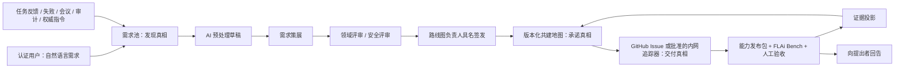

# 13 FLAi 共建地图与需求共创闭环

> 文档状态：V0.2 设计输入
>
> 决策状态：`ACCEPTED-NOT-IMPLEMENTED`
>
> 适用范围：FLAi-OS Phase 0A/0B 产品发现、路线图签发、交付追踪与全员进展展示
>
> 决策依据：[ADR-0059](../../adr/ADR-0059-co-building-map-and-evidence-derived-metrics.md)、[ADR-0060](../../adr/ADR-0060-demand-co-creation-loop.md)、[ADR-0061](../../adr/ADR-0061-demand-decision-rights-and-roadmap-signoff.md)、[ADR-0062](../../adr/ADR-0062-feishu-single-organizational-hub.md)

## 1. 目的与非目标

FLAi 共建地图回答两个问题：

1. 我们正在共同建设什么，当前已经有哪一版真实可用能力；
2. 每一项路线图承诺来自哪些真实需求，又由哪些发布、评测、人签和运行事实证明。

它是全体参与者可见的**只读证据投影**，不是第二套项目管理平台，也不是普通用户的治理控制台。用户可以从地图进入需求、能力发布和证据的适当视图，但不能在地图上直接修改任务、评测、授权、知识、发布或路线图状态。

本设计明确不做：

- 不用手填百分比、拖拽卡片或修改颜色的方式维护进度；
- 不以注册人数、页面访问量、点赞数、Token 数量或模型评分制造“繁荣度”；
- 不建立个人任务量、个人 Token、个人节时或生产力排行榜；
- 不让 AI、需求策展人、交付负责人或全局管理员代替路线图负责人签发；
- 不把每条反馈自动转成路线图节点或 GitHub Issue；
- 不把 GitHub Issue 的关闭、代码合并或任务 `completed` 冒充用户需求已经解决；
- 不在本设计阶段授权数据库、API、前端、通知连接器或外部 Issue 写操作。

## 2. 状态诚实度

本文件使用以下统一标签区分“现在有什么”和“已决定要做什么”：“现在有”只表示仓内可定位实现，不表示已经满足本文件的完整验收。

| 标签 | 含义 | 本领域事实 |
|---|---|---|
| `IMPLEMENTED-VERIFIED` | 当前精确范围、版本与环境有可复跑机械证据，绑定命令、结果引用和日期；不等于生产就绪 | 本文件不声明任何完整共建地图或需求闭环达到该状态 |
| `IMPLEMENTED-PARTIAL` | 存在可复用实现，但合同或覆盖不完整 | Today 页面、`GET /api/stats/overview`、任务反馈、任务事件、工具/模型调用事实、评测与晋升记录、GitHub Issue 约定 |
| `ACCEPTED-NOT-IMPLEMENTED` | 已由 ADR 接受，尚未形成完整运行能力 | 共建地图、指标定义注册表、需求池、AI 预处理草稿、策展/评审/路线图签发、三层引用闭环、回告机制 |
| `DECLARED-NOT-VERIFIED` | 有声明但缺少足够新鲜证据 | 不得用于点亮地图节点或对外宣称价值 |
| `OUT-OF-SCOPE` | 本阶段明确不做 | 个人排行榜、投票晋级、AI 自动排期、自动发布权威知识、普通用户治理后台 |

## 3. 产品位置

默认入口改为飞书 FLAi 工作空间的工作收件箱。普通用户首页只展示共建地图摘要：当前路线图版本、本周真实解锁能力、下一目标、近期里程碑和“提交需求”入口；完整地图是同一飞书工作空间中的只读空间。治理与运行职责可以在相同节点上查看更多评测、风险、授权和审计证据，但仍通过 Hub typed intent 调用对应 owner Module，不能在 Bitable 或投影层写回事实源。



## 4. 共建地图的信息结构

### 4.1 五层主干

地图使用固定的五层关系，不把列表、看板和组织架构混在一起：

```text
战略目标
  └── 基础能力（平台地基）
        └── 黄金工作流
              └── 能力发布包
                    └── 证据
```

| 层级 | 表达内容 | 允许的权威来源 | 禁止冒充的内容 |
|---|---|---|---|
| 战略目标 | 组织为什么建设此能力、目标范围和有效期 | 具名路线图负责人签发的路线图版本；经权威知识底座确认的正式指令 | AI 总结、会议转述、热度排名 |
| 基础能力（平台地基） | 知识、Benchmark、Sandbox、审计、模型网关等复用基础能力 | 能力发布事实、适用安全门、生产准备证据 | 原型截图、待办项数量 |
| 黄金工作流 | 智能办公、CFD 工程辅助、会议行动等用户价值流 | 已签发路线图节点及其目标发布范围 | 单个 Agent 的自我描述 |
| 能力发布包 | 冻结的版本、适用范围、限制、运行依赖和退役关系 | CapabilityReleasePackage | 当前分支、代码合并、未冻结配置 |
| 证据 | FLAi Bench、人工签发、生产准备、采用、反馈与安全事实 | 原始事实源的稳定引用和摘要投影 | LLM 自评、手工填绿、无来源百分比 |

地图上的每条关系必须有稳定标识和版本。一个父节点不得因为部分子节点通过就显示笼统的“全部完成”；父节点应显示各目标版本、证据覆盖和剩余缺口。

### 4.2 版本化路线图

路线图不是可被原位覆盖的当前表格。每次签发形成不可变 `RoadmapVersion`：

```yaml
roadmap_version_id: roadmap_2026_phase0a_v3
previous_version_id: roadmap_2026_phase0a_v2
scope: phase0a
effective_at: 2026-07-23T00:00:00+08:00
signed_by: user_ref
signed_at: 2026-07-23T00:00:00+08:00
change_reason: "具名且可读的变更理由"
source_candidate_refs: []
node_refs: []
signature_evidence_ref: evidence_ref
```

历史版本永久可查。更改优先级、里程碑、范围、接受/暂缓决定或节点关系必须产生新版本和追加事件，不能覆盖旧承诺。路线图负责人签发的是一个明确作用域和版本，不获得跨作用域的永久全局权力。

### 4.3 节点状态只能由证据派生

建议的展示状态如下；具体枚举由实现合同固定，但语义不得弱化：

| 展示状态 | 必须满足的最小事实 | 展示原则 |
|---|---|---|
| `计划中` | 节点存在于已签发路线图版本，尚无有效交付活动证据 | 不显示完成百分比 |
| `进行中` | 有窗口内新鲜的 task/build/active lease 等执行事实；Issue 只能提供规划关联，不能单独证明正在执行 | 只有 Issue open/in-progress 时仍显示计划中或未知，不制造假进度 |
| `证据待补` | 已有候选发布或实现，但缺少适用 Benchmark、签发、生产准备或证据不可解析 | 用 amber/中性提示，不给绿色 |
| `受阻` | 适用安全门明确为 false，或存在未解除的硬依赖/阻断 Issue | 展示具名阻断原因和可见证据 |
| `已验证可用` | 冻结能力发布包、适用 FLAi Bench 非补偿式门、人类签发、目标部署范围与生产准备证据全部成立 | 绿色只属于当前明确版本与范围，不外推到未来版本 |
| `未知` | 必需事实缺失、冲突、过期、权限不足或无法解析 | fail-closed；未知绝不转成 0 或“默认正常” |
| `已退役` | 有具名退役决定和替代/影响说明 | 历史证据保留，不从地图事实中删除 |

投影器是一个只读 `MapProjection` Implementation。它通过证据 Interface 读取事实，并按版本化规则计算状态；前端只渲染投影结果，没有 `setGreen`、`setProgress` 或等价写入口。规则变更必须升级 `derivation_version`，旧版本仍可复算。

“新鲜”必须由版本化 `freshness_policy` 定义事件类型、最大年龄、时钟来源和失效行为；证据过期或时钟未知时降为 `计划中/未知/证据待补`，不能沿用昨日的运行态。Issue 状态只证明已有工程计划，不参与运行 freshness 判定。

对一个已经可用的当前版本和一个受阻的目标版本，必须同时显示“当前 v1 已验证可用 / 目标 v2 受阻”，不能让未来阻断抹掉当前能力，也不能让 v1 的绿色借给 v2。

## 5. 指标合同

### 5.1 通用 Metric Envelope

任何公开数字进入共建地图前都必须经过 `MetricDefinitionRegistry` Interface。没有定义版本的 SQL 聚合、前端本地统计或人工填写值不得展示为正式指标。

```yaml
metric_id: adoption.active_users
definition_version: "1.0.0"
title: "活跃使用人数"
category: adoption
since: 2026-07-01T00:00:00+08:00
until: 2026-08-01T00:00:00+08:00
timezone: Asia/Shanghai
scope_ref: phase0a
source_refs:
  - facts://tasks
formula_ref: metric://adoption.active_users/1.0.0
numerator: 12
denominator: null
sample_count: 12
value: 12
unit: authenticated_user
value_state: measured
coverage: 1.0
suppression_reason: null
purpose: product_improvement_and_capacity
minimum_group_size: 5
retention_policy_ref: retention://team-metrics/v1
allowed_projection: team_only
export_policy_ref: export://aggregated-metrics/v1
generated_at: 2026-08-01T00:05:00+08:00
```

强制字段与语义：

- `definition_version`：口径变化必须升版，不能回算后覆盖历史；
- `since` / `until` / `timezone`：窗口必须闭合且可复现；
- `source_refs`：指向事实源和查询快照，不只写一段文案；
- `numerator` / `denominator` 或 `formula_ref`：比例和推导数必须可重算；
- `sample_count`：样本不足时仍如实显示，不用空白掩盖；
- `value_state`：至少区分 `measured`、`unknown`、`not_applicable`、`suppressed`；
- `value=0` 只在事实完整且计算结果确实为零时成立；
- 裸 `null` 没有业务语义，必须与 `value_state` 和 reason 一起返回；
- 权限不足或小样本隐私抑制使用 `suppressed`，不得显示成 0；
- 事实缺失、口径未建立或证据冲突使用 `unknown`，不得估算补齐。
- `purpose` 只允许容量、安全、产品改进和经批准的组织价值分析；禁止个人绩效、纪律评价或强迫采用；
- `minimum_group_size`、保留期、允许投影和导出策略必须版本化；具名下钻只对事件处置/数据质量等明确目的、具备相应 scope 的治理角色开放并留审计；
- 团队聚合导出仍要重新鉴权、再次执行小样本抑制并带口径/窗口；不得导出可拼接回个人的明细或长期保存超出 retention policy 的数据。

### 5.2 五类指标

| 类别 | 可展示内容 | 主要事实源 | 不得做的推断 |
|---|---|---|---|
| 当前能力 | 当前发布版本、已验证范围、限制、退役状态 | 能力发布包、Benchmark、签发、生产准备 | 以代码存在推断生产可用 |
| 使用采纳 | 活跃使用人数、复用人数、真实任务终态、工作流分布 | `tasks` 及经批准的真实工作事件 | 注册数/访问量/eval 任务冒充活跃 |
| 质量安全 | 各 Benchmark 门、人工评审、线上失败、审计违规、退修 | FLAi Bench、反馈、任务/安全事件 | 压成可互相补偿的单一质量分 |
| 资源消耗 | Token、模型/工具调用、时延、并发、稳定性、适用时的估算成本 | `model_calls`、`tool_runs`、任务时间戳、资源遥测 | Token 冒充贡献度；缺 Token 当 0 |
| 组织价值 | 有基线的方法下区间化节时、覆盖率、返工减少等 | 版本化基线、人工抽样、可比较任务证据 | LLM 自评或 Agent 运行时长推导节时 |

### 5.3 活跃使用人数

`active_user` 的 V0.2 默认口径是：在指定窗口和作用域内，至少产生一次合格真实工作行为的**不同认证用户**。

合格行为必须同时满足：

1. 来源为真实 `user-origin` 工作，而不是 eval、测试、演示注水、迁移或系统保活；
2. 认证身份可解析且在统计作用域内；
3. 行为类型位于版本化 allowlist，Phase 0 默认从真实用户任务开始；
4. 重试、轮询、同一任务事件和页面访问不增加用户数；
5. 被删除/遮蔽的身份仍按隐私政策聚合，但不能重复计数。

注册账号、登录次数、页面浏览和最近 100 条前端窗口都不是正式活跃口径。身份或 origin 缺失时报告覆盖缺口，不将其归入匿名用户后猜测人数。

### 5.4 Token 与成本

- Token 统计逐条读取真实 `model_calls`，按 resolved model、调用状态和时间窗口归集；profile 名不能替代实际模型身份。
- 对缺失 usage 的调用报告“已知 Token 合计 + usage 覆盖率 + 缺失调用数”，不能把缺失值加为 0 后声称完整总量。
- 失败或重试若真实消耗 Token，应依事实计入，并保留 attempt 维度，不能只计最终成功行。
- 团队视图只展示适当聚合；Token 是资源成本，不是个人贡献、工作量或绩效。
- 估算成本只有在 `PriceTableVersion` 同时匹配实际模型、计价单位、币种、适用时间和部署方式时才能计算。
- 存在未匹配调用时，必须显示已覆盖成本与覆盖率；不能用当前价格倒填历史，也不能把未知成本显示为 0。

### 5.5 节省时间

节时指标需要一份具名、版本化的 `TimeSavingBaseline`：

```yaml
baseline_id: office_doc_polish_v1
method_version: "1.0.0"
task_class: office.docx_polish
population_scope: phase0a_pilot
baseline_source: observed_or_human_confirmed
baseline_sample_count: 18
assisted_sample_count: 12
human_reviewed_sample_count: 12
range_method: documented_method_ref
valid_from: 2026-07-01
approved_by: user_ref
```

平台只接受可比较任务类型的人工工时基线与辅助后实际人工投入。Agent 运行时长不是人工投入，LLM 评价也不是基线。输出必须是区间和覆盖率，例如“预计节省 42–58 小时，覆盖 27 个有效样本”；样本不足或方法未批准时显示“尚未建立基线”。采样通过阶段性轻量回访、既有任务证据或专门试点完成，不在每次 Agent 会话中插入复杂表单。

### 5.6 隐私与小样本

全员地图仅展示团队聚合。个人任务、需求、反馈、节时样本和资源明细只对本人及获授权治理职责可见。`PrivacyAggregationPolicy` 必须定义最小分组、抑制、合并和脱敏规则；当小样本足以反推个人或敏感项目时，返回 `value_state=suppressed` 和可公开理由。任何跳转到证据详情的链接都要重新鉴权，不能因为聚合页面可见就获得底层明细权限。

## 6. 低摩擦需求入口

### 6.1 用户提交体验

任何认证试点用户都可以用一段自然语言提交需求，不要求先填写 PRD、评分矩阵或完整验收表。入口可以来自工作台全局按钮、任务反馈、失败页、会议行动结果或地图页面；平台自动绑定认证身份、时间、来源类型和已有上下文。

最小提交仅需要：

```yaml
original_text: "用户原话，不能为空"
source_type: proactive_request | task_feedback | task_failure | meeting_decision | audit_finding | repeated_manual_work | authoritative_directive
context_refs: []       # 可选：task/conversation/file/screenshot/evidence
display_identity: team | private
```

缺少更多信息不阻断提交。补证据请求在后续异步聚合，不得打断正常 Agent 工作流。附件及上下文自动继承原任务/文件密级，不能由用户通过选择较低密级降级。

`authoritative_directive` 只有在权威知识底座中存在可验证的正式指令版本、签发者、效力范围和精确锚点时才成立。普通会议记录、聊天转述和 AI 摘要只能按各自真实来源进入需求池，不能冒充领导正式指令。

### 6.2 原始需求不可变

`DemandSignal` 保存发现事实：认证提出者、原始文字、时间、来源、上下文引用、初始分类和内容摘要 digest。创建后不允许 UPDATE/DELETE；纠错、撤回、补证据、身份展示偏好变化都通过 `DemandEvent` 追加表达。法规允许的删除请求通过内容遮蔽和保留审计见证处理，不伪造“从未存在”。

AI 生成的摘要必须存入单独的 `AIDemandDraft`，记录模型调用引用、prompt/workflow 版本和生成时间，不得覆盖 `original_text`。

### 6.3 AI 只做预处理

AI 可以：

- 提取痛点、场景、期望结果和候选验收标准；
- 建议分类、聚类、相似项和可能重复项；
- 标示证据、依赖、密级、专业领域或安全影响可能缺失；
- 起草面向用户的状态说明或决策说明。

AI 不可以：

- 采纳、暂缓、拒绝需求；
- 设置优先级、负责人、里程碑或路线图状态；
- 自动合并/拆分后隐藏原始来源；
- 自行创建工程 Issue、关闭需求、发布能力或签署验收；
- 把需求、会议材料或 AI 草稿发布进权威知识层。

所有 AI 结果默认 `draft`，无签发能力。AI 服务不可用时，人工共创流程仍可继续，最多失去辅助聚类，不得因模型失败丢失原始需求。

## 7. 聚类、合并与拆分

平台区分不可变的 `DemandSignal` 和策展后的 `DemandCandidate`。合并不移动或删除原始记录，而是增加多对多 `CandidateSignalLink`；拆分会创建新的候选并增加新的链接，旧链接通过追加事件标记被后续关系替代。

每次操作必须保留：

- 每条原始信号 id、提出者、时间和原话 digest；
- 操作者的认证身份、策展职责和作用域；
- 操作理由、前后候选引用、证据引用和时间；
- AI 建议与人工决定的明确区分；
- 对所有受影响提出者的回告任务。

“我也遇到”产生独立的支持信号或关联证据，增加频率和覆盖信息，但不是投票。需求数量、点赞数和模型相似度不能自动决定优先级。

## 8. 用户可见生命周期

用户看到的是由追加事件派生的生命周期，不是后台人员随意修改的标签：

| 展示状态 | 事实含义 | 必需回告 |
|---|---|---|
| 已收到 | 原始需求已持久化并获得稳定 id | 回执和后续查询入口 |
| 待补证据 | 策展人提出具名补充请求 | 缺少什么、为何需要、如何补充 |
| 已合并 | 原始需求已关联候选，来源仍完整保留 | 目标候选和合并理由 |
| 候选池 | 已完成初步策展，尚未形成路线图承诺 | 当前评审状态和主要未知 |
| 已采纳 | 路线图负责人已具名决定采纳 | 决策理由、适用评审、目标范围 |
| 已规划 | 已进入签发的路线图版本并关联交付计划 | 路线图版本、里程碑、剩余门 |
| 开发中 | 有正式交付 Issue 和真实执行事实 | Issue 可见摘要或受限提示 |
| 验证中 | 冻结候选发布正在接受适用 FLAi Bench/人工验收 | 验证范围和当前缺口 |
| 已发布 | 能力发布、适用评测和具名验收事实成立 | 版本、解决范围、限制和使用入口 |
| 暂缓 | 具名人员决定暂缓 | 原因、复议条件或预计复查点 |
| 不采纳 | 具名人员决定不采纳 | 可理解理由和可选替代路径 |

`已合并` 是原始信号的关联结果，不代表信号被删除。`已采纳` 不等于已经开发，`已发布` 也不等于原需求全部解决。已发布回告必须明确“已解决部分”和“仍未解决边界”。暂缓、不采纳、合并、拆分和关闭同样需要通知；没有回告的状态变化不算闭环完成。

通知由 `NotificationOutbox` Interface 异步投递，使用事件 id 作为幂等键。ADR-0062 已选择飞书 Bot/Card 作为首选和唯一日常人机回告 Adapter；通知失败不回滚权威决策，但必须可重试并显示“待回告”。敏感信息只能发送脱敏摘要、稳定引用或重新鉴权深链；飞书空间不满足密级时不得发送正文。该选择仍为 `ACCEPTED-NOT-IMPLEMENTED`，本设计不授权真实外部写入。

## 9. 三层真相与稳定引用

三层事实互相引用，但任何一层都不能复制并接管另一层状态：

| 真相层 | SSOT 内容 | 允许写入者 | 不拥有的事实 |
|---|---|---|---|
| 平台需求池 | 原始需求、来源、证据、AI 草稿、策展关系与决策事件 | 认证用户；授权策展/评审职责；系统追加见证 | 路线图承诺、交付完成 |
| 版本化共建地图 | 已签发的战略、节点关系、优先顺序、里程碑与采纳决定 | 具名 Roadmap Owner 通过签发事务 | Issue 执行状态、Benchmark 判定 |
| GitHub Issue / 批准的内网工程追踪器 | 交付范围、实现任务、依赖、负责人和工程进度 | 路线图承诺后由授权 Delivery Owner | 用户需求原文、路线图签发、能力验收 |

稳定引用链：

```text
demand_signal_id
  → demand_candidate_id
  → roadmap_version_id / roadmap_node_id
  → delivery_issue_ref
  → capability_release_package_id
  → flai_bench_evidence_ref
  → human_acceptance_ref
  → demand_resolution_event_id
```

只有已签发路线图承诺可以授权创建或关联正式交付 Issue。Issue Adapter 必须以 `roadmap_node_id + roadmap_version_id` 作为幂等键；AI 分析、原始反馈、点赞或未签发候选不得触发外部写操作。当前仓库以 [GitHub Issue 约定](../../agents/issue-tracker.md) 作为工程真相；内网替代追踪器只能通过相同 Interface 接入，不能改变三层语义。

Issue 关闭只表示工程追踪项结束。需求关闭还要求：

1. 关联明确的 CapabilityReleasePackage 及适用范围；
2. 关联适用的 FLAi Bench 非补偿式门结果；
3. 具名验收记录，或明确记录仍未解决的边界；
4. 向原提出者及关联同类需求代表回告；
5. 追加不可变 resolution event。

## 10. 职责与签发权

职责的身份、能力和作用域判定必须调用全局唯一 Authorization Interface；本领域只维护 `DemandGovernanceRules`（哪些候选需要何种领域/安全评审、哪些证据构成路线图门），不得另建 `authorize/recheck` 或第二 Policy Seam。它不直接等同于 `admin|agent_developer|business_user` 等粗粒度全局角色。

| 职责 | 可以做 | 不能做 |
|---|---|---|
| 认证用户 / 提出者 | 提交、补证据、关联同类需求、关注、参加试用验收 | 改路线图、用点赞自动晋级 |
| Demand Curator | 在授权范围去重、合并、拆分、分类、脱敏、请求证据、起草候选 | 正式采纳、签发路线图、代替提出者改原话 |
| Domain Reviewer | 对专业痛点、候选验收与未知项作具名评审 | 决定路线图优先级、替代安全门 |
| Security Reviewer | 对权限、Sandbox、外联、密级、审计、知识发布和破坏性动作作门控评审 | 伪造业务价值；以“建议”代替机器可判的门结果 |
| Roadmap Owner | 对指定作用域和版本采纳、暂缓、不采纳并具名签发 | 豁免安全门、伪造领域意见、让 AI 代签 |
| Delivery Owner | 在已签发承诺后创建/执行 Issue、关联发布与证据 | 自行宣称用户需求已解决、自验关闭 |
| 需求代表 / 验收人 | 参加试点，按明确范围提供具名验收 | 被强制承担签发责任、越权查看敏感需求 |
| AI 预处理模块 | 预处理、聚类建议、起草说明 | 任何采纳、拒绝、优先级、签发、Issue 写入或验收权 |

专业工程需求必须有适用 Domain Review；触及权限、Sandbox、外联、敏感数据、知识发布、审计或破坏性动作时必须有 Security Review。缺少适用评审、证据不可解析或安全门为 `false` 时，路线图签发事务必须 fail-closed。全局管理员若没有目标作用域的 `roadmap.sign` 能力也不能签发。

授权在动作开始和事务提交前各核对一次，防止权限在处理中被撤销后仍提交。每个签发事件记录 actor、职责、作用域、策略版本、决策、理由、证据 digest 和时间。正式领导指令保留其权威来源，但仍须经过安全控制、可行性说明、FLAi Bench 和最终人签。

## 11. 安全、密级与脱敏

- 需求及附件继承关联任务、文件和知识来源中的最高分类；分类只能由授权流程提升或纠正，不能由提交者/AI 降级。
- AI 草稿、候选摘要、路线图节点、Issue 标题、通知和指标都继承 taint；脱敏投影不改变底层分类。
- 团队视图中的姓名展示偏好只影响公开投影，授权治理职责仍可按审计目的读取认证来源。
- 敏感需求可以在全员地图显示脱敏节点或“受限需求”占位；若节点存在本身会泄密，则整节点和相关计数均抑制。
- 链接跳转逐层重新鉴权，稳定 id、计数、错误消息、通知标题和导出文件都不得成为旁路。
- 需要公开“需求来自多少人”时先执行隐私聚合策略；小样本和可反推组合返回 `suppressed`，不返回伪造值。
- 审计事件追加式保存；失败的权限检查、越权签发、AI 写入尝试和外部 Issue 写失败同样留痕。

## 12. Module、Interface 与 Seam

### 12.1 目标 Modules

| Module | 深度（内部拥有） | 对外 Interface |
|---|---|---|
| Demand Intake | 自然语言接收、上下文绑定、不可变原始记录 | `submit_signal`, `append_evidence` |
| Demand Preprocessor | AI 草稿、聚类建议、缺口提示及 provenance | `generate_draft`；只返回 draft |
| Demand Curation | 候选、合并/拆分链接、补证据请求 | `link_signal`, `merge_candidate`, `split_candidate` |
| Demand Governance Rules | 需求类别到 required domain/security reviews、证据要求和路线图门的版本化映射 | `required_reviews`, `required_evidence`, `roadmap_gate_refs`；不提供授权或 commit recheck |
| Roadmap Signer | 不可变路线图版本与具名签发 | `prepare_version`, `sign_version` |
| Delivery Tracker Adapter | GitHub/内网追踪器引用和状态读取 | `create_from_commitment`, `read_delivery_fact` |
| Evidence Projector | 发布、Bench、人签、运行事实的只读组合 | `derive_node_state`, `explain_state` |
| Metric Registry | 版本化指标定义、窗口、覆盖与缺失语义 | `evaluate_metric`, `read_definition` |
| Notification Outbox | 状态回告、重试、幂等和脱敏 | `enqueue_from_event`, `delivery_status` |
| Co-building Map UI | 只读地图、需求查询、证据深链 | 无事实写 Interface |
| Feishu Organizational Hub | 工作收件箱、Bitable/Docs/Card 投影、typed intent、OwnerCommitReceiptV1 与对账 | `open`, `prepare`, `commit`；不直接写 Roadmap/GitHub/FLAi owner |

这些 Module 的物理存储可以在实施设计中合并，但 Interface 语义不能混合。例如，地图投影器不能通过共享仓储方法获得路线图写权限，AI 预处理不能复用签发 command。

### 12.2 现有可复用 Seams 与缺口

| 现有 Seam | 可复用价值 | 当前缺口 / V0.2 约束 |
|---|---|---|
| [`GET /api/stats/overview`](../../../backend/app/api/stats.py) | 已从 `tasks`、`task_events`、`promotions` 和固化 eval case 读取真实计数 | 当前只有 `since` 与四个计数；缺 `until`、定义版本、公式/事实引用、样本/覆盖、unknown/null/zero、隐私聚合；不能直接冒充正式地图指标 |
| Today 页面 | 已展示待签发、交付、Agent 动态和团队总量，且强调真实状态 | “最活跃 Agent”基于前端最近 100 条任务窗口；它不是正式采纳指标，也不能扩展为个人排行榜；未来只承载地图摘要 |
| [`POST /api/feedback`](../../../backend/app/api/feedback.py) | 认证身份由服务端派生，反馈关联真实 task，并产生 `feedback_received` 事件 | 强制 `task_id`、good/bad 和有限分类；不能承载平台级自然语言需求、不可变来源、合并/拆分、路线图决策和通知，需要 Demand Intake Interface 而非塞入旧请求体 |
| [`task_events`](../../05_Task_Event_Standard.md) | 已有“无事件=没发生”和追加式事实纪律 | 当前是 task-scoped 枚举；需求/路线图事件要复用追加式审计 Infrastructure 与读模型，不应私自滥加 Agent 事件或另造平行 trace 产品 |
| `tool_runs` / `model_calls` | 真实工具、模型调用、版本、状态、时间与部分 Token 的事实来源 | 需要 resolved model、usage 覆盖、attempt、作用域和价格表匹配检查；缺失数据必须显示 unknown/partial |
| feedback / eval_runs / promotions / capability release facts | 可解释质量、安全、采纳与能力版本 | 需要稳定 evidence reference、分类过滤和投影规则；不得合成单一总分 |
| [GitHub Issue tracker](../../agents/issue-tracker.md) | 当前 repo 工程交付真相和执行界面 | 缺需求池/路线图签发语义；只允许从已签发承诺显式创建，不接受 AI 或点赞自动写入 |
| 独立飞书应用 | Bot/长连接/Card/Bitable/项目协作骨架可作 ingress/surface Adapter | 现有 TeamLedger/Bitable 记录只能作为历史来源或草稿候选；缺 ActorBinding、commit recheck、owner receipt 和 reconcile，不可直接晋升为治理事实 |

“复用”指复用事实源和 Interface，不代表继续用一个大 API 拼装所有领域。实现应通过 Adapter 把当前表、文件资产和 GitHub 映射成稳定 evidence refs，避免复制数据后产生第二真相。

## 13. 机械验收

实施进入开发前，至少冻结以下 invalid-first fixtures。所有签发、状态派生和指标测试必须验证结构化结果及事实残留，不能只比 UI 文案。

| ID | 输入/攻击 | 必须结果 |
|---|---|---|
| `CB-D01` | 认证用户只提交一段非空自然语言 | 创建不可变 DemandSignal、稳定 id 和回执；不要求 PRD 表单 |
| `CB-D02` | AI 产出“高优先级、建议采纳” | 只生成带 provenance 的 draft；候选/路线图/Issue 均不变化 |
| `CB-D03` | 尝试修改原始需求文字 | 拒绝 UPDATE；通过追加 correction event 表达，原 digest 保留 |
| `CB-D04` | 合并三条需求后再拆成两候选 | 每条原始信号、提出者、证据和全部关系历史可回查，无来源丢失 |
| `CB-D05` | 同一需求获得大量“我也遇到” | 只增加独立信号/覆盖证据，不自动采纳、提优先级或建 Issue |
| `CB-D06` | 暂缓、不采纳、合并、拆分或发布 | 追加具名理由事件并生成每位受影响提出者的幂等回告；失败可重试 |
| `CB-G01` | Curator 或普通 admin 尝试签发路线图 | 无 `roadmap.sign` 作用域能力则 fail-closed，并留拒绝审计 |
| `CB-G02` | 专业需求缺 Domain Review | 签发失败，缺失门明确可见 |
| `CB-G03` | 涉及 Sandbox/敏感数据的需求缺 Security Review、为 false 或不可解析 | 签发失败；不得用其他高分补偿 |
| `CB-G04` | 授权在签发准备后、事务提交前被撤销 | 提交前复核失败，不产生新路线图版本 |
| `CB-G05` | AI 预处理模块调用采纳、Issue 创建或验收 command | default-deny，写拒绝审计，不产生外部副作用 |
| `CB-T01` | 未签发原始需求尝试创建 GitHub Issue | Adapter 拒绝；三层无伪造关联 |
| `CB-T02` | Issue 合并/关闭，但无发布包、Bench 或具名验收 | Issue 状态可读取，需求不得变“已发布/已解决” |
| `CB-T03` | 发布范围只解决候选的一部分 | 回告和 resolution event 明确已解决/未解决边界，不全量关闭来源 |
| `CB-M01` | UI 或 API 尝试直接把节点改绿 | 无写 Interface 或请求拒绝；状态经 projector 重算不变 |
| `CB-M02` | 当前 v1 可用、目标 v2 安全门失败 | 同时显示 v1 已验证可用和 v2 受阻，不互相覆盖 |
| `CB-M03` | 必需证据缺失、冲突或读取失败 | 状态为未知/证据待补，不显示绿色或 0 |
| `CB-K01` | eval-origin、测试或页面访问混入活跃用户 | 从 active user 分子排除；重复事件不重复计用户 |
| `CB-K02` | 部分 model_calls 缺 Token usage | 显示已知合计、coverage 与缺失数；不得宣称完整总量 |
| `CB-K03` | 没有适用 PriceTableVersion | 成本 `unknown`，Token 仍可按覆盖情况显示；成本不为 0 |
| `CB-K04` | 没有批准的节时基线 | 显示“尚未建立基线”，不得由 LLM/运行时长估算 |
| `CB-K05` | 事实完整且窗口内确实无合格事件 | `value_state=measured,value=0`，与 unknown/null 清晰区分 |
| `CB-P01` | 团队指标样本可能反推个人 | `suppressed` 且深链继续鉴权；标题、计数、通知均不泄密 |
| `CB-P02` | 敏感需求关联公开路线图节点 | 依据策略输出脱敏/受限/整节点抑制，底层分类和来源不被降级 |
| `CB-UX01` | 普通用户首次进入平台 | 单 Composer 与三个结果型入口是首要动作；共建地图只是次级入口，不抢占首页 |
| `CB-UX02` | Phase 0A 导航与深链扫描 | 不出现领导指挥中心或人员 KPI 驾驶舱；地图只读且不能修改路线图/指标事实 |
| `CB-UX03` | 地图摘要数据增长 | 首屏仍是树/列表 + 证据抽屉，不因节点或指标增加自动变成高密度 KPI Dashboard |
| `CB-H01` | 人工修改 Bitable 的路线图/Bench/发布投影字段 | 来源 owner 不变；投影被恢复或标 drift，并保留对账证据 |
| `CB-H02` | 卡片已点击但 owner receipt 丢失或验签失败 | 不显示已采纳/已发布；进入 effect unknown 或对账 |
| `CB-H03` | 飞书群或工作空间不满足对象 classification/audience | 正文、标题与可反推存在性的计数被抑制；不因全员地图泄露 |

完成条件还包括：

1. 同一事实重放可得到同一节点状态与指标值；
2. 规则升版后可按旧 `derivation_version` / `definition_version` 复算历史；
3. 每个公开节点都能回答“为什么是这个状态”，或诚实回答“未知/无权限”；
4. 每个已发布需求都能从原始信号追到路线图版本、Issue、发布包、FLAi Bench 和具名验收；
5. 不读取模型隐藏思维，不以 LLM Judge、综合分或人数热度替代人类责任。

## 14. 共建域候选落地顺序

本节描述共建域自身的候选实现顺序，不是当前 Phase 0A 入场前置，也不授权 F0～F5。四条阶段
轴的关系以 [06_Roadmap.md §4.1](06_Roadmap.md#41-四条正交阶段轴) 为准。

### R0～R5 共建域切片：建立可信闭环

1. 冻结 DemandSignal、DemandEvent、CandidateSignalLink 和分类/可见性合同；
2. 提供自然语言提交、状态查询和异步补证据入口；
3. 实现 AI draft 与原始需求物理/逻辑隔离；
4. 固定 Curator、Domain/Security Review、Roadmap Owner 的领域规则，并统一调用全局 Authorization seam；
5. 生成不可变 RoadmapVersion，并用只读 projector 产出最小共建地图；
6. 只在签发承诺后由授权人员显式创建 GitHub Issue，并完成稳定引用链；
7. 为三个黄金工作流建立最小指标定义和隐私规则，不先追求大盘数量。
8. 飞书 F1 只接需求、共建地图和回告的只读投影；F2 才接提交需求、补证据等低风险意图；
   路线图签发和 GitHub 创建等高影响动作若通过飞书发起，必须等待 F3。

这些领域能力可以在飞书之外按既有流程先形成事实，但每个实现切片仍须单独授权；不能因为
Phase 0A 需要三条 tracer 就夹带完整需求平台。

### R6～R7 扩展切片：用真实证据扩展

1. 接入能力发布包、FLAi Bench、反馈和运行事实；
2. 建立 active user、Token/调用/时延及覆盖率指标；
3. 通过人工抽样建立首批节时基线，不回填虚假历史；
4. 上线提出者邀请试用、具名验收、发布回告和未解决边界；
5. 只有在真实样本和隐私策略成立后扩大全员地图摘要。

### 后续阶段

更丰富的组织价值模型和 Intelligence Command Center 只在基础证据链稳定后进入飞书工作空间。未来若替换 GitHub Issue tracker，必须另立 owner 迁移决定；飞书通知、地图和治理 Surface 通过既有 Interface 扩展，不获得绕过签发、分类、Benchmark 或审计的捷径。

## 15. 仍待实施设计固定的合同

以下事项是开发前的明确门，不得由实现人员临场猜测：

- DemandSignal/DemandEvent/RoadmapVersion/Metric Envelope 的 JSON Schema 与 stable id 规则；
- append-only、digest、签名证据和历史遮蔽的具体持久化方式；
- capability-based policy、作用域委派、撤销和提交前复核事务；
- Domain/Security Review 的适用性判定和 fail-closed 返回合同；
- 地图 projector 的状态优先级、规则版本和证据 freshness；
- 指标注册表、时间窗口、去重、usage coverage 和价格表连接规则；
- 小样本阈值、受限节点、姓名偏好与导出脱敏策略；
- GitHub/内网 tracker Adapter 的幂等、外部写授权和失败恢复；
- Notification Outbox 的渠道、回告 SLA、重试与敏感摘要规则；
- 原提出者/需求代表的验收邀请、拒绝参加和代理验收规则。

这些合同通过架构评审和 MVP 定义后才能进入原型与开发。本文件是 ADR 的一致性读模型，不取代 ADR、现行标准或运行证据。
