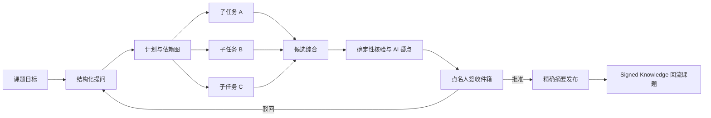

# 书生·端砚设计谱系研究：对 FLAi-OS × JerryAgent 的可迁移原则

> 研究日期：2026-07-20  
> 证据边界：仅采用上海人工智能实验室官网、InternScience 官方 GitHub 仓库、官方论文与官方产品页。媒体转述、营销二次解读和无法回溯到一手材料的说法不进入事实链。  
> 用途：为 FLAi-OS 与 JerryAgent 的深度融合提供架构和交互参考，不把外部项目的宣传语直接翻译成 FLAi-OS 的实现承诺。

## 0. 结论先行

当前可由一手材料确认的，并不是一套公开且可逐项复刻的“端砚产品规格”，而是一条清晰、连续的设计谱系：

1. **Intern-Discovery 提供科研智能体平台的产品骨架**：模型、专业智能体、数据、算力和实验设施被纳入同一平台，以可视化、低代码的方式组织从假设到验证的研究流程。
2. **InternAgent 1.0/1.5 提供智能体运行时内核**：任务被结构化分解、并行探索、验证和演化；长任务通过结构化知识流、任务依赖和经验记忆维持跨阶段一致性。
3. **SCP 提供异构能力连接与生命周期治理**：Hub、Server、Client 形成统一连接面，并覆盖注册、规划、执行、监控和归档等阶段。
4. **官方资料确认了人类反馈与机器评估的协作界面，但没有确认“机器可签发”**。因此，FLAi-OS 的“人是唯一签发者”不仅无需让位，反而应作为高于参考系统的治理约束继续保留。
5. **对 FLAi-OS 最有价值的迁移不是复制又一套 Agent 框架**，而是把 JerryAgent 定位为可替换、可观察、可恢复的 Agent Runtime，把 FLAi-OS 保持为身份、密级、证据、审计、签发和发布真相的 Governance/Product Control Plane。

一句话架构判断：

> **JerryAgent 负责“把工作跑起来”，FLAi-OS 负责“证明跑了什么、依据什么、谁批准、最终发布了什么”。**

## 1. 证据等级与研究边界

全文使用四种标签：

- **官方确认**：可直接由官方站点、官方仓库或官方论文支持。
- **合理推断**：由多个官方事实组合得出的架构推断，但官方没有给出对应产品字段、数据库模型或完整 UI 契约。
- **FLAi-OS 设计建议**：面向本项目的具体落地选择，不冒充参考平台已有能力。
- **未确认**：在公开一手材料中没有找到足够依据，不作为项目决策的事实前提。

### 1.1 关于“端砚”名称

截至研究日期，上海人工智能实验室官网站内以“端砚”检索返回“暂无数据”：

- https://www.shlab.org.cn/info?k=%E7%AB%AF%E7%A0%9A

当前可访问的一手产品页面仍使用 **Intern-Discovery** 品牌：

- https://discovery-home.intern-ai.org.cn/home

因此本文不采信媒体对“书生·端砚”的具体发布时间、参数、机构数量或产品规格描述。本文研究的是可验证的官方设计谱系：**Intern-Discovery + InternAgent + Science Collaboration Protocol（SCP）**。如果后续获得端砚官方白皮书、发布页、仓库或产品帮助文档，应进行一次增量校验，而不是把本文推断自动升级为官方事实。

## 2. 官方材料确认了什么

## 2.1 Intern-Discovery：平台不是聊天框，而是研究基础设施的统一入口

**官方确认**：上海人工智能实验室在 Intern-Discovery 官方发布材料中，将其描述为面向科学发现的开放平台，连接模型、专业智能体、数据、算力与实验设施，覆盖从科学假设形成到实验验证的端到端过程；平台提供 200 余个科学智能体、可视化低代码编排、工作流模板，并可通过 SCP 接入更多能力。

官方材料：

- https://www.shlab.org.cn/news/5444176
- https://discovery-home.intern-ai.org.cn/home

可迁移的产品原则不是“把 200 个 Agent 放进菜单”，而是：

- 用户面对的是**课题和工作流**，不是底层模型清单；
- Agent、数据、工具、算力、实验设施都是可被工作流调用的能力；
- 模板降低首次使用成本，低代码编排支持专家调整；
- 复杂任务需要显式状态、阶段结果和可继续的中间产物。

**合理推断**：面向 FLAi-OS，主导航的一级对象应逐步从“单次会话”提升为“课题 / 工作空间”，会话成为课题里的运行记录，而不是全部上下文的唯一容器。

## 2.2 InternAgent 1.5：Generation、Verification、Evolution 是同一闭环

**官方确认**：InternAgent 1.5 官方升级材料将系统划分为 Generation、Verification、Evolution 三个相互衔接的子系统，并强调动态结构化知识流、任务依赖图、并行探索、有效策略与失败经验的结构化记忆，以及跨阶段、跨任务的长程一致性。

官方材料：

- https://www.shlab.org.cn/news/5444231
- https://arxiv.org/abs/2602.08990

这给 FLAi-OS 的直接启示是：

- 生成、核验、经验回流不能继续作为三个彼此看不见的页面或日志栏目；
- 一个运行单元应明确区分“提出候选”“收集证据”“执行验证”“得出结论”“等待人签”“沉淀经验”；
- 并行子智能体不是 UI 上几颗闪动头像，而是任务依赖图中的可审计执行节点；
- 失败不应从界面消失，失败经验必须有结构、有范围、有来源，并且不能自动晋升为平台事实。

**FLAi-OS 设计建议**：将参考系统的三段式内核翻译为受治理的五段闭环：

```text
生成候选 → 证据核验 → 人工裁决 → 精确发布 → 受控回流
```

其中“人工裁决”和“精确发布”是 FLAi-OS 必须额外加固的两道边界。

## 2.3 InternAgent Memory：经验有结果、有指标、有相对基线标签

**官方确认**：InternAgent 官方仓库的 Memory Module 文档描述了跨会话保存实验结果的机制。记忆记录包含实验结果、指标，以及相对基线的正向、持平、负向标签；保存记忆和检索记忆可分别开关。IdeaGraph 用于识别想法冗余和探索广度，PromptEvolver 可依据既有经验调整提示。

官方材料：

- https://github.com/InternScience/InternAgent
- https://github.com/InternScience/InternAgent/blob/main/docs/memory_module.md

这里有三条值得直接吸收的原则：

1. **经验必须相对某个基线被评价**，不是把所有历史文本都塞入向量库。
2. **写入和读取是两项独立权限**，能保存不等于允许在下一轮正式使用。
3. **失败经验同样有价值**，但它的用途是避免重复踩坑，而不是被包装成“已验证知识”。

官方实现也暴露出一条不应照搬的边界：Memory 文档说明，当嵌入服务不可用时，记忆流程可能被跳过。对通用研究代理，这可以是可接受的降级；对 FLAi-OS 的可信主线则不够。

**FLAi-OS 设计建议**：凡是声称发生了经验写入、课题回流或知识引用的路径，都必须显式成功或显式失败。不得静默跳过后仍显示“已沉淀”“已继承”或“已复用”。

## 2.4 Deep Research：分解、并行收集、综合，协调者负责完整性

**官方确认**：InternAgent 官方 Deep Research 文档展示了研究任务的分解、并行信息收集和结果综合；可选 coordinator 用于检查完整性，并在信息不足时补充后续任务。

官方材料：

- https://github.com/InternScience/InternAgent/blob/main/docs/deep_research.md

可迁移原则：

- coordinator 不必亲自完成每个分支，但必须知道还有哪些问题没有覆盖；
- 并行价值来自独立分支和显式汇合，而不是同时显示多个“正在思考”；
- 综合结果必须能回指分支证据，不能只保留最终自然语言摘要；
- “完成”至少包含范围完整性检查，而不仅是某个 Agent 停止输出。

**FLAi-OS 设计建议**：JerryAgent 的 coordinator 只负责运行时计划、分派和汇总建议；FLAi-OS 的 verifier、evidence ledger 与 human-sign gate 决定候选是否具备发布资格。

## 2.5 InternAgent 1.0：人类反馈、想法树、自动调试与指标看板

**官方确认**：InternAgent 1.0 论文与官方仓库展示的工作流包含任务选择、想法树可视化、人机交互、代码生成、自动调试和实时指标展示；论文还讨论了人类专家反馈接口、AI 评估和编排，以及人类反馈介入时机。

官方材料：

- https://arxiv.org/abs/2505.16938
- https://arxiv.org/pdf/2505.16938
- https://github.com/InternScience/InternAgent

需要严格区分：

- **官方确认**：系统允许人类专家反馈参与研究流程。
- **未确认**：AI 评审员拥有正式签发权。
- **未确认**：平台采用实名签收件箱、100% 人签或与 FLAi-OS 相同的发布闸门。

因此，参考平台的人机反馈机制可以启发“何时请人介入、如何展示分支和指标”，但不能被拿来削弱 FLAi-OS 的唯一人签红线。

## 2.6 SCP：连接异构能力，但连接协议不等于治理真相

**官方确认**：Science Collaboration Protocol（SCP）官方仓库、论文和发布材料描述了 Hub / Server / Client 架构，面向异构科学工具与智能体的连接，覆盖注册、规划、执行、监控和归档等生命周期，并强调细粒度身份认证、授权、端到端可追踪工作流和可复用 Skills。

官方材料：

- https://github.com/InternScience/scp
- https://arxiv.org/abs/2512.24189
- https://www.shlab.org.cn/news/5444236

对 FLAi-OS 的借鉴应落在接口纪律上：

- 能力需要声明、发现、健康检查和版本信息；
- 一次执行要有稳定身份和完整生命周期；
- 运行事件需要可观察、可归档；
- 权限不应只停留在“能否连接”，还要覆盖“能执行什么、能读取什么、能产出什么”。

**FLAi-OS 设计建议**：当前阶段不要因为 SCP 具备连接能力，就在 JerryAgent 之外再引入一套并列编排框架。先吸收其 adapter、capability discovery 和 lifecycle contract；未来确有多机构、多工具接入需求时，再把 SCP 作为某类外部 provider，而不是平台的第二真相源。

## 2.7 全流程评测：Agent 应按研究阶段被评估

**官方确认**：上海人工智能实验室发布的科学智能全流程评测材料，将评估维度覆盖到文献检索、假设提出、实验执行和结果分析，并提供标准化模型/智能体接口。

官方材料：

- https://www.shlab.org.cn/news/5444234

对 FLAi-OS 的意义是：

- 不应只用“最终答案好不好”评估 JerryAgent；
- 每个阶段都应有可机械验证的成功条件、失败类型和证据；
- 评审梯子的训练数据，应包含“在哪个阶段犯了什么错误”，而不是只有总分；
- workflow template 的质量也应按阶段通过率、人工驳回原因和返工次数评估。

## 3. 对 FLAi-OS × JerryAgent 的目标架构

## 3.1 两层分工

| 层 | 核心职责 | 明确不拥有 |
| --- | --- | --- |
| JerryAgent Agent Runtime | 计划、分解、工具调用、子 Agent 调度、运行恢复、候选综合、运行时能力发现 | 人员身份真相、密级最终判定、人签状态、正式发布状态、不可变审计真相 |
| FLAi-OS Governance / Product Control Plane | 身份与角色、课题作用域、分类分级、证据账本、事件真相、人工签发、发布、审计、受控经验回流 | 具体 Agent 框架内部实现、模型私有推理、工具自身业务逻辑 |

这不是“FLAi-OS 调用 JerryAgent 的一个接口”那么简单，而是要把边界焊死：

- JerryAgent 可以提交候选、疑点、证据引用和运行结果；
- JerryAgent 不可以把候选状态改成已签发；
- JerryAgent 不可以替代 FLAi-OS 写入正式发布摘要；
- JerryAgent 不可以在事件断档后自行宣称状态连续；
- FLAi-OS 不解析或依赖 JerryAgent 的内部私有思维链；
- 所有可见运行状态必须来自规范化事件或强制 resnapshot 后的权威快照。

## 3.2 第一条实现接缝：AgentLayer Interface

建议先建立窄接口，再接 JerryAgent，而不是把 JerryAgent 类型扩散进 FLAi-OS 领域层。

最小接口能力：

```text
AgentLayer
├── capabilities() / health()
├── start_run(request)
├── stream_events(run_id, after_sequence)
├── get_snapshot(run_id)
├── cancel_run(run_id, expected_revision)
├── resume_run(run_id, checkpoint)
├── list_artifact_refs(run_id)
├── get_runtime_provenance(run_id)
└── get_terminal_outcome(run_id)
```

至少保留两个 adapter：

- `NativeFlaiAgentAdapter`：维持现有可信主线和回归基线；
- `JerryAgentAdapter`：在功能开关下接入 JerryAgent。

adapter 契约要求：

- 默认关闭；
- 未配置或不健康时不得静默切换成另一个运行时；
- 每个运行事件规范化为 FLAi-OS event envelope；
- 原始 payload 可以留存为诊断附件，但 UI 和状态机只消费规范字段；
- runtime 名称、版本、模型、工具清单、配置摘要进入 provenance；
- 取消、恢复、超时、失败必须有可区分的终态；
- adapter 永远无权写入 human-sign、release 或 signed-knowledge 状态。

## 3.3 规范化事件模型

建议每条事件至少包含：

```text
event_id
run_id
topic_id
conversation_id
task_id
sequence
occurred_at
received_at
actor_type
actor_id
event_type
phase
status
summary
artifact_refs[]
evidence_refs[]
parent_event_id?
runtime_provenance_ref
classification
schema_version
```

这套 envelope 同时服务于：

- 断连和 gap 检测；
- 强制 resnapshot；
- 主会话状态叙事；
- 右侧工作流 / 子 Agent 监控；
- 审计与可重复检查；
- 课题级经验回流。

## 4. 课题空间：从“会话容器”升级为“复利容器”

## 4.1 哪些是官方事实，哪些是项目推断

**官方确认**：参考系统支持跨会话实验结果记忆、长周期跨阶段任务、结构化任务依赖和经验复用。

**未确认**：官方公开材料没有给出名为 `topic_id` 的数据模型，也没有确认其 ACL、生命周期、跨会话依赖规则或签发见证机制。

**合理推断**：FLAi-OS 需要一个高于 conversation 的持久工作单元，承接同一研究课题的目标、已签发产物、经验、判例、工作流和多轮运行。

## 4.2 推荐的三相落地

### 第一相：容器相

纯加法，不改变现有跨会话依赖规则：

- 新增 `topics`；
- `conversations`、`tasks` 挂可空 `topic_id`；
- 课题页聚合会话、任务、签发产物和时间线；
- 老数据保持无 topic 也可运行；
- topic 不自动赋予跨会话读取或依赖权限。

### 第二相：回流相

只允许受治理的内容进入课题知识域：

- 已由人签发的产物；
- 已签发产物中的精确摘要；
- 人工裁决及结构化驳回理由；
- 已审核判例；
- 来源、密级、签发者、签发时间和原始产物引用完整绑定。

### 第三相：跨会话管道相

这是内核变化，需独立 spec、迁移方案和异源审：

- 依赖作用域由 conversation 有条件放宽到 topic；
- 只允许消费具备签发见证的产物；
- 继承原始密级并执行合成升级判断；
- origin、tenant、topic ACL 和用途范围同时校验；
- 使用记录进入审计链；
- 任何证据缺失、签发撤销或密级冲突均 fail-closed。

## 5. 经验回流：三层记忆，而不是一个向量库

参考 InternAgent 的经验记忆思想，同时保持 FLAi-OS 的可信边界，建议明确分成三层：

| 层级 | 写入方式 | 可被谁读取 | 可产生的影响 | 是否等同平台事实 |
| --- | --- | --- | --- | --- |
| Raw Run Memory | 运行时自动记录 | 同一运行恢复、诊断 | 恢复上下文、避免重复工具调用 | 否 |
| Evaluated Experience | 指标、测试、确定性核验、AI 评审疑点形成 | 后续 Agent 作为建议读取 | 排序、提醒、避免重复失败 | 否 |
| Signed Knowledge | 仅由人签动作触发 | 符合 topic、密级、权限的后续任务 | 进入正式课题上下文，可支撑后续结论 | 是，但仍需保留来源与适用范围 |

### 5.1 Raw Run Memory

- 服务于断点续跑和故障诊断；
- 生命周期通常绑定单次 run；
- 不自动跨 topic；
- UI 清楚标为“运行记录”，不用信任绿或人签 teal；
- 运行时删除或过期策略不得影响正式证据账本。

### 5.2 Evaluated Experience

- 必须有评价来源：指标、测试、基线对比或明确评审意见；
- 使用类似正向 / 中性 / 负向的相对基线标签是合理做法；
- AI 评审产生的是“疑点”和“建议”，不是裁决；
- 检索命中时应显示来源任务、评价依据和适用范围；
- 可单独关闭写入或检索；关闭与失败必须在运行状态中可见。

### 5.3 Signed Knowledge

- 人工签发是唯一晋升触发器；
- CAS-on-NULL 或等价不可变机制保护首次签发事实；
- 修订版形成新版本，不覆盖旧签发记录；
- 发布摘要必须精确指向获批候选及其证据；
- 后续引用记录反向连接到签发版本，构成真实的知识复利链。

## 6. 研究工作流：把复杂过程变成可理解的状态，而不是噪声

建议 FLAi-OS 将参考系统的任务图和协调者思想落成以下受治理流程：



状态语言建议保持用户可理解：

- 正在澄清目标；
- 已形成计划，等待开始；
- 正在并行收集 3 个分支；
- 已收到 2/3 个分支，1 个失败；
- 正在核验证据；
- 需要你回答 2 个问题；
- 候选已形成，等待王工签收；
- 已驳回：证据不足；
- 已由王工批准并发布；
- 已回流至“性能盘排故”课题知识。

不要把以下信息当作主要状态：

- “Agent 正在思考……”；
- 无文本解释的小图标闪动；
- 与真实阶段无关的连续动画；
- 已 completed 但没有核验或签发语义的绿色徽章。

## 7. 多 Agent 可观测：展示任务、证据和决定，不展示私有思维链

## 7.1 主会话区

主会话只需要持续回答四个问题：

1. 现在在做什么？
2. 为什么做这一步？
3. 已经得到什么结果？
4. 是否需要用户行动？

建议每个进行中运行保持一个稳定的“运行状态块”，而不是不断追加相似气泡：

```text
正在核验 3 份候选证据
最近事件：仿真结果校验通过（14:32:08）
下一步：等待材料数据库分支返回
需要你做：无需操作
```

状态块可使用克制脉冲帮助发现，但文本必须是主语义。`prefers-reduced-motion` 下完全静止，断连、事件 gap 和重建快照均以明确文字告知。

## 7.2 右侧边栏

参考 ChatGPT.app 的低噪声上下文栏和 Claude Desktop 对多子智能体 / workflow 的渐进披露，建议分层呈现：

默认层：

- 当前阶段；
- 最近可信事件；
- 运行健康状态；
- 需要用户处理的事项。

展开层：

- 子 Agent 列表及各自任务、状态、耗时；
- workflow / idea tree；
- 证据与产物；
- 人机决定和驳回理由；
- 运行记忆与课题知识的引用关系。

诊断层：

- sequence、event id、runtime provider；
- 重连次数、gap 区间、snapshot 版本；
- 模型和工具 provenance；
- 原始 payload 下载或受权限控制的检查入口。

用户默认看到的是“研究进展”，工程人员按需展开“运行机制”。不应把所有 Agent 日志永久铺满右栏。

## 7.3 事件断连与 resnapshot

参考系统官方材料确认了监控和长程运行，但**未确认**其公开实现包含 FLAi-OS 所要求的 sequence gap 检测或强制 resnapshot。

因此以下是 FLAi-OS 自己的可信设计：

- 客户端保存最后连续 sequence；
- 收到非预期 sequence 立即进入 `degraded`；
- 暂停把增量事件合成为“当前事实”；
- 显示“事件不连续，正在重新同步”；
- 获取服务端权威 snapshot；
- 校验 snapshot revision 与最新 event cursor；
- 成功后显示“已恢复，状态快照更新于 ……”；
- 失败则保持不可用或只读，不以旧 UI 假装实时。

## 8. 人机边界：Human feedback 不等于 Human sign

这是整项迁移中最容易被概念偷换的地方。

官方材料支持以下事实：

- 人类专家可以对研究过程提供反馈；
- AI 可以参与评估、验证和编排；
- 人类反馈可以在不同阶段介入。

官方材料没有确认：

- AI 评审员拥有最终批准权；
- 平台采用实名点名签收；
- sensitive / EAR 相邻类别永远 100% 人签；
- 每份产物都必须人签；
- 发布状态由不可变签发见证驱动。

FLAi-OS 应保持自己的更强边界：

| 动作 | AI / JerryAgent | 人类签发者 |
| --- | --- | --- |
| 提出候选 | 可以 | 可以 |
| 列出疑点 | 可以 | 可以 |
| 执行确定性核验 | 可以触发并报告 | 可以复核 |
| 推荐批准 / 驳回 | 可以，但仅为建议 | 可以 |
| 写入批准 / 驳回裁决 | 不可以 | 可以 |
| 生成发布摘要候选 | 可以 | 可以修订 |
| 发布正式摘要 | 不可以 | 可以 |
| 晋升 Signed Knowledge | 不可以 | 由人签动作触发 |

点名人签收件箱应至少显示：

- 被点名签发者；
- 候选版本和摘要；
- 证据充分性与缺口；
- AI 评审疑点清单；
- 确定性核验结果；
- 密级和用途范围；
- 结构化驳回原因；
- 批准 / 驳回动作的不可混淆语义。

## 9. 从参考系统吸收什么，不吸收什么

| 参考能力 | 建议 | 原因 |
| --- | --- | --- |
| 任务依赖图和并行探索 | 吸收 | 提升长任务清晰度和效率 |
| Generation / Verification / Evolution 闭环 | 吸收并加强 | 与候选、核验、回流天然对应，但需加人签和发布闸 |
| 跨会话经验记忆 | 吸收思想，重做治理 | 必须分层并显式写入 / 读取权限 |
| IdeaGraph / 探索广度 | 作为评审辅助 | 可发现冗余，不得成为事实判定器 |
| coordinator 完整性检查 | 吸收 | 适合 JerryAgent runtime，但结论仍需证据和人签 |
| 实时指标与工作流可视化 | 吸收 | 缓解用户对长任务的不确定和焦虑 |
| SCP 生命周期与 adapter 思想 | 吸收接口纪律 | 有助于连接异构能力 |
| 直接再引入 SCP 编排框架 | 暂不实施 | 避免 JerryAgent 与 SCP 双运行时、双真相 |
| 嵌入失败后静默跳过记忆 | 明确拒绝 | 违反 FLAi-OS 假绿禁令和可信主线 |
| 将 AI 评估等同签发 | 明确拒绝 | 违反人是唯一签发者红线 |
| 展示原始思维链 | 明确拒绝 | 不必要、不可稳定审计，也会制造信息噪声 |

## 10. 推荐实施顺序

## P0：先固定分层与接口，不改签发边界

- 编写 `AgentLayer` 端口和 normalized event contract；
- 保留 Native adapter；
- JerryAgent adapter 默认关闭；
- 写清运行时无权修改的人签、发布、密级字段；
- 建立 adapter contract tests。

验收重点：相同 FLAi task 可在不改变治理语义的情况下选择不同 runtime；runtime 故障不会伪装成平台成功。

## P1：接入运行真相与多 Agent 可观测

- start / stream / cancel / snapshot / terminal outcome；
- sequence gap 检测和强制 resnapshot；
- 主会话稳定状态块；
- 右栏按当前阶段、Agent、workflow、证据渐进展开；
- provenance 和失败原因完整落账。

验收重点：用户不看日志也能知道当前在做什么、最后发生了什么、需不需要自己行动。

## P2：接入结构化研究工作流

- 结构化提问；
- 任务依赖图和并行分支；
- coordinator 完整性检查；
- 候选、证据、疑点、核验结果分别建模；
- 点名人签收件箱和结构化驳回原因。

验收重点：AI 的建议与人的裁决永远是两个状态和两条审计记录。

## P3：建设课题容器与受控回流

- topic 容器相；
- Raw Run Memory / Evaluated Experience / Signed Knowledge 三层分离；
- 先让已签发知识回流，再讨论跨会话依赖；
- 采集人机一致率、驳回类型、下轮引用和真实使用结果。

验收重点：每次正式知识引用都能反查来源、签发版本、密级和适用范围。

## P4：独立评审跨会话管道与外部能力协议

- topic 范围依赖 spec；
- K1 签发见证、origin 隔离、分级合成全部复用；
- 评估 SCP 作为外部 provider 的必要性；
- 完成异源审、迁移演练和 fail-closed 测试后再启用。

验收重点：便利性不能绕过会话隔离最初保护的泄漏风险。

## 11. 当前不能作为事实写入产品叙事的说法

以下项目在本轮一手材料中没有得到确认：

1. “端砚”存在一套公开、稳定、可引用的完整产品规格或开源仓库；
2. 官方系统采用 `topic_id`、课题 ACL 或 FLAi-OS 设想的三相课题模型；
3. 官方系统具备点名人签收件箱；
4. AI 评审员在官方系统中拥有最终关门权；
5. 官方系统要求所有产物 100% 人签；
6. 官方系统已实现与 FLAi-OS 等价的 sandbox、不可变审计或 CAS-on-NULL；
7. 官方前端已实现 sequence gap 检测和强制 resnapshot；
8. 官方 UI 已形成本文提出的暗色、移动端、focus、reduced-motion 或信任色规范；
9. 公开材料已经披露所谓 Mobius 架构的完整工程实现。

这些概念可以作为 FLAi-OS 的独立设计，但发布文档必须标成“本项目设计”或“基于公开材料的合理推断”，不能写成“端砚已有能力”。

## 12. 最终设计原则

### 原则一：课题是复利容器，会话是运行记录

同一课题可以有多次会话、多次任务和多个候选，但只有经过治理的知识才能跨轮成为正式起点。

### 原则二：经验必须分层，写入和读取必须分权

运行记忆、经评估经验和人签知识不可混成一个检索池。越能影响后续正式判断，越需要强来源、强范围和强批准。

### 原则三：多 Agent 可观测的对象是任务、证据和决定

用户需要知道谁在做什么、进展到哪、最后事件是什么、是否卡住以及需要谁行动；不需要观看不可验证的“思考直播”。

### 原则四：验证可以自动化，签发不能被自动化偷换

JerryAgent 可以让生成和核验更强、更快，也可以给人更好的建议；正式批准、驳回、发布和 Signed Knowledge 晋升仍由人完成。

### 原则五：所有运行时都只是 adapter，FLAi-OS 保持唯一治理真相

Native、JerryAgent，乃至未来的 SCP provider，都必须经过同一事件、证据、身份、密级、人签和发布契约。

### 原则六：静默降级不属于可信系统

断连、事件缺口、记忆不可用、工具失败、模型降级和 provenance 缺失都必须被看见；无法证明连续性时，界面进入降级并强制重建快照。

## 13. 一手来源清单

### 上海人工智能实验室官方材料

- Intern-Discovery 官方发布材料：  
  https://www.shlab.org.cn/news/5444176
- InternAgent 1.5 官方升级材料：  
  https://www.shlab.org.cn/news/5444231
- 科学智能全流程评测官方材料：  
  https://www.shlab.org.cn/news/5444234
- Science Collaboration Protocol 官方发布材料：  
  https://www.shlab.org.cn/news/5444236
- 上海人工智能实验室站内“端砚”检索：  
  https://www.shlab.org.cn/info?k=%E7%AB%AF%E7%A0%9A

### 官方产品页与开源仓库

- Intern-Discovery 产品页：  
  https://discovery-home.intern-ai.org.cn/home
- InternAgent 官方仓库：  
  https://github.com/InternScience/InternAgent
- InternAgent Memory Module：  
  https://github.com/InternScience/InternAgent/blob/main/docs/memory_module.md
- InternAgent Deep Research：  
  https://github.com/InternScience/InternAgent/blob/main/docs/deep_research.md
- SCP 官方仓库：  
  https://github.com/InternScience/scp

### 官方论文

- InternAgent 1.0：  
  https://arxiv.org/abs/2505.16938  
  https://arxiv.org/pdf/2505.16938
- InternAgent 1.5：  
  https://arxiv.org/abs/2602.08990
- Science Collaboration Protocol：  
  https://arxiv.org/abs/2512.24189

---

## 收口判断

端砚 / Intern-Discovery 谱系真正值得 FLAi-OS 学习的，不是“更多 Agent”或“更炫的研究大屏”，而是把长期研究组织成**可分解、可并行、可验证、可演化**的工作流。FLAi-OS 应在此基础上再加一道更严格的治理逻辑：每一个跨轮产生复利的知识，都必须知道它来自哪次运行、经过什么核验、由谁签发、允许在哪个范围复用。

JerryAgent 因而最适合成为 FLAi-OS 的核心 Agent Runtime 底座，而不是新的治理中心。融合成功的判据不是“能跑 JerryAgent demo”，而是：在 JerryAgent 提供更强计划、并行、恢复和经验能力后，FLAi-OS 的断连真实性、证据链、密级、人工签发和发布边界仍然完整，且用户比现在更清楚系统正在做什么、为什么可信、下一步由谁行动。
