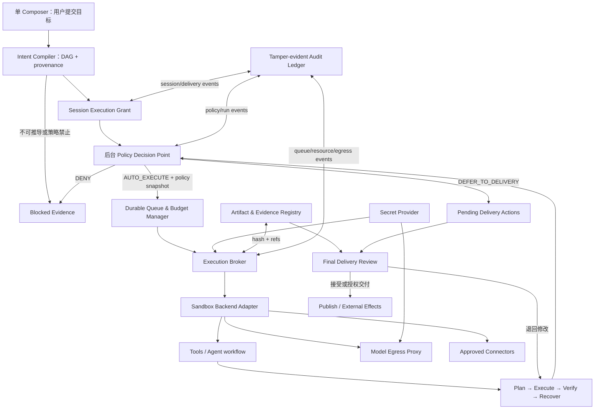

# OpenClaw × WorkBuddy × FLAi-OS：国企内网智能体平台安全治理研究与实施裁决

> 状态：**DRAFT / NO-GO 研究与 owner 决策输入**
> 本文不是运行时代码、数据库 schema、公开接口、部署形态或上线授权。
> 研究日期：2026-07-23（Asia/Shanghai）
> 当前仓库观察基线：`feat/eval-async-queue@567de2d` 的混合工作树；live remote `main@7523edf` 仅作只读对账。
> 用户术语说明：用户已于 2026-07-23 明确确认研究对象为 **OpenClaw**；此前口述的 “OpenCloud” 是口误。

## 0. 决策摘要

推荐采用“三层取长、绝不整包照搬”的产品与技术路线：

| 层 | 主要参考 | 吸收内容 | 最终约束 |
|---|---|---|---|
| 用户工作台 | WorkBuddy v5.2.6 实机与腾讯官方资料 | 中文化信息架构、项目空间、能力目录、渐进式执行轨迹、产物侧栏、低认知负担 | 不复制品牌、像素布局、粗粒度完全访问或宣传口径 |
| 运行时机制 | OpenClaw v2026.7.1 官方仓库与文档 | 分层工具策略、执行审批、沙箱后端接口、队列 lane、SecretRef、审计账本、重启恢复、插件 manifest | 生产默认必须比 OpenClaw 更严格，尤其是 sandbox default-on、网络 default-deny、身份隔离和防篡改审计 |
| 安全宪法 | FLAi-OS 现有宪法、ADR 与生产门 | 人是唯一签发者、假绿死罪、fail-closed、不可变证据、信任色、SQLite 轻内核 | 优先级高于所有外部产品设计；当前先把 macOS 体验与质量做到完整，Windows 适配延后 |

当前结论是明确的 **NO-GO**：现有混合工作树不能成为部署基线；即使只看当前工作树实码，也存在对象级越权、治理写入口授权缺口、敏感附件旁路、不可强杀执行、主进程内任意 Python、非统一并发、可变审计和离线发布未实现。不能用 WorkBuddy 风格 UI 掩盖这些缺口，但安全治理也不能被错误地做成用户每一步都要填写和确认的前台流程。

### 0.1 已锁定的交互与平台裁决

1. **任务提交即开启一次受控自治会话。** 用户只需要说明目标；平台自动冻结输入、选择工作空间、生成计划并启动执行，不要求用户把 Agent 已经推导出的字段再手工填写一遍。
2. **会话内部默认不中断。** 规划、工具选择、文件读写、构建、测试、失败恢复、重新规划和结果整理，只要仍在项目策略与会话授权范围内，都由 Agent 自动完成。
3. **治理在后台执行。** 身份、资源、工具、网络、并发、SecretRef、审计和沙箱策略每一步都自动判定；允许就继续，禁止就 fail-closed，可能产生不可逆外部效果就暂存为待交付动作。普通用户不承担策略表单录入工作。
4. **人类决定集中在末端。** Agent 自检完成后，提交一个包含产物、diff、证据、未决风险和待执行外部动作的 Delivery Bundle。用户在这里一次性决定接受、退回修改或授权交付/发布；“人是唯一签发者”不等于“人是每一步操作员”。
5. **中途不使用权限弹窗追着用户。** 如果目标需要当前策略绝对禁止且无法安全暂存的能力，任务进入带完整原因的 `blocked`，而不是循环追问或展示复杂表单。用户补充新范围后形成新的会话版本再继续。
6. **当前平台优先级是 macOS-first。** 先把本机工作台、自治循环、真实沙箱、可取消执行和交付体验打磨到稳定可用；Windows 兼容不作为本阶段设计与验收门。

推荐顺序：

1. 恢复干净、可复现的 release candidate；
2. 先封闭统一授权与敏感附件旁路；
3. 建立会话级自动授权、可强杀、可隔离、网络默认拒绝的 Execution Broker；
4. 闭合并发、审计、SecretRef、供应链和恢复；
5. 并行把真实自治状态映射成 WorkBuddy/Codex/Claude Code 式单输入框、不中断工作台，而不是等后端完成后再拼装 UI。

## 1. 证据分层

本文只把三类证据放在一起比较，不互相冒充：

### L1：官方上游材料

- OpenClaw 官方仓库与 v2026.7.1 release；
- OpenClaw 官方 sandbox、multi-agent policy、exec approvals、queue、secrets、audit、restart recovery、plugin manifest 文档；
- 腾讯 WorkBuddy 官方权限模式文档、WorkBuddy Enterprise 产品资料。

这些材料能证明上游公开合同和设计方向，不能证明 FLAi-OS 已实现，也不能替代内网测评。

### L2：WorkBuddy 实机录屏

用户提供的 9 分多钟 WorkBuddy v5.2.6 实机录屏能证明真实界面、操作顺序、权限提示和渐进式过程呈现。它不证明 WorkBuddy 后端的隔离强度、审计不可篡改性或私有化部署验收结果。独立时间线见 [workbuddy-recording-analysis-2026-07-23.md](./workbuddy-recording-analysis-2026-07-23.md)。

### L3：FLAi-OS 当前代码、测试与部署文档

本地审计以工作树中的源代码、DDL、测试和当前文档为事实源，并对 remote main 做了只读刷新。由于当前 checkout、index 与工作树是三棵不同的树，本文不能把任何一次本地通过外推为可发布版本。

## 2. 上游判断

### 2.1 OpenClaw：适合借机制，不适合直接当国企信任边界

截至本次研究，OpenClaw 官方最新 release 为 [v2026.7.1](https://github.com/openclaw/openclaw/releases/tag/v2026.7.1)。它的价值是已经把个人/多 Agent 运行时中容易遗漏的机制做成显式模块：

固定标签、源码位置、默认值和许可证的逐项证据见 [openclaw-runtime-security-reference-2026-07-23.md](./openclaw-runtime-security-reference-2026-07-23.md)。

- [多 Agent sandbox 与 tool policy](https://docs.openclaw.ai/tools/multi-agent-sandbox-tools)：Agent 可有独立 workspace、sandbox 和工具 allow/deny，策略层只能进一步收窄，不能把上层拒绝重新授予；
- [Sandboxing](https://docs.openclaw.ai/gateway/sandboxing)：区分 sandbox mode、scope、backend 和 workspace access，Docker 示例包含无网络、只读根、drop capabilities 等硬化选项；
- [Exec approvals](https://docs.openclaw.ai/tools/exec-approvals)：执行策略、allowlist 与人工确认共同决定，严格者优先，并尽可能把 cwd、argv、环境和可执行文件绑定到批准请求；
- [Queue](https://docs.openclaw.ai/queue)：用 session lane 和 global lane 控制同会话碰撞与总并发；
- [Secrets](https://docs.openclaw.ai/gateway/secrets)：使用 SecretRef 和内存快照，把 env/file/exec provider 与业务配置分开；
- [Audit](https://docs.openclaw.ai/cli/audit)：运行和工具的 metadata-only 审计默认开启，消息内容可选择性记录；
- [Restart recovery](https://docs.openclaw.ai/gateway/restart-recovery)：持久化会话/子 Agent/后台工作，并区分 drain、恢复、tombstone/quarantine；
- [Plugin manifest](https://docs.openclaw.ai/plugins/manifest)：在执行插件代码前用原生 manifest 验证配置和静态合同。

同时，OpenClaw 文档明确显示一些不适合作为国企生产默认值的边界：sandbox 可以关闭且存在默认关闭场景；elevated/host exec 可成为逃逸路径；exec approval 是防误操作措施而不是完整的用户授权或只读文件系统安全边界；个人 Gateway 的信任模型也不等于多部门、多主体的企业资源授权。

因此，FLAi-OS 只移植“合同与接口思想”，不直接引入整个 Gateway、插件生态或个人身份模型。

### 2.2 WorkBuddy：适合借前台心智，不把一键完全访问当治理模型

[WorkBuddy 权限模式官方文档](https://www.workbuddy.cn/docs/workbuddy/From-Beginner-to-Expert-Guide/Function-Description/Permission-Modes) 将工作区、默认权限、安全路径、删除、外部程序和网络访问组织成用户可理解的确认流程，并对 Full Access 给出风险警告。用户实机录屏进一步确认：v5.2.6 的“允许完全访问”会减少确认步骤，并允许更多敏感操作、文件修改或外部执行。

官方功能、企业权限、连接器身份、Runtime/Session、审计表面和 14 项公开未知点见 [workbuddy-enterprise-reference-2026-07-23.md](./workbuddy-enterprise-reference-2026-07-23.md)。

[WorkBuddy Enterprise](https://cloud.tencent.com/product/workbuddy-enterprise) 的公开资料强调统一身份、组织与安全管理，并提供逻辑隔离、专有部署和私有部署等产品层级。它可以作为需求清单来源，但公开产品描述不能替代源代码检查、目标机测评、等保/密评适用性判断或采购合同中的可验证指标。

值得吸收：

- 用项目承载人员、能力、任务、自动化与资产；
- 用专家、技能、连接器等中文对象隐藏底层协议复杂度；
- 中央任务线 + 右侧产物/文件/变量的渐进披露；
- 计划、工具步骤和原始结果逐级展开；
- 风险动作独立弹窗，取消路径清楚；
- 用真实状态和轻量提示承接长任务等待。

必须改造：

- Full Access 拆成主体、能力、对象、影响、有效期和计划摘要；
- 个人连接器授权不能自动流入共享项目；
- 项目分享不能等于资源执行权；
- 技能上传必须先进检疫区，不得直接在应用进程执行；
- 生成完成、验证为 REAL、真人签发必须是三个不同状态。

## 3. 当前仓库真相

### 3.1 当前 checkout 不是部署基线

只读对账结果：

- 当前分支 `feat/eval-async-queue@567de2d` 无 upstream，远端不存在同名分支；
- 相对 live remote `main@7523edf` 为 6 ahead / 80 behind；
- 工作区有 72 staged、141 unstaged、38 untracked；
- 多个关键文件同时表现为 index 删除、工作树同路径未跟踪重建；
- `docs/reviews` 中大量截图与证据文件是用户资产，不能清理、覆盖或拿去当本轮新证据；
- 当前 checkout 缺少 remote main 已有的若干 Gate 1 实现，属于代码基线回退，不只是缺目标机验证。

正式工作必须从刷新后的 remote main 建立独立 clean worktree，再按提交逐个审查和移植确实需要的 safe-auto 变更。当前研究文档不改变这个结论。

### 3.2 已有值得保留的深 seam

| seam | 当前强点 | 保留方式 |
|---|---|---|
| Agent Package | manifest/schema/version/tools 白名单/limitations 已成形 | 扩充 capability 与供应链声明，不推倒包标准 |
| Runtime → Tool Registry | 所有声明工具经中央入口，输入输出 schema 和 tool_runs 已存在 | 在此之前插入 Policy Decision，在此之后改接 Execution Broker |
| Model Gateway | profile 解析与 model_calls 归因集中 | 加 egress policy、SecretRef、请求 attempt 与分类上下文，不允许 workflow 绕过 |
| SQLite queue | `BEGIN IMMEDIATE` claim 与状态 CAS 是可靠基础 | 在同一存储内增加 lane、lease、budget 和 backpressure，不引入 Redis/Celery |
| Task events | JSON Schema 校验、任务/工具/模型证据引用已存在 | 扩成 decision evidence，不保存内部思维链 |
| 人签链 | review event 与依赖消费已有真人见证思想 | 增加职责分离、唯一主体 ID、版本化审批合同和 plan digest |
| 文件证据 | hash、output_dir 与部分分级门已经存在 | 修复对象授权与附件旁路，扩展 taint、隔离预览与正式资产准入 |
| ax L0 合同 | binary pin、固定 argv、clean env、fixture-only、fail-closed | 作为真实 subprocess adapter 的局部先例，不冒充通用 sandbox |

### 3.3 当前 P0 阻断项

| P0 | 当前事实 | 失败影响 |
|---|---|---|
| 基线不可复现 | 混合工作树落后 remote main，且三棵树不一致 | 无法定义测试对象、制品 SHA 和回退点 |
| 治理写入口越权 | eval enqueue 有角色门，但 fix sample、promote 等入口缺统一 actor/resource 授权与 commit-time recheck | 普通登录用户可能修改评测资产或推进治理状态 |
| BOLA/IDOR | 全局 tasks、conversations、feedback、internal files 等存在 owner/role 校验缺口 | 跨用户读取、取消、污染或枚举对象 |
| 敏感附件旁路 | sensitive 下载虽然 403，但文件 ID 可被附到 Guide 会话并进入模型上下文 | 绕过直接下载门，泄露到模型调用和会话记录 |
| 无真实执行隔离 | workflow 和 tool adapter 在 worker 主进程 import/exec；线程 timeout 后不能强杀 | 超时记录为失败后仍可产生文件或外部副作用 |
| 无运行中 kill 链 | running task 不可取消；detached CFD 进程无持久 PID/stop | 错误或失控执行无法由控制面终止 |
| 出站与凭据边界缺失 | Model Gateway 和多数工具没有统一 task-aware egress allowlist、SecretRef、目标 witness | 数据越界、凭据扩散、无法回答“谁向哪里发了什么” |
| 并发与背压不统一 | job 实际串行；eval 有局部 quota；tool manifest 并发声明未执行；API 可在 degraded 时继续接纳 | 队列堆积、资源抢占、部门间不公平、磁盘耗尽 |
| 终态可被晚写覆盖 | 同步 eval 可绕 quota，恢复与无 CAS finish 竞态可出现 `error → completed` | 假绿，破坏治理证据可信度 |
| 审计不可抗抵赖 | 本地滚动 JSONL/SQLite 可变，事件覆盖不全，部分状态与事件非原子 | 关键操作无法形成完整、防篡改证据链 |
| 离线供应链未闭合 | 发布脚本明确 `NOT-IMPLEMENTED`；依赖锁、wheelhouse、hash、SBOM、签名与包摘要不足 | 无法证明离线可复现，也无法验证导入物 |
| macOS 运行门未证 | 当前没有真实 sandbox、完整取消链、睡眠/唤醒恢复、受控制品与本机 novice 路径证据 | 只能称开发态，不能称高质量 macOS 首发版 |

此外，LoginThrottle 的有界清理会在用户名基数喷射时清空已有锁定；`/api/health` 固定返回 ok；graceful shutdown/drain、真实 readiness、备份全资产覆盖也未闭合。这些至少是同一上线批的 P0/P1，不应以“已有登录/健康接口/备份脚本”为完成证据。

### 3.4 为什么当前 Guide 仍然像“规划器 + 填表器”

当前实现已经迈出了 `safe_auto` 的第一步：`GuidePage.vue:760-763` 会显式请求自动执行，后端也把建任务和入队放在同一事务中。这一基础应保留。但它的自动执行集合被收得过窄，正常任务很容易退化成“Agent 给草案，用户替系统补参数、拆任务并再次提交”：

- `agents/guide_agent/workflow.py:329-359` 明确把 `prefilled_inputs` 定义为部分输入，并写明“用户还要补全”“齐全性由人在创建页负责”；
- `backend/app/runtime/guide_dispatch.py:231-243` 只接受恰好一个 Agent，多 Agent 计划一律因缺机器可读依赖图而阻断；
- `backend/app/runtime/guide_dispatch.py:308-322` 将缺少 required 字段直接变成 `blocked_input`，要求用户回会话补充；
- `backend/app/runtime/guide_dispatch.py:339-365` 对任何附件 fail-closed，并要求用户原文包含与计划输入完全相等的显式 JSON 对象；
- `backend/app/runtime/guide_dispatch.py:178-187` 只允许 `effect=none`、`tools=[]`、`input.type=params` 的 Agent 自动执行；
- `frontend/src/views/GuidePage.vue:204-220,858-883` 仍保留“预填草案 → 去创建此任务 → 人在创建页补全”的兼容路径；API helper 的非显式调用默认仍是 `plan_only`（`frontend/src/api/conversations.js:24-38`）。

这些限制各自都有安全动机，不能简单删除。真正的问题是：**系统把安全边界的求解责任转交给了普通用户。** 用户被迫成为 schema 填写员、依赖图编排员和逐 Agent 发起者，所以产品即使视觉上像工作台，行为上也不像 Codex、Claude Code 或 WorkBuddy。

目标替换不是“让 LLM 随便猜参数”，而是在单 Composer 后建立后台 `IntentCompiler`：

```text
compile_intent(
  authenticated_request,
  project_context,
  attachment_envelopes,
  available_capabilities
) -> canonical_task_spec + provenance + assumptions
```

它自动把自然语言目标、会话附件、项目默认值、已存在资产和工具发现结果编译成机器可执行 DAG，并给每个字段和依赖边绑定来源。调用方只看到一个深模块：成功时直接得到可入队的 `canonical_task_spec`；失败时只得到合并后的、可解释的不可满足原因。内部可迭代检索、验证 schema、重新规划和缩小能力，不把这些循环暴露成表单。

后台按四类处理不确定性：

1. 可从上下文、附件或项目策略确定的值自动解析，并保存 provenance；
2. 可安全默认的值自动采用保守默认，并在最终交付中列出 assumption；
3. 需要工具探索或子 Agent 协作才能确定的值，在会话内自动探索和重规划；
4. 客观上不可推导、缺失会改变安全边界或策略明确禁止的事实，才将整个会话置为一次性 `blocked`，给出合并后的缺口，不在执行中连续弹窗追问。

前台正常路径因此只有：提交目标 → 自动执行 → 查看按需展开的计划/证据 → 最终 Delivery Bundle。`prefilled_inputs` 可以保留为后台中间表示和审计事实，但不得继续作为普通用户必须确认、补齐或搬运的交互对象。

机械验收至少包括：

- 一个包含附件、两个以上 Agent 和工具调用的自然语言任务，不经过 `/tasks/new`，即可生成 DAG、入队并持续执行；
- 会话内重试、重新规划、参数解析和安全允许的工具调用均不出现强制表单或逐步批准按钮；
- 不可逆外部动作只进入 Delivery Bundle，未获末端授权时不会发生真实副作用；
- 任一步字段、附件、工具、策略和执行结果都能回溯 provenance 与 immutable digest；
- 真正不可满足的任务只产生一个聚合 `blocked` 结果，不伪造完成，也不循环追问。

## 4. 目标架构



关键原则：应用 API 不直接执行第三方 workflow、技能或工具；Intent Compiler 在后台承担 schema 求解、来源绑定与 DAG 编译，不把它们变成用户填表；Policy Decision 是每一步不可绕过但对用户默认不可见的后台 seam；Execution Broker 只接收已验证、已绑定策略快照的计划。内部、可回滚工作自动执行，不可逆外部效果进入 Delivery Bundle，直到末端由具名人一次性授权。

## 5. 深模块与合同

### 5.1 ActorContext 与 Resource Authorization

统一入口：

```text
authorize(
  actor,
  action,
  resource,
  request_context,
  policy_version
) -> DENY | DEFER_TO_DELIVERY | AUTO_EXECUTE
```

最小对象：task、conversation、file、agent、tool、connector、eval run、sample、promotion、audit view、project membership。任何 API、后台恢复、自动化、会话工具调用都必须使用同一事实源；前端隐藏按钮不构成授权。

约束：

- actor 使用不可变唯一 ID，display name 只作展示；
- action 使用有限枚举，不允许自由文本权限；
- resource 同时带 owner、project、classification、agent visibility 和版本；
- 读、写、执行、批准、发布、审计是不同 action；
- 进入执行前与产生不可逆副作用前至少两次 recheck；
- `AUTO_EXECUTE` 直接继续运行，不生成用户确认；`DEFER_TO_DELIVERY` 只生成待交付动作，不打断自治循环；
- 用户、角色、项目成员关系或策略已撤销时 fail-closed；
- 策略层只允许继续收窄，低层不能恢复上层拒绝。

### 5.2 IntentCompiler 与 Canonical TaskGraph

`IntentCompiler` 是隐藏复杂度的深模块，不是新的向导页面。它接收用户原始表达和服务端已有事实，返回完整、可验证、可执行的任务图：

```text
compile_intent(request_envelope, project_context, capability_catalog)
  -> READY(task_graph, provenance, assumptions)
   | BLOCKED(missing_facts, policy_conflicts, evidence)
```

`request_envelope` 绑定 authenticated actor、原始文本、附件 ID/hash/owner/classification 和会话版本；`task_graph` 的节点绑定 Agent/tool/version、typed inputs、source refs、effect class、资源预算和验收条件，边使用有限依赖类型并通过确定性 schema 校验。LLM 可以提出候选图，但只有编译器能解析字段来源、补项目默认值、拒绝歧义映射并生成 canonical digest。编译器可以内部重试和调用只读 discovery capability；外部调用方不接触 `prefilled_inputs`、schema 修补或逐 Agent 创建接口。

### 5.3 SessionExecutionGrant、Canonical Plan 与 DeliveryAuthorization

用户通过认证入口提交任务时，平台自动创建 `SessionExecutionGrant`。它不是要求用户填写的授权表，而是从 authenticated actor、项目策略、工作空间、Agent 版本和任务目标推导出的后台合同：

```text
open_session(actor, task_input, project_policy) -> session_grant
authorize_step(session_grant, canonical_step) -> AUTO_EXECUTE | DEFER_TO_DELIVERY | DENY
prepare_delivery(session_grant) -> delivery_bundle
commit_delivery(delivery_bundle, authenticated_human) -> delivery_receipt
```

Grant 至少绑定 `task_id`、不可变输入摘要、actor/project、Agent package digest、工作空间范围、允许的能力/目标类别、网络策略、资源预算和到期条件。Agent 可以在这个范围内重新规划、重试和改变具体步骤；每个新步骤都生成 canonical digest 并自动重新判策，但不要求用户重新批准。

最终 `delivery_bundle` 绑定产物 hash、文件 diff、验证证据、残余风险、待执行外部动作、策略版本和完整会话摘要。只有这里的接受、正式发布、外部写入或签发需要具名人的 `DeliveryAuthorization`。Bundle 漂移、审批过期、审批人无权或单次 CAS 消费失败都拒绝交付，但不会抹去已经在隔离工作区完成的草稿与证据。

### 5.4 Execution Broker 与 SandboxBackend

推荐接口：

```text
prepare(plan, policy_snapshot) -> execution_handle
start(execution_handle) -> running_witness
cancel(execution_handle, actor, reason) -> termination_witness
collect(execution_handle) -> result + resource_usage + evidence_refs
destroy(execution_handle) -> cleanup_witness
```

生产强制：

- 每任务独立 workspace；只允许显式 bind/mount；默认无宿主工作区；
- 文件系统 allowlist，根文件系统只读，输出只写任务目录；
- 网络 default-deny，经解析后 IP/端口/域名/每跳 redirect 复核和出口代理执行；
- 无 shell 字符串；固定 argv；清洁环境；SecretRef 按步骤短时注入；
- CPU、内存、进程数、输出大小、墙钟和空闲时限；
- 能终止进程树并产生 termination witness；
- 主应用进程不 import 不可信 workflow/adapter；
- sandbox 不可用或能力无法证明时拒绝，不自动降级到 host exec。

本阶段只实现和验收 macOS Adapter。进程组、临时目录和清洁环境只能称为 containment；若要声称真实 sandbox，必须由 macOS 上可验证的容器/虚拟化或等价 OS 强制机制执行文件、网络与资源策略。建议在同一 seam 下至少保留生产 `MacSandboxAdapter` 与测试 `InMemorySandboxAdapter`，让调用方只理解上述五个方法。Windows Adapter 延后，不影响本阶段 macOS 产品质量收口。

### 5.5 Durable Queue & Budget Manager

复用 SQLite，不引入 Redis/Celery。核心表概念：

- lane：tenant/project/user/agent/tool/egress/provider；
- budget：max queued、max running、CPU/内存/外部调用额度；
- lease：owner、generation、heartbeat、expires_at；
- admission decision：accepted/rejected/deferred + reason；
- cancellation token：requested、observed、terminated；
- idempotency key 与 side-effect class。

队列必须在接纳前检查总深度和预算，而不是只在执行时限流。恢复策略按副作用分类：纯读/幂等步骤可在新 lease 下重试；未知或外部副作用步骤进入 `needs_reconciliation`，不得自动重放。所有终态更新使用 CAS，禁止 error/failed 被晚到 writer 改回 completed。

### 5.6 Secret Provider 与 Egress Proxy

配置只存 SecretRef：

```text
secret://provider/scope/name@version
```

解析发生在受控 Broker/Proxy，业务进程只拿引用或短期代理令牌。snapshot 原子替换，缺少 required ref 时 fail-closed；日志、事件、模型摘要和错误正文经过 exact-value 与结构化字段双重脱敏。每次使用记录 secret identity/version，不记录值。

模型调用同样经过受控 Egress Proxy：按任务分级、模型 profile、目标 endpoint、允许字段、最大 body、超时、并发和重试策略决策；记录 attempt、latency、provider request ID（若有）、policy ID 和结果，不记录秘密或不必要的原文。

### 5.7 Tamper-evident Audit Ledger

现有 task_events/tool_runs/model_calls 继续作为业务证据，安全审计增加不可抗抵赖层：

- 严格 event schema、单调序列、`prev_hash/event_hash`；
- actor_id、request_id、task_id、plan_digest、policy_digest、approval_id、execution_handle；
- grant/revoke、登录、对象访问拒绝、治理写入、审批、执行、kill、网络决策、SecretRef 使用、配置/包变更、导出；
- 关键业务状态与 audit outbox 同事务，异步送入独立 append-only/WORM sink；
- metadata 与敏感内容分离，分别设访问控制和留存；
- 定期 seal、导出、校验、告警和恢复演练；
- 审计不可用时，高风险写与执行 fail-closed，低风险读按明确降级策略处理。

哈希链不等于外部 WORM；两者都需要具名运维 owner、时间同步、密钥轮换、留存和恢复证据。

### 5.8 Package Quarantine & Supply Chain Gate

Agent、Skill、Tool、connector 和离线制品统一经过：

1. 离线导入到 quarantine；
2. 路径/symlink/压缩炸弹/大小检查；
3. manifest + JSON Schema + `additionalProperties:false`；
4. package digest 覆盖 workflow、prompt、schema、adapter、依赖、模型/工具引用；
5. 依赖锁、wheel/npm cache、license、SBOM、漏洞/恶意模式扫描；
6. 组织签名与签发人；
7. 在隔离环境跑合同测试、负例和 tamper；
8. 进入批准目录后按 digest 引用；升级生成新版本，不原地漂移。

目录里的“看得见”“可装配”“可执行”“可自动化”是四层独立状态。

## 6. OpenClaw 机制的裁剪矩阵

| OpenClaw 机制 | FLAi-OS 决策 | 企业化增强 |
|---|---|---|
| per-agent workspace/sandbox/tool policy | 借鉴 | production sandbox default-on；无后端即拒绝；项目/主体策略只可收窄 |
| sandbox mode/scope/backend | 借接口 | 后端能力证明、目标机 profile 与健康 witness 纳入 deployment gate |
| exec allowlist + approval | 借鉴 | 叠加真正 actor/resource authorization、plan digest、单次 CAS 与职责分离 |
| session/global lane | 借语义 | SQLite durable lane、admission control、租约、容量指标和部门公平性 |
| SecretRef snapshot | 借鉴 | 对接内网秘密系统/HSM 或受控文件 provider；禁止应用进程长期明文 env |
| metadata audit ledger | 借鉴 | 增 hash chain、outbox、外部 WORM、留存/告警/导出和 fail-closed 级别 |
| restart recovery | 条件借鉴 | 只自动恢复可证明幂等/无副作用步骤；未知副作用必须对账或人审 |
| plugin manifest before code | 借鉴 | 再加组织签名、package digest、SBOM、quarantine 和离线批准目录 |
| shared/personal Gateway trust | 不照搬 | 按部门/安全域切 execution cell；共享控制面不共享用户凭据 |
| elevated/host exec | 生产禁用 | 仅在隔离运维 break-glass 流程中临时开启并双人审批、全审计 |

## 7. WorkBuddy 体验的产品映射

| 前台对象 | 用户价值 | 后台真实合同 |
|---|---|---|
| 项目空间 | 把人、任务、资料和能力放在一起 | Project policy、membership、data domain、budget、retention、approved package refs |
| 新建任务 | 单一入口，提交即开始工作 | immutable input snapshot、SessionExecutionGrant、admission decision |
| 专家/Agent | 用业务角色理解能力 | agent version/package digest、owner、maturity、allowed actions |
| 技能 | 可组合的方法与模板 | signed package、declared capabilities、no direct code execution before quarantine |
| 连接器 | 接入办公和工程系统 | credential owner、resource scope、egress policy、rate limit、revocation |
| 自动化 | 重复任务自动运行 | trigger identity、idempotency、concurrency budget、delivery policy、stop rule |
| 执行轨迹 | 看得懂正在做什么但无需操作 | policy/queue/tool/model/evidence refs，不保存内部思维链 |
| 产物侧栏 | 边聊边检查结果 | isolated preview、hash、classification、verification/signature state |
| 会话范围摘要 | 非阻塞地说明本次会做什么 | 系统自动推导的 grant，可展开但无需填写或逐项确认 |
| 最终交付页 | 一次判断是否满意并交付 | Delivery Bundle、unique approver ID、digest、expiry、single-use CAS |

视觉上建议采用 WorkBuddy 的留白和中文亲和力，加上 Codex/Claude 式更克制的排版、焦点层次与短动效。所有状态色必须服从 FLAi-OS 信任色，不因“任务生成完成”使用 REAL 绿。

## 8. P0 / P1 / P2 路线图

### P0：任何正式试点前必须闭合

#### P0-0：恢复可信 release candidate

- 从刷新后的 remote main 创建独立 clean worktree；
- 记录并保护当前混合工作区的用户资产；
- 逐提交审查 safe-auto 的 6 个本地提交，拒绝整树覆盖；
- 全量验证、干净 status、release SHA、依赖与制品 hash；
- current main、工作区候选和目标机证据分开命名。

Done when：`bash scripts/verify_all.sh` exit 0，worktree 除预期证据外干净，release SHA/制品 hash 可复算；不使用当前旧分支截图或历史测试结果冒充本轮证据。

#### P0-1：统一对象授权与敏感数据封口

- 建立 actor/action/resource chokepoint；
- fix/promote、全局任务/会话/文件/feedback、取消与元数据写全部接入；
- 附件引用在写入会话和渲染模型上下文前检查 owner、project、classification 和 Agent capability；
- commit-time 再检查 actor live、role/membership 与 SessionExecutionGrant；该检查在后台完成；
- 身份归因使用 username/subject ID，不以 display name 作权威键；
- 高风险治理动作启用职责分离。

RED-first witness：

1. `business_user` fix sample / promote 返回 403；
2. 用户 A 读取、取消或修改用户 B 的 task/conversation/file 返回 403；
3. sensitive file ID 作为 Guide 附件返回 403，且未进入 model call；
4. 发起后撤销角色/停用会话，commit-time 写入失败；
5. 对明确要求双人控制的正式发布动作，签发者等于提交者时失败；普通会话内工作不因此暂停。

#### P0-2：Execution Broker 与最小真实 sandbox

- 先迁移一个无网络、可复算、低副作用 Tool；
- subprocess/容器能 kill 进程树，超时后不得继续写输出；
- 独立 workspace、文件 allowlist、clean env、no shell、resource limit；
- 无网络是可验证事实，不是 manifest 声明；
- Tool Registry 只接收 Broker 返回的签名结果与证据；
- running cancel、shutdown drain、worker generation 和 kill witness 闭合。

RED-first witness：越界读写、symlink escape、fork child、超时后继续写、网络访问、伪造可执行路径、kill 后副作用都必须失败。

#### P0-3：并发、终态与恢复

- durable lane/budget/admission/lease；
- per-user/project/agent/tool/provider 并发与 queued-depth；
- running cancel 与 backpressure；
- terminal CAS，禁止 late writer 翻转；
- 状态与 audit outbox 同事务；
- side-effect-aware recovery 与 reconciliation；
- readiness 真实反映 DB、worker generation、queue/broker 和 audit sink。

#### P0-4：审计、秘密、供应链与离线发布

- audit coverage + hash chain + WORM/export/retention/alert；
- SecretRef、短期注入、redaction 和受控 egress；
- 组织签名、package digest、lock/hash、SBOM、quarantine；
- 实现 macOS `.sh`/应用制品的离线发布路径并验证完全断网安装；Windows `.ps1` 延后；
- 备份覆盖 DB、uploads、task_runs、audit/keys/config refs，并完成 restore drill。

#### P0-5：macOS 本机质量 Gate

- 固定支持的 macOS 与 Apple Silicon 基线，验证启动、睡眠/唤醒、异常退出和升级回退；
- `MacSandboxAdapter` 能证明工作区、symlink、进程树、网络和资源限制，而不是只声明配置；
- Keychain/SecretRef、模型 endpoint、证书、代理、超时、p99、并发和 429/故障闭合；
- running cancel、graceful stop、worker singleton、重启恢复和无重复副作用；
- 离线/受控制品签名、hash、恶意包拒绝、备份与真实恢复演练；
- 单 Composer → 自动执行 → 自检 → 最终交付的完整 novice 路径不出现强制填表或逐步确认。

只有 P0 全部有机器证据并由具名 owner 签发，才允许正式试点。

### P1：可信基础上的企业工作台

- WorkBuddy 式 Project Space、单 Composer、能力标签、自动执行时间线、产物/证据侧栏；
- Final Delivery Review、Audit Explorer、队列/预算/执行单元运维视图；
- 统一身份、部门/项目角色、临时授权与撤销；
- 自动化模板的触发/并发/交付/停止合同；
- 版本化 Human Review contract；
- 指标只从 tasks/tool_runs/model_calls/queue/audit 等事实源计算，带定义版本与样本量。

P1 UI 不得先行伪造后台尚不存在的状态或控制按钮。

### P2：规模化与生态

- 多 execution cell/部门隔离、容量调度与 HA；
- Windows Adapter 与目标机兼容验证；
- Connector/Skill/Agent 内网目录与审批发布流水线；
- 更细的多 Agent lane、委派预算和跨项目协作；
- 密钥系统/HSM、集中 SIEM、合规报表与长期归档；
- sandbox backend 插件化，但公共接口保持最小、稳定和 fail-closed。

## 9. 推荐的第一个实施切片

第一个代码切片应是 **P0-1 统一授权封口**，而不是先做通用 sandbox 或 UI。原因是当前存在可由登录用户触达的直接越权路径，范围可用 RED 测试明确表达，也能在不引入新框架的情况下快速降低暴露面。

边界：

- 只新增内部 authorization service / resource checks 和对应负向测试；
- 不改公开 response schema，不改状态机，不引入新角色体系；
- 先覆盖 governance fix/promote、task/conversation/file read/cancel/write、Guide attachment；
- 复用现有 `role_can_access_agent` 与当前用户事实源；
- 所有 deny 都有稳定 reason code 和 audit event，但不记录敏感对象内容；
- 必须在 remote main 的 clean worktree 实施，不能在当前混合工作树直接修。

完成后立即进入 P0-2 的 threat model 和 Execution Broker ADR；不能因为授权补丁完成就声称 sandbox 或部署就绪。

## 10. 已裁决与仍需 owner 裁决的事项

| 决策 | 推荐值 | 为什么现在要定 |
|---|---|---|
| D0 交互合同 | **已裁决：任务提交即自治执行，末端一次性交付授权** | 禁止把治理转化为中途填表和逐步点击 |
| D1 上游对象 | **已裁决：OpenClaw** | 此前 “OpenCloud” 为口误 |
| D2 执行拓扑 | 控制面与执行主机池分离 | 主应用进程不应成为不可信代码的安全边界 |
| D3 首发平台 | **已裁决：macOS-first；Windows 延后** | 当前只优化 Mac 上的运行质量与体验 |
| D4 身份源 | 目标 AD/LDAP/OIDC、MFA 和离线账户降级策略 | 影响 actor ID、角色同步、撤销和审计归因 |
| D5 职责分离 | promotion、发布、高风险审批、break-glass 至少双人 | 不能由代码自行假定组织控制强度 |
| D6 审计 | 留存年限、WORM/SIEM、导出格式、审计不可用策略 | 影响存储、网络、运维职责和 fail-closed 范围 |
| D7 数据域与出站 | 分级、允许模型/域名、跨域规则、脱敏责任人 | 决定模型代理和连接器能否开启 |
| D8 离线签发 | 包签名体系、离线根、签发/验签/吊销人 | 决定供应链制品是否可验证 |
| D9 部署规模 | 用户数、峰值任务、模型/工具并发、部门隔离 | 决定 lane/budget 与容量验收，不应凭经验拍值 |

未裁决事项保持 `UNKNOWN/BLOCKED`，不由实现者代填成默认通过。

## 11. 明确不做

- 不把 OpenClaw 代码整仓移植到 FLAi-OS；
- 不引入 Redis、Celery、ORM 或新数据库；
- 不把 LLM 放进授权、晋升、签发或工程判决链；
- 不保存或展示完整内部思维链；
- 不把 Full Access、host exec 或 sandbox-off 作为生产快捷模式；
- 不让用户在 Agent 已完成规划后重新手工填写目标、输入、责任字段或子任务参数；
- 不用逐工具、逐步骤审批弹窗打断会话内执行；
- 不把“有进程或临时目录”直接称为安全沙箱；
- 不在当前混合工作树做 runtime 修改或发布制品；
- 不把当前 macOS 结果外推成 Windows 已适配。

## 12. 来源

### OpenClaw 官方来源

- [GitHub repository](https://github.com/openclaw/openclaw)
- [v2026.7.1 release](https://github.com/openclaw/openclaw/releases/tag/v2026.7.1)
- [Multi-agent sandbox & tools](https://docs.openclaw.ai/tools/multi-agent-sandbox-tools)
- [Sandboxing](https://docs.openclaw.ai/gateway/sandboxing)
- [Exec approvals](https://docs.openclaw.ai/tools/exec-approvals)
- [Queue](https://docs.openclaw.ai/queue)
- [Gateway rate limiting](https://docs.openclaw.ai/gateway/security/rate-limiting)
- [Audit ledger](https://docs.openclaw.ai/cli/audit)
- [Security](https://docs.openclaw.ai/gateway/security)
- [Secrets](https://docs.openclaw.ai/gateway/secrets)
- [Restart recovery](https://docs.openclaw.ai/gateway/restart-recovery)
- [Plugin manifest](https://docs.openclaw.ai/plugins/manifest)

### WorkBuddy 官方来源与直接证据

- [WorkBuddy 权限模式](https://www.workbuddy.cn/docs/workbuddy/From-Beginner-to-Expert-Guide/Function-Description/Permission-Modes)
- [腾讯云 WorkBuddy](https://cloud.tencent.com/product/workbuddy)
- [WorkBuddy Enterprise](https://cloud.tencent.com/product/workbuddy-enterprise)
- 用户提供的 WorkBuddy v5.2.6 实机录屏；不提交原视频或未脱敏截图

## 13. 本研究完成与未完成的证据

已完成：

- WorkBuddy 实机 9 分多钟时间线与权限确认逐帧复核；
- OpenClaw 当前 release 与官方安全/运行时文档核验；
- FLAi-OS 当前工作树的认证、授权、对象访问、工具执行、队列、恢复、供应链和审计只读审计；
- 定向安全测试由审计工作流执行并通过；通过只证明现有行为被稳定复现，其中一部分现有行为本身就是需要修复的安全缺口。

未完成且不能声称完成：

- 未在 clean remote main 上跑全量 `verify_all.sh`；
- 未实现任何 runtime 安全改动；
- 未建立真实 sandbox、WORM、SecretRef、统一并发或离线发布包；
- 未完成 macOS 真实 sandbox 与完整本机体验验收；Windows 适配已明确延后；
- D0、D1、D3 已由用户裁决；D2、D4–D9 仍待具名 owner 裁决；
- 未获得正式上线授权。
