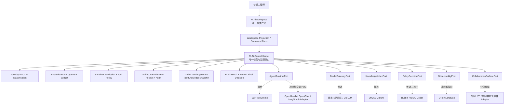

# FLAi-OS DeepResearch 关键评审与路线裁决

- 评审日期：2026-07-25
- 被评材料：`/Users/Zhuanz/Downloads/20260725FLAi-OS DeepResearch.md`
- 评审性质：外部研究提案的证据化架构审阅
- 生产实施授权：无
- 生产 Schema / API / 状态机变更：无
- 当前结论：`RESEARCH-REVIEWED / ARCHITECTURE-NOT-REPLACED`

## 1. 执行结论

这份报告是一份质量较高的**生态地图和候选能力雷达**。它正确识别了 FLAi-OS 的真正护城河：

1. 航空工程工作流；
2. 权威知识与证据链；
3. 工程工具链；
4. Sandbox、权限、审计和真人签发；
5. Agent 资产与 FLAi Bench；
6. 可持续的组织共建机制。

但它不适合作为当前项目的直接技术选型或部署蓝图。报告把“成熟能力应该复用”进一步推导成
“Open WebUI + Dify + LangGraph + OpenHands + LiteLLM + Langfuse + OPA/Cedar + Qdrant”
组合栈，低估了以下成本：

- 多套任务状态机、知识库、预算、审计和身份事实之间的冲突；
- 社区版与企业版能力边界；
- 品牌、白标、多租户和离线许可约束；
- 20–30 人团队维护多个 PostgreSQL、Redis/Celery、ClickHouse、对象存储和 K8s 服务的成本；
- 空隔供应链、SBOM、签名镜像、漏洞修复与离线升级；
- 与当前 FastAPI + SQLite Job Runner 轻内核、无 Redis/Celery 生产约束的直接冲突。

因此，建议冻结如下总决策：

> **FLAiWorkspace 继续拥有唯一正式用户体验；FLAi Control Kernel 继续拥有任务、授权、知识、
> 证据、审计、Bench 和真人交付事实。成熟项目只作为 Port 后方的可替换 Adapter、参考实现或
> 隔离试验对象，一次只引入一个变量。**

这不是“继续从零造所有东西”。正确做法是：**拥有产品体验和企业事实语义，复用通用执行能力。**

## 2. 原报告中应直接采纳的判断

| 判断 | 裁决 | FLAi-OS 中的落点 |
|---|---|---|
| 不寻找单一万能 Agent 壳 | 采纳 | Workspace、Control Kernel、Runtime、Knowledge、Tool、Bench 分层 |
| 护城河不在聊天框或通用 Agent Loop | 采纳 | 三条黄金工作流、Truth Knowledge Plane、FLAi Bench |
| 普通问答与高权限执行分离 | 采纳 | Sandbox admission、ExecutionTicket、Tool Adapter、receipt |
| 模型接入应收敛到统一网关语义 | 采纳 | 先冻结 `ModelGatewayPort`，具体产品后选 |
| 三栏工作台与动态结果区 | 采纳 | Workspace Rail、Continuous Work Surface、Focus Surface |
| 运行解释应基于证据、动作和产物，而非隐式推理 | 采纳 | Observer、Artifact、Evidence、Receipt |
| Agent 应作为有 owner、版本、权限和评测的资产 | 采纳 | CapabilityReleasePackage 与 FLAi Bench |
| WorkBuddy 可作为成熟 UX 和商业能力标杆 | 采纳 | 对照研究与条件性共存，不成为 FLAi 事实源 |

这些原则已经被当前 ADR-0064、Workspace Shell 蓝图、权威知识基础和 FLAi Bench 更精确地
表达，无需通过引入整套第三方平台才能获得。

## 3. 必须修正的关键判断

### 3.1 “不要再造通用壳”不等于“不要拥有 Workspace”

原报告把 Open WebUI 推荐为员工统一入口，但当前产品北极星已经明确：

> 让普通工程师用一句目标，在受控权限内连续完成真实工作，并在同一处看到过程、依据、产物和
> 真人最终决定。

FLAiWorkspace 的价值不是一个聊天页面，而是把 `Observer → Artifact → Evidence → Delivery`
编译成低摩擦体验。若把入口交给第三方 chat/workspace 数据模型，用户会重新面对多套导航、
状态和事实语义。

因此保留已经批准的路线 C：

- Open WebUI：只读参考、设计研究或隔离 sidecar；
- 正式产品：Vue 独立 no-copy Workspace Shell；
- 第三方 chat ID、workflow ID、knowledge ID 不成为 FLAi 领域身份。

Open WebUI 从 v0.6.6 起使用带品牌限制的自定义许可证。50 人以内存在品牌豁免，但这不是面向
组织扩展的长期许可策略；其权限模型也是多用户、单实例、加法授权，不能自动等同于 FLAi 的
ACL/classification 交集。[官方许可说明](https://docs.openwebui.com/license/)、
[认证与访问模型](https://docs.openwebui.com/features/authentication-access/)

### 3.2 OpenHands 是受控执行 Adapter，不是企业控制面

OpenHands 适合软件开发、脚本、浏览器和文件执行，但其开源 Local GUI 官方明确面向单用户，
不适合共享实例的多租户部署，也没有内置认证、用户隔离或伸缩。SAML、RBAC、集中审计和远程
多人监控属于 Enterprise 边界。[Enterprise 与 OSS 对比](https://docs.openhands.dev/enterprise/enterprise-vs-oss)、
[官方 FAQ](https://docs.openhands.dev/overview/faqs)

Docker sandbox 是重要执行隔离，但不是完整企业治理：

- Agent 仍可能访问网络；
- 注入凭据可被使用；
- 挂载目录可被修改或删除；
- Process sandbox 被官方明确视为不安全。

因此正确定位是：

> `BoundedSoftwareExecutionAdapter`：FLAi-OS 先完成身份、任务、知识快照、策略、Sandbox
> admission 和 ExecutionTicket，再允许 OpenHands SDK/Agent Server 执行限定工作；其结果必须
> 回到 FLAi Artifact/Evidence/Receipt，不得自行决定完成或签发。

[OpenHands Sandbox 官方说明](https://docs.openhands.dev/openhands/usage/sandboxes/overview)

### 3.3 Dify、LangGraph 与现有 Kernel 不能同时拥有工作流状态

Dify 的可视化工作流和 Knowledge Pipeline 很适合快速实验，但其自托管栈包含 API、Celery、
PostgreSQL、Redis、向量库、Sandbox、插件守护进程和 SSRF Proxy。当前许可证是带额外条件的
modified Apache 2.0；多租户和前端品牌修改存在商业许可边界。
[Dify LICENSE](https://github.com/langgenius/dify/blob/main/LICENSE)

LangGraph 的开源库适合 checkpoint、interrupt、重放、长任务和幂等副作用设计，但它是低层
编排 Runtime，不是产品壳。[LangGraph 官方概览](https://langchain-ai.github.io/langgraph/index.html)

当前 FLAi-OS 已有 `task_events + ExecutionRun + SQLite Job Runner`。在没有机械证明现有 Runner
无法满足某个冻结用例前：

- 不引入 Dify 作为生产状态机；
- 不引入 LangGraph Server 作为第二 Runtime truth；
- 可以吸收 LangGraph 的设计模式；
- 必要时仅在 `AgentRuntimePort` 后做兼容性 spike；
- Dify 最多作为可丢弃的流程创作实验，输出必须转换为 FLAi 合同。

### 3.4 统一模型网关是职责，不等于必须采用 LiteLLM

LiteLLM 能提供 OpenAI-compatible 路由、成本、限流和 fallback，作为候选很有价值。
[官方能力概览](https://docs.litellm.ai/)

但 2026 年其 PyPI `1.82.7/1.82.8` 曾发生供应链入侵，随后项目加强了发布签名；另有影响旧版
Proxy API key 验证的高危安全公告。该事实不等于永久拒绝 LiteLLM，却意味着国企空隔部署必须：

1. 禁止未固定版本的 PyPI 安装；
2. 固定 OCI digest；
3. 验证发布签名；
4. 生成并离线审查 SBOM；
5. 在内部 Registry 重打包和扫描；
6. 先明确 OSS 与 Enterprise 的身份、审计和细粒度权限缺口。

[供应链事件记录](https://docs.litellm.ai/blog/security-update-march-2026)、
[安全公告 GHSA-r75f-5x8p-qvmc](https://github.com/BerriAI/litellm/security/advisories/GHSA-r75f-5x8p-qvmc)

所以应先冻结 `ModelGatewayPort` 和失败语义，再比较现有内网网关与 LiteLLM，而不是先把产品名
写入架构核心。

### 3.5 OTel、Langfuse 与 FLAi Audit/Bench 不是同一类事实

OpenTelemetry 提供 traces、metrics、logs 的生成、收集和导出语义，本身不是存储、可视化或
不可变合规档案。[OpenTelemetry 官方定义](https://opentelemetry.io/docs/what-is-opentelemetry/)

Langfuse OSS 能提供 tracing、dataset、evaluation 和 prompt management，但项目级 RBAC、
SCIM、审计日志、服务端遮蔽等属于企业功能；完整自托管栈还会带来 PostgreSQL、ClickHouse、
Redis/Valkey 和对象存储。[Langfuse 自托管许可边界](https://langfuse.com/self-hosting/license-key)

因此：

- OTel 可较早成为脱敏遥测出口合同；
- Langfuse 是可选的工程诊断投影；
- 两者都不能替代 FLAi Evidence Ledger、签名 receipt 或 FLAi Bench；
- 敏感字段应在离开 FLAi 进程前过滤，不依赖下游“稍后遮蔽”。

### 3.6 OPA 与 Cedar 是替代候选，不是组合清单

OPA 是通用 Policy Decision Point；Cedar 是细粒度授权策略语言。两者都需要 FLAi 提供受信的
principal、resource、action、context、版本和 epoch。引擎不会替平台建立身份真实性、ACL 来源、
classification 或 receipt。

[OPA 部署模型](https://www.openpolicyagent.org/docs/deploy)、
[Cedar 授权语义](https://docs.cedarpolicy.com/auth/authorization.html)

当前应先冻结 canonical policy input/output、unknown、stale、revocation 和 fail-closed 语义。
只有策略数量和复用复杂度证明需要独立 PDP 后，才做 OPA 或 Cedar 的单选影子判定。任何 error
或 diagnostics gap 都必须由 FLAi 映射为拒绝。

### 3.7 Qdrant 只能是可重建索引

权威知识的真实性来自：

- source owner；
- ACL/classification；
- 精确版本与内容 digest；
- 适用范围和有效期；
- 精确锚点；
- 具名真人发布或受信上游签发证据；
- 任务时 `TaskKnowledgeSnapshot`。

BM25、Qdrant、Milvus 或任意向量索引只能加速检索。索引损坏或更换不能改变 KnowledgeVersion。
当前应先以 BM25 + 合成权威知识快照建立 Bench 基线；只有召回率、延迟或规模指标证明不足时，
才引入 Qdrant Adapter。

## 4. WorkBuddy 的准确定位

报告对 WorkBuddy 的总体判断基本成立，但混合了三个产品层：

- WorkBuddy Desktop：Plan/Craft/Ask、任务、文件、产物和模型选择；
- WorkBuddy Managed Agents：Manifest、Runtime、Session、Checkpoint、Version；
- WorkBuddy Enterprise：组织、用量、模型、部分审计和企业后台。

官方材料能证明这些产品**宣称和提供**相应能力，但不能仅凭产品页证明其审计满足不可篡改、
逐动作证据、验签 receipt 和 FLAi Bench 的标准。

更现实的商业边界是：官方当前公开的专有云专享版 100 席起购，私有化版 300 席起购；这与
FLAi-OS 当前 20–30 人范围不自然匹配，除非获得单独商务方案。
[WorkBuddy Enterprise 版本与门槛](https://cloud.tencent.com/product/workbuddy-enterprise)

因此 WorkBuddy 的位置应冻结为：

1. 首要 UX 与产品能力标杆；
2. 外网阶段可共存的通用办公工具；
3. 有明确 API、许可和安全证据时的能力消费者；
4. 不是当前内网 FLAiWorkspace 的既定底座；
5. 不能跨越 ADR-0063 的外网研发与内网空隔边界。

## 5. 经修正的目标架构

核心约束：

- 用户只感知一个 Workspace；
- 治理对象退到背景，低风险获准工作连续执行；
- 仅提权、越密级、高影响工具、覆盖/删除、外发和最终签发出现最小 JIT gate；
- 第三方组件不能拥有 FLAi 的领域身份、最终状态或签发事实；
- 一个 Seam 同一阶段最多选择一个外部实现；
- 每个外部实现都必须可移除，并通过同一合同测试。

## 6. 组件裁决

| 组件 | 现在 | 后续允许条件 | 永久边界 |
|---|---|---|---|
| Open WebUI | 只读参考 | 隔离 sidecar / 兼容入口 Spike | 不拥有正式 Workspace、任务或事实 |
| Dify | 不进入主链 | 非生产流程创作实验 | 不拥有 ExecutionRun、KnowledgeVersion、审批或审计 |
| LangGraph | 吸收模式，不部署服务 | 现有 Runner 缺口被 Bench 证明 | 只在 Runtime Port 后 |
| OpenHands | 不进入首发依赖 | 合成数据、无长期凭据的执行 POC | FLAi 授权在前、receipt 在后 |
| OpenClaw | 不作为平台内核 | 渠道或单信任域 Runtime POC | 不拥有多租户、审计或 Sandbox Authority |
| LiteLLM | 不作为硬依赖 | 供应链、许可和网关对照 Spike | 不拥有业务状态或 Secret truth |
| OTel | 接口语义可采纳 | 脱敏 OTLP 出口 | 不等于审计和 receipt |
| Langfuse | 延后 | 生产力收益覆盖运维成本 | advisory projection，不替代 Bench |
| OPA / Cedar | 延后、二选一 | canonical policy 合同稳定后影子判定 | FLAi 保留 PEP、fail-closed 与审计 |
| Qdrant | 延后 | BM25 Bench 证明具体缺口 | 可重建 Index，不是知识权威 |

## 7. 修正后的阶段门

### G0：设计与责任冻结

- 七个责任域评审同一 clean SHA；
- 生产仍为 `NO-GO`；
- 不引入新平台。

### G1：合成机制验收

- 三条黄金薄切片：技术报告润色、CFD 算例只读体检、会后纪要与行动项；
- Workspace 96-case、异常、stale、信任色、reduced-motion 和视觉 E2E；
- Truth Knowledge 和 FLAi Bench 使用 approved synthetic fixtures；
- Built-in Runtime 足够，不需要 OpenHands/Dify/LangGraph。

### G2：生产只读事实链

- 认证通道；
- ACL/classification；
- 一致性读边界；
- witness resolver；
- receipt 验签；
- fact digest；
- 完整失败码与 fail-closed。

这与已冻结 Production Snapshot Assembler 的只读设计合同一致，仍不修改生产 Schema。

### G3：隔离测试网

- 断公网、断公共 DNS；
- 内网身份与单一模型网关；
- 备份恢复、撤权、stale/gap、时间和审计演练；
- 先使用 Built-in Runtime。

### G4：单一真实只读薄切片

- 5–8 名具名验收人员；
- 一个真实知识范围、一个真实 Artifact 链、一个真实真人交付 receipt；
- 不允许完整自主 CFD 求解；
- 通过 Bench 不自动成为生产发布。

### G5：单变量 Adapter POC

只有 G1–G4 暴露具体、可测量的能力缺口，才逐项试验：

1. OpenHands 执行 Adapter；
2. 现有网关与 LiteLLM 对照；
3. BM25 与 Qdrant 对照；
4. Built-in Policy 与 OPA/Cedar 单选影子判定；
5. OTel/Langfuse 运维收益评估。

每次只引入一个变量，并要求：

- 许可证与品牌审查；
- 离线镜像与依赖闭包；
- digest、签名、SBOM、CVE 扫描；
- 故障、撤权、备份、恢复和回退；
- 不产生第二事实源；
- 可删除测试通过。

### G6：生产准入

由 Bench、运维成本、安全证据、七责任域签发和具名人类决定是否吸收。POC 成功、任务
`completed`、GitHub merge 或第三方产品自报“企业级”都不构成准入。

## 8. 对原报告预算和周期的处理

原报告的 9–15 个月和各阶段预算可作为讨论锚点，但不能进入正式汇报基线。报告没有绑定：

- 内部人力单价和兼职比例；
- 现有算力、K8s、存储、IdP 和运维能力；
- WorkBuddy 或各 Enterprise 组件的正式报价；
- 真实工具适配范围；
- 等保/涉密/空隔和国产化要求；
- 采购、法务和安全测试周期；
- 每阶段可机械验收的 WBS。

正式计划应改为“阶段门 + 资源包 + 退出条件”，在 G1 结束后才根据实际吞吐和运维证据更新
时间/成本预测。

## 9. 最终北极星

本报告不改变已经冻结的产品北极星：

> **让一名普通工程师只用一句目标，就能在受控权限内连续完成一项真实工作，并在同一处获得
> 可检查的过程、可追溯的依据、可交付的产物，以及由真人作出的最终决定。**

唯一北极星指标仍是 `WeeklyVerifiedValueUserRate`。Token、MAU、SUS、任务成功率、平均时延和
节省时间都应保留，但它们是诊断、成本或采用指标，不能代替“获得 REAL 可验证交付”的核心
价值。

## 10. 本轮决定

1. 不用该报告替换 ADR-0063、ADR-0064 或 Workspace Shell 蓝图。
2. 不授权导入 Open WebUI、Dify、LangGraph Server、OpenHands、LiteLLM、Langfuse、OPA/Cedar
   或 Qdrant。
3. 将报告转化为候选能力雷达与后续 Spike backlog。
4. 当前继续完成 Workspace Shell、只读观察合同、Truth Knowledge 和 FLAi Bench 的共同地基。
5. 下一份可冻结工作项应是“Candidate Adapter Evaluation Contract”，不是“安装七件套”。

## 11. 证据纪律

原报告内的 `citeturn...` 是生成会话内部引用，不是可独立解析的 URL。因而本评审只把其
内容视为待核主张，并以本文件中的官方文档、官方仓库和官方许可证链接重新建立证据。

本文件仍不是采购法律意见、涉密认定、安全测评或生产授权。所有时间敏感的许可、价格、功能和
安全状态必须在正式选型时按固定版本重新核验。
