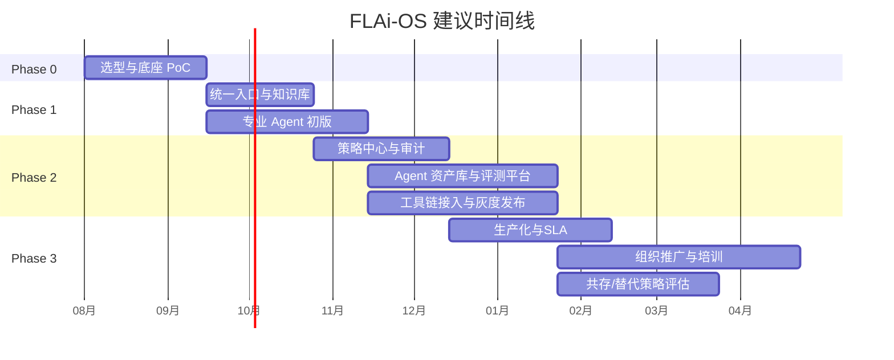
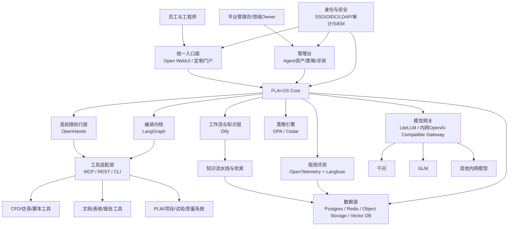
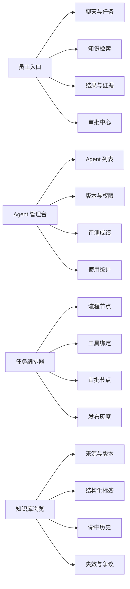

# FLAi-OS 深入规划与路线图研究报告

## 执行摘要

这份报告的核心结论是：**FLAi-OS 不应继续被定义为“再造一个通用 Agent 壳”**，而应重新定位为面向中国商飞动力系统场景的**企业级 AI 操作系统核心层**。原因很直接：通用 Agent 壳正在快速商品化。WorkBuddy 已经把“任务入口、多 Agent 并行、模型切换、渠道接入、Session/Runtime 管理、企业后台”做成了成熟商用品；开源生态中，OpenHands、Dify、LangGraph、Flowise、Open WebUI 也分别把“代码执行型 Agent”“可视化工作流”“长任务编排”“低代码搭建”“内网统一入口”做到了可用甚至较成熟的程度。对 20–30 人长期运维团队而言，继续从零自研完整壳层，投入大、收益低、维护负担重。citeturn13search3turn14view2turn16search1turn22search1turn19search1turn20search12turn6search0turn10search0turn9search4turn21search6

更准确的战略是采用**组合式架构**：用成熟开源/商用底座承载通用能力，再把自研资源集中到真正构成护城河的部分，即**行业流程编排、知识飞轮、工具链封装、治理与审计、Agent 资产管理、评测体系**。从现有方案看，没有任何一个“顶级开源项目”能够单独媲美 WorkBuddy 在办公场景的完整性；但若以 **Open WebUI 作为统一入口、Dify 作为工作流与知识流水线、LangGraph 作为生产级编排内核、OpenHands 作为代码/终端/沙箱型 Agent 能力、LiteLLM 作为模型网关、Langfuse 与 OpenTelemetry 作为观测与评测底座**，已经能拼出一套更可控、可迁移、可内网演进的 FLAi-OS 技术底座。citeturn21search6turn7search5turn7search16turn6search0turn6search1turn6search6turn10search0turn10search2turn19search1turn5search0turn5search11turn24search0turn24search2turn11search0turn3search3

因此，FLAi-OS 的护城河不在“聊天窗口”或“通用 Agent 循环”本身，而在三层粘合：其一，把动力系统设计、分析、验证、审查、归档等流程转成可复用的 Agent 化工作模板；其二，把知识库、工具链、日志、反馈、评测数据闭环成持续优化的知识飞轮；其三，把身份、权限、审计、数据分级、模型路由、人工审批、回滚与评测做成可治理的企业控制平面。这些能力恰好是 WorkBuddy 这类成熟壳可以承载但很难替你完成行业深耕的部分。citeturn14view2turn6search21turn10search2turn10search1turn11search15turn25search0turn25search2turn4search0turn4search1turn4search2

基于上述判断，报告建议的主路线是：**短期不与数据部的 WorkBuddy 路线正面竞争，而是采取“共存 + 反向吸收”**。先用开源组合完成 PoC 与专业 Agent 能力沉淀，再逐步把模型接入、知识治理、专业工具、评测、审计、资产库纳入 FLAi-OS Core；等核心能力成熟后，再决定是长期与 WorkBuddy 共存，还是以开源入口取代部分通用入口。就节奏而言，较合理的路线是 **Phase 0–3 共约 9–15 个月**；若现有内网算力、K8s、SSO 等基础设施已经具备，则可以更快。以下预算与时间均为研究性粗估，不是采购报价。  

## 研究边界与判断前提

本报告采用你给定的目标：**为中国商飞动力系统构建企业级 AI 操作系统 FLAi-OS，部署于内网，接入国产大模型，服务 20–30 人产品/工程团队，长期运维**。以下边界被视为“已指定”：内网部署、国产模型优先、企业级长期运维、研发与工程并重、需要 Agent 化而不是单一对话机器人。

同时，有一组对架构和路线影响很大的条件在题设中**未指定**，必须明确标记：**等保级别未指定、是否涉密与密级边界未指定、现有模型部署方式未指定、是否已有统一身份认证未指定、现有 K8s/GPU/对象存储/向量库基础设施未指定、动力系统工具链清单未指定、与 PLM/文档/仿真/试验/质量系统的接口边界未指定、年度预算口径未指定、是否允许使用源可见但非 OSI 标准许可的组件未指定**。这些“未指定”项会直接影响你能否选择 Open WebUI、Dify 这类带有商标/衍生许可条款的项目，以及是否需要把某些模块替换成 MIT/Apache 更彻底的组件。citeturn19search4turn19search0turn21search2turn21search5

就顶层策略而言，可以把你当前面临的路线分成三类。**完全自研壳**的优点是理论上最可控，但实际上会重走聊天入口、文件上传、会话管理、工具运行、沙箱、安全交互、模型路由、权限管理这些已经被成熟产品证明能复用的工作；**直接迁入成熟壳**的优点是上线最快，但会受制于许可证、黑盒能力边界、二次开发空间和供应商节奏；**组合式 FLAi-OS**则是中间道路：底层复用成熟壳与运行时，上层自建行业能力与治理平面。结合当前市场状态，这第三条路线最适合你的团队规模和组织语境。citeturn13search3turn14view2turn16search1turn19search1turn21search6turn6search0turn10search0

从部署适配看，国产模型接入并不是当前最大的技术障碍。阿里云百炼对千问提供了 OpenAI 兼容接口与原生接口；智谱开放平台也提供 OpenAI 兼容接口，强调现有 OpenAI SDK 应用可通过替换 base URL 和 API Key 快速迁移。这意味着，**模型适配更像“统一网关与协议标准化”问题，而不是“重新改造每个 Agent 框架”问题**。citeturn3search0turn3search1turn3search8turn3search9

## 竞争与替代方案分析

先给出总判断：**没有单个开源项目能完整复刻 WorkBuddy 的成熟办公壳体验，但不同项目在不同层面各有长板**。你真正需要的不是“一个开源版 WorkBuddy”，而是一套“前端入口 + 运行时 + 编排 + 知识 + 治理”的组合。下表按你要求对主要候选做横向比较。

| 方案 | 功能覆盖 | 可定制性 | 可控性 | 部署复杂度 | 适配国产模型难度 | 企业级特性 | 优缺点 | 推荐场景 |
|---|---|---|---|---|---|---|---|---|
| **WorkBuddy** | 强。覆盖任务入口、Plan/Craft/Ask 模式、多任务并行、模型切换、技能/专家/MCP、Runtime/Session/Version、渠道接入与企业后台。 | 中。官方支持模型配置、自定义 API、MCP、技能、连接器，但源码不可控。 | 中偏低。公开资料体现其为商用产品，官方提供文档、企业后台和专享版，但未见公开开源仓库；应按闭源商用品管理。 | 低到中。SaaS 企业版较低，专享版/私有部署由供应商交付，公开资料显示专享版支持单租户与私有访问。 | 低。官方模型配置页支持“提供商接入/自定义 API”，并列出 GLM 等主流模型兼容。 | 强。第三方登录、组织结构、统一订阅、用量控制、企业后台、审计可见性、专享部署等较完整。 | **优点**：成熟、快、办公场景完整；**缺点**：黑盒、供应商绑定、深度行业改造受限。 | 适合快速部门级上线、验证价值、作为短期共存底座。citeturn13search3turn14view2turn16search1turn16search4turn22search1turn22search4turn22search5turn22search9 |
| **OpenHands** | 强于“代码/终端/浏览器/文件/沙箱”型 Agent，偏工程执行，不是完整办公壳。 | 很高。MIT 许可，支持自建界面、SDK、扩展、MCP、自定义 sandbox。 | 高。核心开源，官方强调可部署在自己的环境中，控制代理运行位置与数据位置。 | 中到高。推荐 Docker sandbox；生产要处理 agent-server、镜像、隔离与插件。 | 低到中。官方强调 model-agnostic；若前接 OpenAI 兼容网关，接 GLM/千问成本可控。 | 中。公开文档中多用户、RBAC、预算控制等更偏 Cloud/源码可得特性；纯 MIT 核心版企业治理需补齐。 | **优点**：真正能“动手干活”，很适合代码、脚本、自动化；**缺点**：默认心智偏开发者，不适合作为全员统一办公壳。 | 适合 FEA/CFD 脚本、数据处理、自动化分析、开发工具链 Agent。citeturn19search1turn20search12turn15search4turn5search0turn5search11turn5search5turn3search0turn3search1 |
| **OpenClaw** | 强于“多渠道助手”与 Gateway，覆盖 Slack/Teams/Telegram/WhatsApp/WebChat 等；不是企业多租户工作台。 | 高。MIT 许可，渠道、MCP、模型提供商和工具配置都可改。 | 中。代码可控，但官方明确其不是面向敌对多租户的安全边界，更偏个人/单信任边界助手。 | 中。需搭 Gateway、渠道插件、鉴权和 WebChat。 | 中。支持多模型提供商与自定义 provider，但不是以企业模型网关为中心设计。 | 弱到中。公开文档未把其定位成 SSO/RBAC/审计完备的企业平台。 | **优点**：消息渠道整合强；**缺点**：官方安全模型更偏单用户助手，难直接承载企业共享多租户。 | 适合需要“飞书/企微/Slack/Teams 远程助手”入口时作为渠道层，而非 FLAi-OS 主平台。citeturn12search0turn12search2turn12search4turn12search6turn20search3turn20search7 |
| **Dify** | 很强。覆盖 Agent 工作流、RAG、知识流水线、工具/模型/插件市场、发布为 Web/API、观测与企业版能力。 | 高。社区版可自托管，工作流可视化，适合二次封装。 | 中到高。可自托管；但当前许可是 Apache-2.0 衍生/附加条款，严格法务需审。 | 中。Docker Compose 可快速起步，生产建议 K8s/Helm。 | 低。模型与工具集成友好，前接 OpenAI 兼容的国产模型较自然。 | 强。企业版提供 SSO/SAML、RBAC、审计日志、K8s 部署与支持；社区版无官方 SLA。 | **优点**：距离“企业 AI 应用工厂”最近，知识流水线成型；**缺点**：对底层运行时控制不如 LangGraph/OpenHands，自定义极深时会受平台范式约束。 | 适合 FLAi-OS 的工作流层、知识层和业务应用工厂。citeturn6search0turn6search1turn6search2turn6search6turn6search21turn19search4turn19search0 |
| **LangGraph** | 强于长任务、状态机、持久化、Human-in-the-loop、故障恢复、多 Agent 编排；无现成完整产品壳。 | 很高。低层框架，控制粒度最大。 | 高。逻辑、状态、节点、审批点都掌握在自己手里。 | 中到高。开发门槛高于低代码平台，需要工程能力。 | 低。官方强调 any model provider；接 OpenAI 兼容模型自然。 | 中。框架级很强，但企业后台、权限、审计、运营界面需自建或外接。 | **优点**：是最适合做 FLAi-OS Core 编排内核的候选；**缺点**：不是现成产品。 | 适合做核心任务编排、审批、回放、状态恢复、复杂流程闭环。citeturn10search0turn10search2turn10search3turn15search10turn17search18turn17search10 |
| **Flowise** | 中到强。可视化构建 AI Agents 与 LLM workflows，AgentFlow 能覆盖多 Agent 场景。 | 高。拖拽搭建快，适合低代码团队。 | 中。社区版可自托管，但企业特性依赖商业计划；源码许可为 Apache 2.0，另有企业能力分层。 | 低到中。npm 或 Docker 都较快。 | 中。支持自定义 base URL/模型，国产模型可接，但整体生态与治理深度不如 Dify。 | 中。官方文档包含 Workspace/RBAC、SSO（企业版）、加密凭据与 Secret Manager；审计与 SLA 能力不如 Dify/商用品完整。 | **优点**：P0/P1 非常快；**缺点**：大型平台化项目后期可能遇到治理与复杂逻辑天花板。 | 适合快速原型、部门级工作流试点、低代码推动。citeturn8search5turn8search1turn9search4turn9search0turn18search1turn18search2turn19search11 |
| **Open WebUI** | 强于统一聊天入口、模型接入、文件/RAG、工具、Pipelines、MCP、SSO/RBAC/SCIM、离线部署。 | 高。可扩展、支持 Pipelines/Functions/MCP；但品牌与许可有要求。 | 中到高。可内网、离线、支持多协议与任何 OpenAI-compatible provider；但当前许可包含品牌保留条款。 | 低到中。Docker 推荐，K8s 适合生产。 | 低。官方明确支持 OpenAI-compatible provider，天然适合作为 GLM/千问统一入口。 | 中到强。社区版即有 SSO、RBAC、SCIM、审计就绪日志与数据驻留控制；官方可提供企业功能与品牌定制。 | **优点**：最适合做“员工统一入口”；**缺点**：它是入口平台，不是流程内核；许可与品牌策略需法务确认。 | 适合做 FLAi-OS 门户层与日常统一聊天/检索/工具入口。citeturn21search6turn15search0turn7search5turn7search16turn7search0turn7search4turn7search3turn21search2turn21search5 |

综合下来，若你的问题是“有没有能媲美 WorkBuddy 的顶级开源 Agent 壳”，更准确的回答是：**没有单体方案；最接近的路径是“Open WebUI 负责入口，Dify 负责业务工作流，LangGraph 负责关键编排，OpenHands 负责代码与终端执行”**。这一组合的优点不是像 WorkBuddy，而是**比 WorkBuddy 更可控、更便于和企业治理体系深度耦合**。citeturn21search6turn6search0turn10search0turn19search1

如果必须给一个“优先级最高的开源替代栈”，我建议如下：**入口层首选 Open WebUI；应用工厂首选 Dify；核心编排首选 LangGraph；高权限执行 Agent 首选 OpenHands；渠道助手如未来需要，可局部引入 OpenClaw，而不是让它担任主平台。** 这四者各自承担不同层，不宜互相替代。citeturn21search6turn6search0turn10search0turn19search1turn12search0

## 核心护城河构建

FLAi-OS 若要“有意义”，护城河必须建立在**对通用壳层的克制**之上。真正值得自研的，不是再做一个对话框，而是把企业内部的工程流程、知识资产、权限治理和工具链联成一个可持续进化的系统。下面按技术、产品、组织与运营三个视角拆解。

### 技术护城河

技术层的第一护城河是**可恢复、可审批、可回放的 Agent 编排能力**。LangGraph 的强项恰好是 durable execution、human-in-the-loop、persistence 与 stateful agents；Dify 已经把知识流水线、Agent 节点和可视化工作流产品化；OpenHands 则把“在隔离沙箱中真正执行代码和命令”做成了成熟能力。对于 FLAi-OS 来说，正确做法不是再造这些基础机制，而是围绕它们定义动力系统场景的任务状态机、审批节点和安全边界。citeturn10search0turn10search2turn10search1turn6search6turn6search17turn5search0turn5search14

第二护城河是**知识飞轮**。从工程组织视角，真正值钱的不是“模型回答了一次”，而是“这次任务沉淀成下次更可复用的上下文、检索块、评测样本和流程模板”。Dify 的 Knowledge Pipeline 已经把数据摄取、清洗、切分、索引与检索测试串起来；Langfuse 则把 tracing、evaluation、dataset、prompt management 和实验比对作为 AI 工程平台能力提供出来。FLAi-OS 应该在其上层增加“文档版本与适用范围”“失效时间”“型号/部件/子系统标签”“引用证据链”“评测集回灌”等企业知识治理元数据。citeturn6search6turn6search21turn11search0turn11search11turn11search15

第三护城河是**模型适配与路由治理**。因为千问和 GLM 都已提供 OpenAI 兼容接口，模型交换本身并不难；难的是企业如何实现统一密钥、预算、熔断、Fallback、灰度与审计。LiteLLM 正是作为统一 OpenAI 格式网关来解决多模型、多 provider、预算、费控和 fallback 的问题。建议 FLAi-OS 明确采用“模型网关先于业务系统”的策略，让上层所有入口和 Agent 都只认一个内网模型网关，而不直接连具体模型服务。citeturn3search0turn3search1turn24search0turn24search2

第四护城河是**数据治理、权限与审计**。在中国语境下，个人信息保护法、数据安全法、网络安全法共同决定了企业内网 AI 平台不能只追求“好用”，还必须具备数据最小化、分级处理、日志留痕、访问授权与边界隔离。治理机制上，应把“谁能让哪个 Agent 调哪个工具、读哪类知识、访问哪类文件、把结果发到哪里”全部做成 policy-as-code，而不是散落在前端配置里。OPA 与 Cedar 都适合承担这一层。citeturn4search0turn4search1turn4search2turn25search0turn25search2turn25search16

第五护城河是**可解释性与可信执行**。企业 AI 的“解释”不应建立在暴露模型隐式推理过程上，而应建立在**证据链、工具链、审批链和执行轨迹**上：用了哪些检索块；跑了哪些工具；命中了哪些规则；谁批准了高风险动作；任务在哪一步失败、重试或回滚。OpenTelemetry 给出 traces、metrics、logs 的统一语义；Langfuse 则补上 AI 特有的 token、prompt、评估与实验。citeturn3search3turn3search7turn3search11turn11search0turn11search15

下面把技术护城河进一步落成“实现路径—KPI—风险—缓解”的项目表。

| 护城河项 | 建议实现路径 | 建议 KPI | 主要风险 | 缓解措施 |
|---|---|---|---|---|
| Agent 编排 | 以 LangGraph 为核心编排；高权限步骤调用 OpenHands；低代码业务流由 Dify 承担；关键节点强制人工审批。 | 关键任务成功率、失败恢复率、审批命中率、回放成功率。 | 流程失控、长链路超时、不可重现。 | 任务状态机、检查点、幂等节点、审批中断点、回放环境。 |
| 知识飞轮 | 用 Knowledge Pipeline 做摄取；每次任务产出自动入候选知识；审校后进入正式知识库与评测集。 | 有效引用率、知识更新时滞、评测集增长率、过期知识比例。 | 垃圾入库、旧文档污染、检索漂移。 | 严格元数据、双库隔离、过期策略、离线评测。 |
| 工具链 | 工具全部统一成 MCP 或内部 REST 规范；对 CAD/仿真/脚本工具设置风险等级。 | 工具可用率、失败重试率、人工接管率。 | 工具权限过大、执行不可预测。 | 最小权限、沙箱、审批、白名单命令。 |
| 模型适配 | 用 LiteLLM 统一上游；所有应用只认内网 OpenAI-compatible 网关。 | 模型切换时间、成本透明度、Fallback 成功率。 | 模型供应切换导致接口碎片化。 | 网关封装、模型能力标签、灰度发布。 |
| 数据治理 | 提示词、文件、知识、日志统一分级；涉敏场景强制本地模型与专用存储。 | 敏感数据外泄事件为零、100% 审计留痕。 | 影子知识库、用户私自接外部模型。 | 出口封禁、代理统一、审计告警。 |
| 权限与审计 | 用户、Agent、工具、数据集四维授权；策略引擎外置。 | 权限误配率、审计覆盖率、季度权限复核通过率。 | 角色膨胀、越权访问。 | ABAC/RBAC 结合、权限申请闭环、审计报表。 |
| 可解释性 | 记录证据块、工具轨迹、审批意见、版本与回滚信息。 | 有证据输出占比、可重现问题单比例。 | 用户不信任、问题排查困难。 | 结果卡片显示证据来源与动作轨迹。 |

### 产品护城河

产品层最重要的护城河是**Agent 资产管理**。WorkBuddy 的 Manifest、Session、Runtime、Version 管理已经说明，真正成熟的平台不会只把 Agent 当作“一个 Prompt”。FLAi-OS 需要把每个 Agent 都定义成企业资产：有负责人、有输入输出契约、有依赖工具、有权限边界、有版本、有评测成绩、有适用范围、有升级历史、有回滚说明。这个“Agent Registry / Agent Store”将决定平台长期是否可治理。citeturn14view2turn16search0

第二个产品护城河是**行业 Agent 库**。对中国商飞动力系统来说，真正有壁垒的对象不应是“通用写作助手”“会议纪要助手”，而应是围绕实际工程闭环形成的 Agent 模板与流程包，例如：需求解读 Agent、设计规范检索 Agent、CFD 前处理 Agent、FEA 工况检查 Agent、试验数据归档 Agent、适航条款追踪 Agent、技术报告生成 Agent、故障复盘 Agent。平台价值不在于这些 Agent 名称，而在于它们能否被**标准化、版本化、复用化**。

第三个产品护城河是**流程闭环**。若 FLAi-OS 只是把“知识 + Agent”接起来，它仍然只是一个更高级的问答系统。真正的护城河是把流程闭环起来：任务立项、上下文装载、工具执行、人工审查、结果归档、知识回灌、评测更新、版本升级。也就是说，平台不是“帮一个人做一次事”，而是“把一次工作转化成组织可复用能力”。这也是你与“单纯迁一个壳到内网”最本质的差别。citeturn6search0turn10search2turn11search11

### 组织与运营护城河

组织层的护城河通常被低估，但在企业里经常比技术更重要。首先，FLAi-OS 需要明确**职责分层**：平台 Owner 负责技术底座和治理；领域 Owner 负责专业 Agent 与评测集；数据 Steward 负责知识质量和失效策略；安全/合规 Owner 负责红线、权限和审计；运维 Owner 负责 SLA、监控和容量。没有这个角色分工，平台一定会因为“谁都能建 Agent、没人维护质量”而失控。citeturn4search0turn4search1turn4search2turn3search3

其次，必须把**评测与运营**内建成平台功能，而不是临时测试。WorkBuddy 官方已经把 Agent 评测作为正式能力；Langfuse 和 LangGraph 生态也都强调 tracing、evaluation、fault tolerance、human-in-the-loop。FLAi-OS 应要求每个拟上线的行业 Agent 必须绑定至少一组基准数据集、离线评测与回归测试。没有评测，平台只能“展示”；有评测，平台才能“运维”。citeturn14view2turn11search11turn10search0

最后，合规和生态也是护城河的一部分。对内，需要遵循数据安全法、个保法与网络安全法框架；对外，需要尽量采用开放协议而不是私有协议锁死，其中 MCP 对工具接入尤其关键。MCP 已被 OpenHands、Open WebUI、OpenClaw 等多方支持，它不是万能解法，但非常适合作为 FLAi-OS 的工具接入标准层。citeturn4search0turn4search1turn4search2turn3search2turn3search10turn5search1turn7search0turn12search6

## 分阶段路线图

这套路线图按照“先验证底座，再沉淀专业能力，再治理与规模化”的顺序设计。它默认你**优先复用已有内网模型与基础设施**；若从零采购 GPU、K8s 和存储，预算要明显上浮。下表给出建议节奏。

| 阶段 | 目标 | 关键里程碑 | 主要交付物 | 验收标准 | 人员配置 | 粗略预算区间 | 建议周期 |
|---|---|---|---|---|---|---|---|
| **Phase 0** | 完成底座选型与内网可运行 PoC | 统一入口跑通；GLM/千问接入；最小权限与审计链路具备 | 选型报告、技术样机、模型网关、统一登录原型、PoC 演示 | 两个国产模型均可用；至少一个端到端任务可运行；核心日志可追踪 | 4–6 人：架构 1、后端 2、前端 1、MLOps/运维 1、兼职领域专家 1 | **15–40 万元** | 1–1.5 个月 |
| **Phase 1** | 建立 FLAi-OS 最小可用产品 | 员工入口上线；知识库上线；2–3 个专业 Agent；离线评测初版 | Open WebUI 门户、Dify 工作流、LangGraph 编排骨架、知识库、Agent 资产页 | 目标用户能完成 3 个高频流程；知识引用可追溯；初版评测稳定 | 6–8 人：架构 1、后端 2–3、前端/设计 1–2、平台运维 1、领域专家 1–2 | **40–100 万元** | 2–3 个月 |
| **Phase 2** | 把“可用”推进到“可治理、可扩展” | 审批与回放；策略引擎；评测体系；5–8 个行业 Agent；接入关键工具链 | Agent Registry、策略中心、评测平台、工具适配层、灰度发布机制 | 关键流程有审批闭环；每个 Agent 有 owner、版本、评测；审计覆盖率接近完整 | 8–10 人：Phase 1 基础上增加安全/数据治理、测试/QA | **80–180 万元** | 3–4 个月 |
| **Phase 3** | 稳定运营与规模化推广 | 角色体系、SLA、治理机制、知识飞轮与组织级运营跑通 | 生产平台、运营看板、培训体系、演进规范、年度路线图 | 用户留存和复用率达标；专业 Agent 成为团队日常工具；能承接更多团队 | 10–12 人：平台团队 + 领域 Owner + 运营/培训 | **150–350 万元** | 4–7 个月 |

以上预算大头通常不在“软件 license”，而在**人力、内网部署、运维与领域人员投入**。若复用开源底座与既有算力，软件成本可控；若新建算力节点、对象存储、向量库、K8s 或高可用链路，则成本会明显抬升。这也是为什么本报告建议聚焦差异化能力，而非再造通用壳层。



从产品与组织管理角度看，**Phase 0–1 的成功标准不是“功能很多”，而是“形成正确定位”**。如果 P1 结束时你们做出来的仍是“一个聊天窗口 + 若干 Prompt”，那路线是偏的；如果 P1 结束时已经出现“统一入口 + 知识流水线 + 2–3 个专业流程 Agent + 初步权限与评测闭环”，那说明 FLAi-OS 的方向是正的。

## 技术架构与运维建议

### 推荐分层架构

FLAi-OS 的推荐架构不是单体，而是分层式系统：**前端入口层、Agent Runtime 层、FLAi-OS Core、行业 Agent 库、模型层、数据层、运维与安全层**。考虑到你们是内网长期运维，建议在“模型接入”和“治理”之间再加一层**统一网关与策略控制平面**。这样做的好处是，未来无论用千问、GLM，还是替换成别的内网模型，前端和 Agent 不需要重写。citeturn3search0turn3search1turn24search2turn25search0



### 组件推荐与替代关系

| 层 | 首选组件 | 可替代方案 | 选择理由 |
|---|---|---|---|
| 员工统一入口 | **Open WebUI** | 轻定制前端、自研门户、未来保留 WorkBuddy 共存入口 | Open WebUI 天然适合内网统一入口，支持离线、自托管、OpenAI-compatible provider、SSO/RBAC/SCIM/MCP/Pipelines。citeturn21search6turn7search5turn7search16turn7search0turn7search4 |
| 业务工作流与知识流水线 | **Dify** | Flowise、部分自研 Node Editor | Dify 在工作流、知识流水线、插件与企业版治理方面更接近“平台产品”，而不是单纯可视化拼图。citeturn6search0turn6search1turn6search6turn6search21 |
| 核心编排内核 | **LangGraph** | Temporal + 自研 Agent 层、其他框架 | 其持久化、恢复、人工审批、长任务控制能力更适合生产级复杂流程。citeturn10search0turn10search2turn10search3 |
| 高权限执行 Agent | **OpenHands** | 自研执行器、容器化脚本服务 | OpenHands 已把代码/终端/浏览器工作与安全沙箱做成成熟模块。citeturn19search1turn5search0turn5search14 |
| 模型网关 | **LiteLLM** | 自研网关、API Gateway + 自定义适配层 | 统一 OpenAI 格式、预算/费控/fallback 易于集中治理。citeturn24search0turn24search2 |
| 工具接入协议 | **MCP + REST** | 纯 REST / gRPC | MCP 已被多个主流 Agent 平台支持，适合作为工具标准层；专有系统可保留 REST。citeturn3search10turn5search1turn7search0turn12search6 |
| 可观测与评测 | **OpenTelemetry + Langfuse** | 纯 APM、手工日志、其他观测平台 | OTel 负责统一 traces/metrics/logs，Langfuse 补足 LLM/Agent 专用评测与提示管理。citeturn3search3turn3search11turn11search0turn11search15 |
| 策略与授权 | **OPA / Cedar** | 应用内硬编码 RBAC | 适合把策略外置为 policy-as-code，强化审计与治理。citeturn25search0turn25search2turn25search16 |
| 向量检索 | **Qdrant** | Milvus | 20–30 人团队优先建议轻量、可自托管、易运维方案；若后续规模化和高吞吐检索增长，可转 Milvus 分布式。citeturn11search2turn11search16turn11search3turn11search7 |

### 接口规范与部署要点

接口规范上，建议尽量收敛成五类。**模型调用统一到 OpenAI-compatible 网关**，因为千问和 GLM 都明确支持 OpenAI 兼容接口；**工具调用统一到 MCP 或内部 REST**；**身份认证统一到 OIDC/SAML/LDAP 对接企业目录**；**观测统一走 OTLP**；**文件与知识对象统一进对象存储与元数据索引**。这样的好处是，每一层都可以替换，而不会导致整个系统重写。citeturn3search0turn3search1turn7search5turn6search15turn3search3turn3search10

内网部署方面，建议把系统拆成三类命名空间：**在线入口与治理面、异步任务与 Agent 运行面、数据与基础设施面**。高权限执行任务（如脚本运行、文件修改、仿真工具调用）应与普通聊天检索分离，以便做更强隔离和审批。OpenHands 官方推荐 Docker sandbox，本身就适合作为这种隔离单元；Open WebUI、Dify 则更适合作为相对稳定的长期服务。citeturn5search0turn5search4turn6search2turn15search0

CI/CD 上，建议采取“**工作流版本化 + Agent 版本化 + 策略版本化 + 知识集版本化**”四轨并行。上线流程至少要经过：单元与集成测试、离线评测、策略校验、灰度发布、回滚预案。Kubernetes 层面的基线策略可以用 OPA Gatekeeper；应用运行时的授权和工具可用性则由 FLAi-OS Core 自己控制。citeturn25search14turn25search2

如果未来需要与数据部现有 WorkBuddy 共存，最合理的方法不是“谁替代谁”，而是让 FLAi-OS 先做**受治理的能力供给层**：模型网关、知识库、专业工具、评测集、Agent 资产库都由 FLAi-OS 管；WorkBuddy 作为既有交互壳继续存在一段时间，通过开放接口、MCP、企业 API 或人工迁移方式消费这些能力。WorkBuddy 官方文档已经体现其支持 MCP、企业 API 集成、模型配置与渠道接入，因此共存具备现实基础。citeturn14view2turn16search1turn22search9

## 产品美学与 UX 优化

### 产品美学原则

FLAi-OS 的美学原则应围绕“**可信、克制、专业、可操作**”展开，而不是消费级“炫酷感”。在工程组织里，用户真正需要的不是热闹的动效，而是**任务状态清晰、风险动作可见、证据来源明确、系统不抢控制权**。从 WorkBuddy、Dify、Open WebUI 的公开产品形态都能看到一个共同趋势：真正高频使用的 AI 平台，都会把“输入区、任务状态、产物区、配置区、历史区”做成明确分区，而不是让一切塞在单一聊天气泡里。citeturn16search6turn6search0turn21search6

视觉层建议采用**高信息密度但低噪声**的 B2B 设计体系：稳定的左右三栏信息架构、少量强调色、清晰可比较的状态标签、统一的证据卡片和审批卡片。交互层应保持“先展示计划、再执行高风险动作、最后沉淀资产”的单向心智，避免模型在未经许可时给用户“已经帮你做完了”的错觉。

可用性和无障碍方面，建议直接以 WCAG 2.2 作为下限：常规文本对比度至少 4.5:1；键盘导航必须完整可达，尤其是任务列表、审批弹窗、证据抽屉和配置抽屉。对于国企/制造业长期平台，这不是额外要求，而是降低使用门槛和维护成本的基础。citeturn23search4turn23search1turn23search20

### 关键界面建议

建议把关键界面拆成五类：**员工入口、Agent 管理台、任务编排器、Agent 资产页、知识库浏览器**。这五类页面分享统一视觉语言，但目标不同。

员工入口应该最像“任务工作台”，而不是“开发者控制台”。适合采用三栏布局：左边是项目/任务与最近 Agent；中间是对话与计划；右边是产物、证据、执行日志与审批。这样做的原因是，员工用户不需要理解底层节点，只需要看到“做了什么、基于什么、能否继续”。参考上，Open WebUI 擅长统一聊天入口，WorkBuddy 擅长把任务、结果、模型与工作目录放在同一屏，值得借鉴。citeturn21search6turn16search6turn16search4

Agent 管理台则是平台 Owner 与领域 Owner 的工作区，要突出**可治理性**：Agent 列表、负责人、版本、权限范围、最近 7 天成功率、平均成本、平均时延、最近失败案例、绑定知识库、绑定工具、绑定评测集。这个页面不应该强调交互美感，而要强调“平台运营像管理软件资产一样管理 Agent 资产”。

任务编排器不建议完全暴露给普通员工，而应定位为“高级用户/平台团队”的工作流设计器。若底座选 Dify，可复用其可视化工作流与 Agent 节点；若核心逻辑选 LangGraph，则需要自建一层“业务可看懂”的编排抽象，不要直接把底层 node/edge 暴露给所有人。citeturn6search0turn6search17turn10search0

Agent 资产页要成为 FLAi-OS 的“产品名片”。页面结构建议固定为：**摘要、适用边界、输入/输出契约、工具依赖、知识依赖、权限边界、版本历史、评测成绩、使用案例、Owner、FAQ**。这会显著降低“看起来每个 Agent 都差不多”的管理混乱。

知识库浏览器不能只是“文档目录”。它需要支持**按型号/系统/部件/主题/时效/等级/来源**多维浏览，且每条知识对象都应展示：来源、版本、有效期、审校状态、最近被哪些 Agent 使用、是否曾触发争议或回退。对工程组织而言，这种“知识对象视图”比普通搜索框更能建立信任。

### 示意草图

下面给出一个低保真员工入口草图，重点不是精细视觉，而是信息结构。

```text
┌───────────────────────────────────────────────────────────────────────────┐
│ FLAi-OS ｜ 当前项目：动力系统设计优化 ｜ 当前Agent：CFD分析助手 v1.3       │
├──────────────┬───────────────────────────────────────┬────────────────────┤
│ 项目/任务列表 │ 对话与计划区                            │ 结果 / 证据 / 审批    │
│              │                                       │                    │
│ - 今日任务    │ 用户：请分析这组工况，给出异常点与建议       │ [产物预览]            │
│ - 最近Agent   │                                       │ 报告.docx            │
│ - 收藏模板    │ Agent计划：                            │ 图表.png             │
│ - 待审批      │ 1. 读取工况文件                         │                    │
│              │ 2. 调用前处理脚本                        │ [证据来源]            │
│              │ 3. 检索历史案例与规范                     │ 规范A-第3章          │
│              │ 4. 生成报告并等待你审批                   │ 历史报告B-版本2       │
│              │                                       │                    │
│              │ [继续执行] [仅查看计划] [需要人工审批]      │ [执行日志]            │
│              │                                       │ read-file           │
│              │                                       │ python-run          │
│              │                                       │ approval-required   │
└──────────────┴───────────────────────────────────────┴────────────────────┘
```

再给出一个信息架构图，便于你和产品、设计团队对齐。



### 可量化 UX 指标

建议把 UX 做成可运营指标，而不是“上线后看反馈”。下面是一组更适合企业 AI 平台的指标。

| 指标 | 建议定义 | 建议目标 |
|---|---|---|
| 首次价值达成时间 | 新用户从登录到完成第一个有效任务的时间 | < 15 分钟 |
| 任务成功率 | 用户在不求助人工的情况下完成目标任务的比例 | 首批核心流程 > 80% |
| 审批理解率 | 用户能否理解为什么需要审批、审批什么 | > 90% |
| 证据点击率 | 输出结果中用户展开证据来源的比例 | > 50% |
| 回退率 | 用户因不信任而撤销/放弃结果的比例 | 持续下降 |
| SUS 可用性分数 | 标准 SUS 问卷得分 | 首版争取 ≥ 68，稳定后目标 ≥ 80 |
| 平均交互步数 | 完成任务所需点击/确认步骤数 | 持续下降 |
| P95 页面响应时间 | 管理台与门户关键页面的交互响应 | < 2 秒 |
| 搜索零结果率 | 知识库检索无命中的比例 | < 10% |

其中，任务成功率是最基础的可用性指标；SUS 68 常被视为平均水平，但若平台要进入日常高频使用，目标不应停留在“平均”，更应靠近 80 这一更优秀的区间。citeturn23search6turn23search2turn23search9

## 实施建议与汇报口径

### 短期可落地的 PoC 清单

最值得优先落地的 PoC 不是“大而全平台”，而是能同时验证**入口、知识、工具、审计、评测**五件事的小闭环。建议从以下五个开始。

| PoC | 目标 | 成功标准 | 资源需求 | 时间 |
|---|---|---|---|---|
| **统一入口 + 国产模型双接入** | 验证 Open WebUI + 模型网关是否能把 GLM/千问统一成一个内网入口 | 同一门户可切换两类模型；会话、文件、权限与日志统一 | 前端 1、后端 1、平台 1 | 2–3 周 |
| **工程知识库与证据输出** | 验证知识流水线、检索质量、证据卡片样式 | 输出必须带来源、版本、引用片段；业务用户认可度高 | 后端 1、数据/知识 1、领域专家 1 | 3–4 周 |
| **CFD/FEA 脚本执行 Agent** | 验证 OpenHands 类执行能力在内网工具链上是否可控 | 成功完成读取输入、调用脚本、生成结果、审批环节 | 后端 1、平台 1、领域专家 1 | 4–6 周 |
| **Agent 资产页 + 版本评测** | 验证 Agent 不是 Prompt，而是可管理资产 | 至少 3 个 Agent 具备 owner、版本、评测、回滚信息 | 产品 1、后端 1、测试/评测 1 | 3–4 周 |
| **权限与审计闭环** | 验证高风险工具调用可审批、可追溯、可回放 | 100% 高风险动作有审批记录与执行轨迹 | 平台 1、安全 1、后端 1 | 2–4 周 |

### 推荐开源组合与迁移策略

综合前文，最推荐的开源组合是：

- **门户层**：Open WebUI  
- **业务工作流与知识层**：Dify  
- **核心编排层**：LangGraph  
- **高权限执行层**：OpenHands  
- **模型网关**：LiteLLM 或等价内网 OpenAI-compatible gateway  
- **观测评测**：OpenTelemetry + Langfuse  
- **授权策略**：OPA 或 Cedar  
- **工具协议**：MCP + REST

这套组合的关键不是“堆项目”，而是分清职责边界：**Open WebUI 不做复杂流程；Dify 不承担长时、高权限执行；LangGraph 不直接做员工 UX；OpenHands 不做全员门户；LiteLLM 不承载业务逻辑；OPA 不写在前端里。** 只有边界清楚，平台才不会越做越乱。citeturn21search6turn6search0turn10search0turn19search1turn24search2turn11search0turn25search0

与数据部现有 WorkBuddy 的关系，建议分三步处理。**短期共存**：把 WorkBuddy 看成已完成的通用入口，不急着替代，而是让 FLAi-OS 做专业知识、工具、评测、治理和领域 Agent 能力层。**中期分层**：新建的专业 Agent 与流程优先落在 FLAi-OS；WorkBuddy 继续服务通用办公和低门槛使用。**长期评估替代**：如果 FLAi-OS 的门户、治理、运维和 UX 成熟，再逐渐把高价值高敏感场景迁到自控入口；若 WorkBuddy 在部分群体里体验优势明显，也可长期双轨存在。考虑到 WorkBuddy 官方已支持模型配置、自定义 API、MCP 与企业 API，这种共存是现实可行的。citeturn14view2turn16search1turn22search9

### 结论与建议口径

**高层汇报版**

- FLAi-OS 不再定位为“再造一个通用 AI 壳”，而是建设面向动力系统研发流程的企业级 AI 操作系统。  
- 通用 Agent 壳层能力已相对成熟，优先复用成熟底座，避免重复建设。  
- FLAi-OS 的核心投入将集中在专业 Agent、知识资产、流程闭环和治理审计。  
- 平台采取内网部署，优先接入国产模型，满足数据与合规要求。  
- 短期与现有 WorkBuddy 路线共存，优先做专业能力层，不做无谓替代。  
- 中期通过评测、权限、审计和知识飞轮，把 AI 从“工具”升级为“组织能力”。  
- 项目分阶段推进，先 PoC、后平台化、再规模化，控制风险。  
- 预期价值不只是提效，而是把一次性经验沉淀成可复用的企业 AI 资产。  

**技术评审版**

- 门户层推荐 Open WebUI，编排内核推荐 LangGraph，业务工作流与知识层推荐 Dify，高权限执行推荐 OpenHands。  
- 模型接入统一走 OpenAI-compatible 网关，优先适配千问与 GLM。  
- 工具层标准化为 MCP + REST，避免每接一个系统就重写一套 Agent 逻辑。  
- 运行链路必须具备可审批、可恢复、可回放与可审计能力。  
- 知识飞轮要把任务日志、引用证据、用户反馈和评测集联动起来。  
- 权限必须外置成 policy-as-code，避免权限散落在前端与 Prompt。  
- 发布必须经过离线评测、策略校验、灰度与回滚预案。  
- 所有 Agent 必须资产化管理，有 owner、版本、权边、依赖和指标。  

**产品路线版**

- 第一阶段先把“统一入口 + 知识证据 + 两三个专业 Agent”做扎实。  
- 第二阶段建设 Agent 资产页、任务编排器和管理台，形成平台化心智。  
- 第三阶段补齐策略中心、评测中心和运营看板，进入组织级治理。  
- 员工入口强调可信计划、证据来源和结果区，而不是炫技式对话。  
- 知识库要做成结构化知识对象，不是纯文档搜索。  
- Agent 页面必须展示适用边界与版本质量，降低误用风险。  
- 高风险动作始终可见、可审批、可追踪。  
- UX 指标以任务成功率、首次价值达成时间、SUS 分数和证据点击率为核心。  

### 优先参考来源

以下来源最值得作为后续内部方案评审的参考底稿，均优先来自官方文档、开源仓库或原始论文：

1. WorkBuddy 官方站与企业智能体文档：用于理解其任务模式、Agent Manifest、Runtime/Session/Version、MCP、企业后台与模型配置。citeturn13search3turn14view2turn16search1  
2. OpenHands 官网、文档与论文：用于判断其在沙箱执行、开发型 Agent、MIT 许可、MCP 与企业化边界的成熟度。citeturn19search1turn20search12turn20search1  
3. Dify 官网、社区版/企业版文档与 Knowledge Pipeline 文档：用于工作流、知识流水线、企业特性与许可判断。citeturn6search0turn6search1turn6search6turn19search4  
4. LangGraph 官方文档：用于 durable execution、persistence、human-in-the-loop 与 stateful agents 设计。citeturn10search0turn10search2turn10search3  
5. Open WebUI 官方文档与许可说明：用于统一入口、SSO/RBAC/SCIM、MCP、Pipelines 与当前许可策略判断。citeturn21search6turn7search5turn7search16turn21search2  
6. Flowise 官方文档：用于低代码 AgentFlow、Workspace/RBAC、SSO 与快速原型能力判断。citeturn8search5turn9search0turn18search1  
7. 千问与 GLM 官方开放平台文档：用于确认 OpenAI-compatible 接口和国产模型适配路径。citeturn3search0turn3search1  
8. MCP 官方规范与项目文档：用于统一工具接入标准。citeturn3search2turn3search10  
9. OpenTelemetry 与 Langfuse 官方文档：用于设计观测、日志、评测与 AI 运行追踪。citeturn3search3turn11search0turn11search15  
10. OPA/Cedar 官方文档：用于实现策略外置、细粒度授权与 policy-as-code。citeturn25search0turn25search16  
11. 中国《个人信息保护法》《数据安全法》《网络安全法》官方文本：用于定义合规底线。citeturn4search0turn4search1turn4search2  
12. WCAG 2.2 与 SUS 相关资料：用于建立可访问性与 UX 指标体系。citeturn23search0turn23search1turn23search2