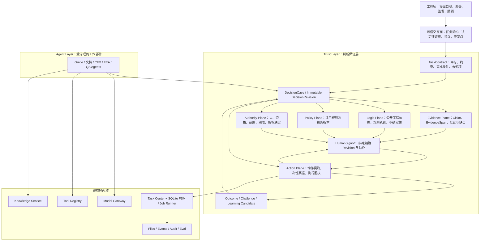
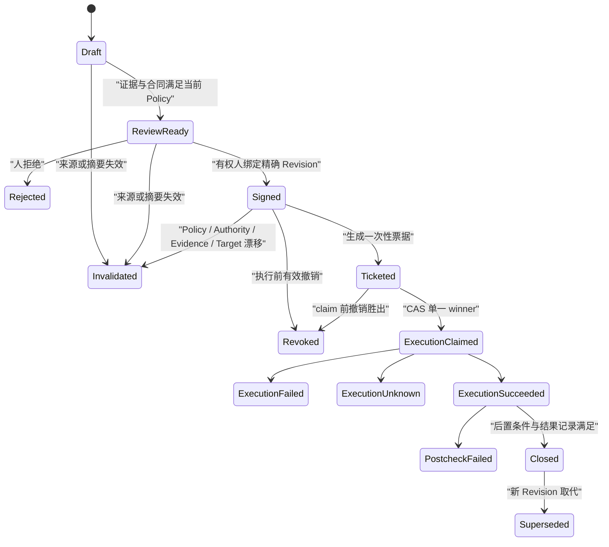
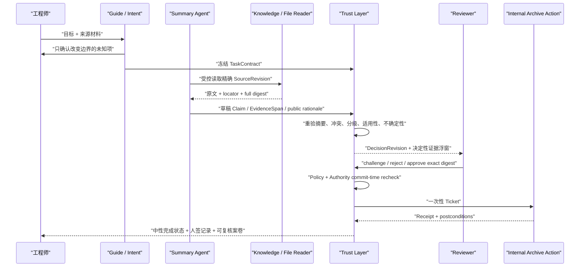

# FLAi-OS Trust Engineering Foundation 与 Trust Architecture v1.0

> Issue [#70](https://github.com/kogamishinyajerry-ops/flai-os/issues/70) · map [#46](https://github.com/kogamishinyajerry-ops/flai-os/issues/46)
> 研究基线：`origin/main@a32b36e48c8351bbcdb111398545339c6b3eb2c8`（2026-08-09）
> 文档性质：研究结论与架构提案；**不是已实现说明、认证结论、生产授权或法规符合性声明**

## 0. 阅读约定

本文用四种标签控制事实边界：

- **[已核实事实]**：在上述固定提交的源码、合同、测试或一手公开资料中可以直接复核；
- **[推论]**：由多项事实推导出的解释，仍可能被后续证据推翻；
- **[提案]**：建议采用的架构、协议或实验，不表示仓库已经实现；
- **[未决]**：必须由平台负责人、业务授权人或后续实验裁定的问题。

外部资料只作为设计输入。除非有权组织另行完成适用性判断，本文不声称 NIST、FAA、EASA、NASA、OMG、W3C 或其他材料对 FLAi-OS 构成直接法规要求。

---

## 1. 研究裁决

### 1.1 一句话结论

**[提案] FLAi-OS 应把 Trust Engineering 设为核心架构原则：Agent 是工作部件，受约束、可复核、可撤销的工程判断过程才是平台价值对象。**

但必须保留一条认识论边界：

**[推论] “Industrial Trust Engineering 能显著改善工业判断”目前仍是可证伪的理论候选，不是已被本仓库或 A1 样板证明的科学定律。**

因此现在可以固化的是不变量，不应提前固化营销式结论：

1. 模型输出永远是草稿或建议，不能成为有效签发；
2. 证据、逻辑、政策、权限、动作必须分开建模；
3. 人签必须绑定一个不可变、可重验的精确版本；
4. `missing / stale / tampered / conflicting / denied / unknown` 必须诚实显现并按政策 fail-closed；
5. 签发、执行、结果正确、知识晋级是不同事件；
6. 摘要只证明身份与完整性，不证明事实为真、人员有权或判断正确；
7. 历史经验只能进入待审学习候选，不能由一次批准自动晋级为组织知识。

### 1.2 产品定义的建议变化

现行宪法把 FLAi-OS 定义为“面向工程业务的智能体操作系统雏形”，同时焊死模型、工具、任务、事件和唯一人签边界。[已核实事实，见《系统宪法》](../00_FLAi-OS_Constitution.md)

**[提案] 不修改这一定义，而是在其下增加一条更精确的产品解释：**

> FLAi-OS 是以 Agent 为执行部件、以可审计工程判断为治理对象的工业智能协作底座。

它不是把 Agent 擬人化为“负责的数字工程师”。FAA 的 AI Safety Assurance Roadmap 明确建议把 AI 当作工具而非人，并要求清楚划分人的责任与系统要求。FLAi-OS 应沿用这一纪律，而不是用“数字同事”文案模糊责任主体。

### 1.3 Trust Engineering 的可证伪命题

**[提案] 核心研究假设：**

> 在不显著增加无效审阅成本的前提下，把 AI 参与判断组织成版本化任务契约、逐项主张、精确证据、公开工程依据、结构化不确定性、权限校验和摘要绑定人签，可以降低无效批准、证据错配和责任断裂。

以下任一结果都应削弱或否定该理论，而不是被解释为“用户不懂 AI”：

- 相比现有 TaskDetail 流程，A1 没有降低植入的 stale、tampered、conflicting 或越权案例的误批率；
- 审阅耗时显著上升，却没有降低关键证据漏检；
- 人签后修改任一重要字段仍保持“已授权”；
- 模型理由在替换其所谓决定性证据后仍基本不变；
- 只有 A1 一个消费者使用新对象，删除该对象不会迫使三个以上消费者重新实现同一绑定逻辑；
- 保守估计的避免损失低于审阅、维护、迁移、存储和决策延迟成本。

---

## 2. 可信不等于“模型解释得好”

### 2.1 五个常见误等式

| 错误等式 | 正确边界 |
| --- | --- |
| 有引用 = 结论可信 | 引用只能先证明“指向了某物”；还需判断来源权限、版本、适用性、完整性、冲突和论证关系 |
| 摘要一致 = 内容为真 | 摘要证明字节身份/完整性，不证明真实性、合法性、权威性或工程正确性 |
| 人点了批准 = 人理解了 | 人签证明一次认证操作发生；理解、胜任、独立性和组织权限还需单独证据 |
| 可解释 = 可审计 | 模型生成的流畅理由可能是事后叙事；工程审计需要公开命题、证据关系、规则轨迹、假设与限制 |
| 执行成功 = 决策正确 | 执行回执证明动作发生及后置条件；结果价值仍需 OutcomeObservation 与后续复核 |

### 2.2 三层信任建立机制

**[提案] 信任不存成一个分数，而通过三层独立证据逐步建立：**

1. **本次判断保证（Decision-instance assurance）**
   精确回答“这次输入、证据、方法、政策、签发人和动作是什么，是否仍有效”。
2. **能力保证（Capability assurance）**
   展示适用域、评测覆盖、失败边界、版本变化、复核推翻率、事件与回退能力；不以一次漂亮回答替代历史证据。
3. **组织保证（Organizational assurance）**
   回答谁有权制定规则、授权签发、接受风险、处理异议、撤销权限、复核事件和晋级知识。

**[推论] 用户真正需要的不是“99% 准确”徽章，而是能迅速找到决定性证据、识别失败边界、提出异议并安全停止。**

---

## 3. 当前 FLAi-OS 可信内核：Current / Partial / Missing

### 3.1 总表

| 能力 | 当前状态 | 可复用原语 | 不能过度声称的缺口 |
| --- | --- | --- | --- |
| Task 与 Event 骨架 | **CURRENT** | 严格 Task 合同、十态状态机、任务事件 | Task 是执行载体，不是统一工程判断案卷 |
| Agent Package 身份 | **CURRENT** | 双遍稳定捕获、完整包摘要、版本漂移拒绝 | Tool 实现没有同等级不可变快照；workflow/tool 仍是 worker 内可信 Python |
| 参数和输入文件证据 | **CURRENT** | canonical digest、文件 ID/SHA/大小/密级、完整性读门 | 这是执行前快照，不是完整签发包 |
| 人工审核事务 | **CURRENT（任务层）** | 会话派生 reviewer；状态、样本标签与事件同事务；证据不一致拒绝 | 当前明确允许 owner self-sign；无资格、委托、期限、撤销或职责分离 |
| 输出、模型、工具、知识绑定 | **PARTIAL** | 输出文件有 SHA；tool/model 有 ledger；knowledge 有 citation event | 这些没有咬合当前人签摘要；输出 ID setter 也不是内容摘要 CAS |
| 知识回源 | **PARTIAL** | `scope_id/chunk_id/source/fingerprint`，当前 chunk 读取，漂移/拒读/歧义状态 | 读取当前语料而非检索时点快照；无页/段/字符定位和原文高亮 |
| Claim / Rationale / Uncertainty | **PARTIAL（Agent 局部）/ MISSING（内核）** | 个别 Agent 有 claim、quote、confidence；UI 明示 confidence 为模型自评 | 无统一身份、版本、来源、密级、挑战、冲突和结构化不确定性 |
| Policy / Authority | **MISSING（统一对象）** | 认证、owner 检查、部分 classification gate | 登录身份不等于组织授权；无政策快照或授权决定对象 |
| Action Receipt / Revocation | **MISSING（通用协议）** | Task/tool 事件、窄用途 Skill application evidence | 无通用 action ticket、外部副作用回执、撤销/补偿协议 |
| 审计不可抵赖 | **MISSING** | SQLite 事件和 JSONL audit 可用于运营追踪 | 无 hash chain、签章或 WORM；API 审计与 DB commit 非原子 |
| Curated Memory | **PARTIAL / MISSING** | 对话、任务事件、Asset Candidate、draft eval case | 无 DecisionCase 经验晋级、失效、撤回和 outcome 验证生命周期 |
| 统一 `EngineeringDecisionCase` | **MISSING** | Asset Candidate 的内容寻址与 lineage 可作种子 | 仓内没有该类型、表、API、状态机或跨平面摘要 |

### 3.2 最关键的源码事实

1. **[已核实事实] 当前人签摘要只绑定执行前四项。**
   Runtime 的 `execution_evidence_digest` 只覆盖 `package_snapshot_digest`、`task_inputs_digest`、`input_file_ids` 和 `input_files_digest`；审核时重新验证同一 basis。[runtime.py](../../backend/app/runtime/runtime.py#L792-L827) · [repos.py](../../backend/app/storage/repos.py#L572-L739)

2. **[已核实事实] 输入文件证据较强。**
   文件证据固定 ID、归属、类型、SHA-256、大小和任务分级，并产生 canonical digest。[task_evidence.py](../../backend/app/runtime/task_evidence.py#L14-L37)；文件下载前校验归属、路径、大小和摘要。[file_integrity.py](../../backend/app/storage/file_integrity.py#L18-L116)

3. **[已核实事实] 人审是原子任务路径，但不是组织权限模型。**
   reviewer 来自认证会话，批准/拒绝与状态和事件同事务；当前源码同时声明只支持 owner self-sign，没有 reviewer assignment、delegation 或 separation of duties。[tasks.py](../../backend/app/api/tasks.py#L1769-L1832) · [repos.py](../../backend/app/storage/repos.py#L742-L856)

4. **[已核实事实] 知识引用仍停留在 chunk 级。**
   Knowledge QA 输出的 citation 只有 `chunk_id/source/fingerprint/score`。[workflow.py](../../agents/knowledge_qa_agent/workflow.py#L162-L235) 回源通道明确读取当前 corpus，并可能与 retrieval time 不同。[service.py](../../backend/app/knowledge/service.py#L81-L131)

5. **[已核实事实] 现有依据不完整不会阻断批准。**
   TaskDetail 会给出“本次输出未提供依据，请谨慎签发”，但当前 UI/服务契约并不把语义证据缺失作为审核硬门。[TaskDetail.vue](../../frontend/src/views/TaskDetail.vue#L190-L258)

6. **[已核实事实] 当前模型 confidence 只是自评。**
   EvidenceList 显示 `high/medium/low` 并明确标注为“模型自评”，不能作为可信或绿色判据。[EvidenceList.vue](../../frontend/src/components/EvidenceList.vue#L1-L30)

7. **[已核实事实] 粘贴文本存在分级缺口。**
   任务 `inputs` 可承载任意文本；当前任务分级合并的是输入文件、知识和工具三轴，无附件输入轴直接落 `internal`。A1 若以粘贴文本为源，必须先补显式来源/分级契约。[tasks.py](../../backend/app/api/tasks.py#L71-L94) · [runtime.py](../../backend/app/runtime/runtime.py#L333-L417)

8. **[已核实事实] Agent workflow 与 Tool adapter 尚无强隔离。**
   workflow 被导入 worker 进程执行，Tool timeout 也不能终止已经发生的外部副作用。ADR-0039 仍是沙箱 spike，而非生产边界。[runtime.py](../../backend/app/runtime/runtime.py#L421-L427) · [ADR-0039](../adr/ADR-0039-nemoclaw-openshell-sandbox-execution-spike.md)

### 3.3 对现状最准确的描述

**[推论] FLAi-OS 已拥有强局部原语：不可变输入/包来源、任务状态、原子人审、内容寻址候选、受控知识回源和诚实漂移提示；但这些原语尚未组成统一 Trust Layer。**

因此不能把 `completed + review_approved` 写成“完整工程决策已签发”，也不能把 current chunk “已回源”写成“结论已核实”。

---

## 4. Trust Architecture v1.0

### 4.1 总体架构



**[提案] Trust Layer 是协议与治理关系，不等于一组新微服务。** v1 应优先复用 SQLite、Pydantic、JSON Schema、现有 Task/Event/Gateway/Registry；五平面先表现为规范化对象和摘要，不预设五张表、五个进程或图数据库。

### 4.2 五平面分离

| 平面 | 回答的问题 | 允许的内容 | 不能替代什么 |
| --- | --- | --- | --- |
| Evidence | 我们实际知道什么？原文在哪里？ | Claim、SourceRevision、EvidenceSpan、反证、缺口、来源关系 | 不能决定政策允许或谁有权签 |
| Logic | 如何从已知走到建议？ | 可公开工程依据、确定性规则轨迹、方法版本、假设、限制、结构化不确定性 | 不是隐藏 CoT，也不是权威 |
| Policy | 当前适用规则是什么？ | Policy ID/version/digest、输入摘要、allow/deny/unknown 与 reason codes | 不能用“登录成功”代替 |
| Authority | 谁可以对什么范围作何种决定？ | 身份、资格、授权来源、范围、期限、委托/撤销、冲突声明 | 不能证明工程结论为真 |
| Action | 被批准的具体动作是什么，实际发生了什么？ | 目标、解析后参数、前后置条件、风险、可逆性、Ticket、Receipt | 不能把执行成功变成结论正确 |

**[提案] 分平面摘要不是为了削弱整体绑定，而是为了支持独立责任人、最小权限披露、局部差异审阅和精确失效传播。** 例如 Policy 版本变化时，可以明确指出 Policy Plane 漂移，同时保留历史 Evidence Plane；最外层 `case_digest` 再把五个精确版本锁成同一个不可拆换的签发对象。所有子引用都必须指向不可变 revision/digest，禁止用可变“当前版本”指针拼装 Case。任何平面摘要一致也只证明该平面的内容身份，没有额外证明其正确性或授权效力。

五平面分别 canonicalize 并摘要：

```text
case_digest = SHA256(canonical_json({
  schema_version,
  case_id,
  revision,
  task_contract_digest,
  classification_basis_digest,
  evidence_plane_digest,
  logic_plane_digest,
  policy_plane_digest,
  authority_requirement_digest,
  action_contract_digest,
  valid_until
}))
```

**[提案] `HumanSignoff` 必须绑定 `case_digest + policy_decision_digest + authority_decision_digest + action_contract_digest`。** 任一重要平面变化都产生新 Revision；旧签发保留为历史记录，但不得授权新动作。

### 4.3 为什么不把五平面做成“万能知识图谱”

**[已核实事实]** ADR-0031 已拒绝在当前规模引入 RDF、Neo4j 和 generic nodes/edges；ADR-0041 也把对象链接收窄为既有 digest 上的确定性只读投影。[ADR-0031](../adr/ADR-0031-agent-shell-read-only-ontology-projection.md) · [ADR-0041](../adr/ADR-0041-l2-object-link-interface-metadata-layer.md)

**[提案]** 借用 W3C PROV 的 `Entity / Activity / Agent / revision / invalidation` 语义即可，不要求采用 RDF 存储。只有预先登记至少三个生产多跳查询，并证明 SQLite/JSON 投影无法满足规模和延迟目标后，才评估图技术。

---

## 5. EngineeringDecisionCase v0 协议

### 5.1 聚合边界

不要建立一个同时承担任务状态、签发、执行、授权和学习的可变“大对象”。

**[提案] 最小深接口拆分：**

- `DecisionCase`：长期逻辑身份和关联根；
- `DecisionRevision`：一次不可变的判断案卷；
- `AuthorizationRecord`：人对某个精确 Revision、动作、政策和权限上下文作出的决定；
- `ExecutionReceipt`：实际动作、副作用、偏差与后置条件；
- `OutcomeObservation`：后续效果和现场反馈；
- `LearningCandidate`：独立待审经验候选，默认不可作为权威知识。

删除 `DecisionCase` 若只会把字段散回 Task、Asset Candidate 和 UI，它就是浅包装。它只有在统一绑定/失效逻辑被至少三个独立消费者复用时才值得持久化。

### 5.2 不可变信封

```yaml
immutable_object:
  id: "server-generated UUID"
  revision: 1
  schema_version: "decision-revision.v0"
  body: "canonical JSON value"
  digest: "sha256:<64 lowercase hex>"
```

`digest` 不包含自身。任何 body 修改都必须创建 `revision + 1`；禁止原地更新后沿用旧地址。

### 5.3 核心对象

#### TaskContract

```yaml
task_contract:
  objective: "要完成的工程判断或交付"
  decision_question: "需要人最终决定什么"
  success_criteria: []
  constraints: []
  known_inputs: []
  unknowns: []
  out_of_scope: []
  evidence_policy_ref: "versioned policy"
  action_boundary: "read_only | internal_write | external_effect"
  stop_conditions: []
  source_refs: []
```

它是目标澄清的机器合同，不是让工程师重新填一张长表。Guide 应从对话和附件提出草案，只向人询问真正改变任务边界的少量未决项。

#### Claim

```yaml
claim:
  claim_id: "UUID"
  kind: "observed | derived | proposal | assumption"
  statement: "可检查的一条命题"
  subject_ref: null
  proposer_ref: "human | model-call | tool-run | rule"
  valid_time: null
  classification_basis_ref: "existing policy reference"
```

`proposer_ref` 只描述来源，不授予权威。

#### EvidenceSpan

```yaml
evidence_span:
  span_id: "UUID"
  artifact_ref:
    artifact_id: "stable logical id"
    artifact_version: "source version"
    full_sha256: "sha256:<64 hex>"
    source_system: "knowledge | uploaded_file | tool_output | external_record"
    observed_at: "RFC3339"
  selector:
    kind: "page_bbox | section_paragraph | exact_text | utf8_range | sheet_cells | json_pointer"
    value: {}
    quote_digest: "sha256:<64 hex>"
    prefix_context: "optional bounded text"
    suffix_context: "optional bounded text"
  relation_to_claim: "supports | contradicts | qualifies | context"
  annotation: "为什么这段内容与该 Claim 有关；简短、可审计"
  source_classification_ref: "existing source policy"
  retrieval_snapshot_ref: "corpus/index/version digest or null"
```

EvidenceSpan 必须同时有：完整源版本摘要、稳定定位器、选中文本摘要和 Claim 关系。短 fingerprint 只能用于快速定位或漂移提示，不能承担签发级身份。

#### EngineeringRationale

```yaml
engineering_rationale:
  output_claim_ref: "claim digest"
  input_claim_refs: []
  evidence_edge_refs: []
  method_ref:
    id: "method or rule id"
    version: "version"
    digest: "sha256:<64 hex>"
  method_kind: "extraction | calculation | comparison | rule_application | human_judgment"
  public_basis: "面向审阅人的简短工程依据"
  assumption_refs: []
  limitation_refs: []
```

**[提案] 明确禁止把隐藏 chain-of-thought、scratchpad 或 raw reasoning trace 存入案卷。** 需要保留的是可公开检查的命题关系、规则轨迹、方法与限制。模型/Prompt/RAG 配置用版本与摘要进入 Logic Plane，不能把生成的叙事冒充真实内部推理。

#### UncertaintyAssessment

```yaml
uncertainty_assessment:
  evidence_coverage:
    state: "complete | partial | none | unknown"
    basis_refs: []
  source_freshness:
    state: "current | stale | unknown"
    affected_span_refs: []
  source_consistency:
    state: "consistent | conflicting | unknown"
    conflict_refs: []
  input_completeness:
    state: "complete | incomplete | unknown"
    missing_items: []
  method_applicability:
    state: "within_scope | limited | outside_scope | unknown"
    limitation_refs: []
  deterministic_validation:
    state: "passed | failed | not_run | not_applicable | unknown"
    receipt_refs: []
  model_instability:
    state: "measured | unmeasured | not_applicable"
    method_ref: null
    result_ref: null
  unresolved_questions: []
```

**[提案] 不生成总 Trust Score，不允许模型自由填写“87% 可信”。** 每个维度必须有来源、方法、观察时间和 basis；没有方法就显示 `unknown/unmeasured`。

#### AuthorizationRecord / HumanSignoff

```yaml
authorization_record:
  decision_revision_digest: "sha256:..."
  action_contract_digest: "sha256:..."
  policy_decision_digest: "sha256:..."
  authority_decision_digest: "sha256:..."
  decision: "approve | reject"
  signer_source: "authenticated_session"
  signer_user_id: "server-derived"
  signer_username: "server-derived"
  signer_session_hash: "server-derived"
  signed_at: "server time"
  expires_at: null
  conditions: []
  comment: null
```

客户端只能提交 `case_id/revision/expected_case_digest/decision/comment`。身份、权限、Policy outcome、风险和动作类别都由服务端派生。

这是一份摘要绑定的认证人类确认，**不是密码学电子签名，也不能自行证明签发人具备组织资格**。

#### ActionContract / Ticket / Receipt

```yaml
action_contract:
  action_name: "versioned catalog action"
  resolved_inputs_digest: "sha256:..."
  target_ref:
    type: "object type"
    id: "target id"
    expected_version: "version"
    expected_digest: "sha256:..."
  side_effect_class: "read_only | reversible | irreversible | external"
  preconditions: []
  postconditions: []
  adapter_ref: {tool_id: "...", version: "...", digest: "sha256:..."}
  retry_policy: "no_automatic_retry"
  compensation_action_ref: null

execution_ticket:
  case_digest: "sha256:..."
  signoff_digest: "sha256:..."
  action_contract_digest: "sha256:..."
  idempotency_key: "sha256:..."
  state: "pending | claimed | revoked | expired | consumed"

execution_receipt:
  ticket_digest: "sha256:..."
  target_before_digest: null
  target_after_digest: null
  outcome: "succeeded | failed | unknown"
  side_effect_state: "none | partial | complete | unknown"
  postcondition_results: []
  error_code: null
```

Ticket 用 CAS 单次 claim；Receipt 对 Ticket insert-once。worker 在外部调用后失联时必须落 `unknown` 或由恢复逻辑保守推定未知，不能无脑重试。执行后“撤销”不能删除既有副作用或 Receipt；补偿必须成为新案卷、新动作和新人签。

### 5.4 生命周期与正交健康状态



生命周期之外保留正交状态：

```yaml
evidence_health:
  availability: "full | partial | missing | denied | conflicting"
  integrity: "verified | stale | tampered | unknown"
  applicability: "applicable | limited | outside_scope | unknown"
```

不要把所有失败压成单一 `blocked`；也不要把 `ready/resolved` 显示成绿色“正确”。

---

## 6. Evidence Engine 与原文浮窗

### 6.1 产品目标

**[业主裁决] 所有模型草稿必须经过人工复核；关键证据必须让用户直接看到原文对应位置、高亮和简要注释。**

这不是“引用列表美化”，而是减少三种审阅成本：

- 找不到原文；
- 找到原文却不知道 AI 为什么引用它；
- 原文已经变化，页面仍给出旧结论。

### 6.2 最小交互

**[提案] 只在现有 TaskDetail 内增加一个 task-scoped 浮动查看器，不新增路由、第二工作台或第二组审批按钮。**

```text
┌────────────────────── 任务详情 ──────────────────────┐
│ Claim：规章要求保留 X 记录                            │
│ 决定性证据 1  [查看原文]  当前 · 适用 · 未发现冲突     │
│ 说明：该段直接规定记录保存要求                         │
│                                                       │
│                         ┌──── 证据原文浮窗 ────────┐  │
│                         │ 来源 / 版本 / 摘要 / 密级 │  │
│                         │ 页 12 · §5.3.2            │  │
│                         │ 上下文……                  │  │
│                         │ █ 高亮原文 █              │  │
│                         │ 上下文……                  │  │
│                         │ 注释：为何支持此 Claim     │  │
│                         │ [下载原件] [关闭]          │  │
│                         └──────────────────────────┘  │
│                         唯一签发卡仍留在原位置          │
└───────────────────────────────────────────────────────┘
```

浮窗应展示：

- 文档/数据对象标题、来源系统和稳定 ID；
- 精确版本、完整 SHA-256、检索/观察时间；
- 页码/章节/段落/坐标/单元格等 locator；
- 原文上下文与 EvidenceSpan 高亮；
- `supports / contradicts / qualifies / context` 关系；
- 一句人工可审计 annotation；
- 当前可用性、完整性、适用性和密级读取结果；
- “下载原件、重试、关闭”，不复制批准/驳回。

### 6.3 状态与信任色

**[提案] UI 用正交状态，而不是七个互斥巨枚举：**

```js
{
  phase: "loading" | "ready" | "error",
  availability: "full" | "partial" | "missing" | "denied" | "conflicting",
  integrity: "verified" | "stale" | "tampered" | "unknown",
  applicability: "applicable" | "limited" | "outside_scope" | "unknown"
}
```

沿用现有信任色锁：

- `tampered`：red，表示真实完整性失败；
- `stale / conflicting / missing / partial / unknown`：amber；
- `ready / denied / loading`：中性墨与明确文字；
- green 只保留 REAL 证据语义，不能由引用数量、模型自评或“已打开”触发；
- teal 只属于认证人签；
- `completed` 保持中性。

`denied` 是策略结果，不是系统故障。没有读取权限时不得泄漏受限原文、路径或越权元数据。

### 6.4 “已回源”的准确文案

现有回源能证明“当前来源中找到了对应 chunk，并可比较短 fingerprint”。它不能证明：

- 该段内容为真；
- 它适用于当前型号/阶段/地区/时间；
- 它足以支持 Claim；
- 签发人有权接受该风险；
- 当前内容等于检索时内容。

**[提案] 将含义收窄为“已定位当前来源”或“当前位置可读”，并把完整性、时效性、适用性分栏显示。**

### 6.5 审阅负担控制

证据不是越多越可信。来源重复、同源转述和相关性堆叠会制造证据墙。

**[提案] 每个 Claim 区分：**

- `decisive`：改变人类决定的最重要证据，默认先展示；
- `counter`：反证或冲突，永不折叠为“更多”；
- `supporting`：补强材料；
- `context`：背景，不计入充分性。

界面首先回答“哪条证据最可能改变我的判断”，而不是展示 citation count。

---

## 7. 不确定性工程

### 7.1 为什么不用星级或模型置信度

模型 token 概率、自由文本 confidence 和工程结论的不确定性不是同一个量。NIST AI RMF 要求在情境中决定指标与阈值，并明确人类判断在阈值选择中的作用；NASA-STD-7009B 则要求把预期用途、数据谱系、假设、限制、验证、确认、不确定性和敏感性组织成可复核材料。

**[提案] FLAi-OS 只展示有测量方法的量；无方法时明确 `unknown`。**

### 7.2 两类不确定性

- **Aleatory / variability**：客观变异，可通过分布、区间、样本或敏感性方法描述；
- **Epistemic / lack of knowledge**：知识不足，可通过补证、试验或专家复核降低。

对 LLM 文本草稿，常见的是证据覆盖、适用域、输入缺失、来源冲突和输出不稳定；不应无依据地包装为精确概率。

### 7.3 成熟机制

成熟不是所有项都显示“高”，而是：

1. `unknown/unmeasured/outside_scope` 是一等状态；
2. 每个值有 `source + method + observed_at + validity_domain`；
3. 超出有效域触发复核或停止，不产生低置信成功；
4. 结果校准基于真实标签和 OutcomeObservation，而不是模型自评；
5. 版本变化后重新评测监督机制是否仍有效。

---

## 8. Authority 与人工签发

### 8.1 四种不能混用的“批准”

| 决定 | 典型问题 | 可能的合法主体 |
| --- | --- | --- |
| Technical verification | 计算、试验或引用是否满足技术准则？ | 具备相应技术资格的人/确定性工具 |
| Operational acceptance | 交付是否可被当前任务接收？ | 任务 owner 或指定 reviewer |
| Risk acceptance | 剩余风险是否可接受？ | 被组织授权承担该风险的人 |
| Release / formal signoff | 是否允许进入后续正式流程？ | 组织定义的签发角色 |

**[已核实事实] 当前 V1 只实现 exact-owner 任务审核，不能声称覆盖上述组织权限。**

### 8.2 有效 Authority Decision 至少需要

- subject 的稳定身份；
- 授权来源和规则版本；
- 可签对象类型、风险级别、业务域和生命周期阶段；
- 生效时间、期限、委托链和撤销状态；
- 资格/培训要求及其当前状态；
- conflict-of-interest 或 self-review 策略；
- `allow / deny / unknown` 精确枚举，绝不以 truthiness 判断。

### 8.3 反对橡皮图章

打开证据浮窗、滚动到底或勾选 checkbox 只能作为过程 telemetry，不能证明理解。

**[提案] 通过对照实验与异常植入检验实质审阅：**

- 决定性反证被植入时，challenge/reject 率是否上升；
- stale/tampered/authority-expired 的召回率；
- 人工推翻率和理由是否与关键证据对应；
- 审阅时间与漏检的权衡；
- 审阅疲劳、队列延迟和重复证据量。

### 8.4 异议是一等对象

**[提案] `Challenge / FormalDissent` 追加记录共同事实、不同立场、理由、建议、裁决和申诉路径。** 它不能覆盖原结论。NASA Governance Handbook 对 Technical Authority 和 Formal Dissent 的分离可作为组织设计类比。

---

## 9. Curated Memory：经验沉淀而非自动记忆

### 9.1 需要保持的分离

```text
任务批准
   ≠ 字段级正确
   ≠ 结果有效
   ≠ 可跨场景复用
   ≠ 已晋级组织知识
```

**[已核实事实]** 现有 Governance Loop 已坚持“任务批准不等于字段正确”，自动形成的 eval case 仍为 draft，必须独立策展。[ADR-0018](../adr/ADR-0018-m10-governance-loop.md)

### 9.2 建议的学习链


学习候选至少记录：来源 Case/Receipt/Outcome 摘要、适用域、失败条件、反例、策展人、批准人、有效期、撤回传播范围。聊天、模型输出和一次人工批准都不能自动晋级。

---

## 10. A1 最小纵向样板：`release_internal_summary.v0`

### 10.1 目标

**[提案] A1 只验证契约和审阅机制，不接外部工程系统，不宣称验证了整个工业 Trust Engineering 理论。**

场景：工程师提交一份明确分级的 UTF-8/PDF/知识源材料，请 Agent 生成一份内部摘要草稿；系统把摘要拆成 Claim，绑定精确 EvidenceSpan，呈现结构化不确定性，人工对精确 Revision 作“封存内部摘要”确认，系统生成只读/内部写 Receipt。

### 10.2 单任务顺序



### 10.3 A1 必须冻结的内容

- 输入全文/文件/知识 corpus 与 index 版本摘要；
- 输入文本的明确来源与分级依据，不能用“无附件所以 internal”；
- 输出摘要字节与 manifest digest；
- 每条 Claim、EvidenceSpan、关系、annotation 和反证；
- model profile、实际 model、Prompt/RAG/tool/package 的版本与摘要引用；
- UncertaintyAssessment；
- Policy 与 Authority 决定；
- 人签和“封存内部摘要”ActionContract；
- Receipt 的实际产物摘要和后置条件。

### 10.4 对照实验

采用同一批材料和 reviewer 的 crossover 设计：

- A：现有 TaskDetail 流程；
- B：A1 DecisionRevision + EvidenceSpan 浮窗；
- 随机植入 missing、stale、tampered、conflicting、wrong-authority、out-of-scope 和正常样本；
- 记录误批、漏检、挑战、审阅时间、决定性证据打开率和主观负担；
- evidence-open 只作次级过程指标，不能作为“认真审阅”证明。

初始研究门（阈值仍需业务 owner 裁定）：

- 所有签后重要字段/字节变异机械拒绝率：100%；
- expired/revoked/wrong-scope authority 的 commit-time 拒绝率：100%；
- operational approval 自动晋级权威知识：0%；
- source invalidation 对依赖 Revision 的 stale/superseded 传播：100%；
- 浮窗是否降低无效批准，必须由对照结果决定，不能预设为 PASS。

### 10.5 A1 失败样本

| 场景 | 预期 |
| --- | --- |
| happy | 可定位、高亮、摘要一致；进入 review-ready，不出现绿色“结论正确” |
| missing | amber，不能批准要求该证据的动作；仍允许 reject/challenge |
| stale | 显示检索版与当前版差异；旧签发失效 |
| tampered | red；零签发、零 Ticket、零动作 |
| conflicting | 反证置顶；Policy 为 unknown/deny，不能靠前端按钮穿透 |
| denied | 不泄漏正文和受限元数据；不能把拒读写成“不存在”或“已验证” |
| partial/truncated | 明示边界；不能把局部预览当全文检查 |
| authority expired/revoked | commit-time 拒绝，不能沿用已打开页面的旧 allow |
| superseded Revision | 旧 Revision 仍可审计，未 claim Ticket 立即失效 |
| worker crash after claim | outcome/side effect 进入 unknown，不自动重试 |

---

## 11. 威胁模型与机械不变量

### 11.1 必须拒绝的输入或变异

| 攻击/失败 | 机械预期 |
| --- | --- |
| 客户端提交 signer、actor、policy outcome、risk、session | 422，零写入 |
| 客户端提交 `confidence` 或 hidden CoT 字段 | schema 拒绝或忽略为非权威草稿，绝不进签发判据 |
| 任一 child/plane/case digest 不一致 | freeze/sign 失败，零写入 |
| EvidenceSpan 越界或选中文本摘要不符 | tampered，禁止批准和出票 |
| source missing/stale/denied | 诚实状态；需该证据的 protected action 调用数为 0 |
| supports 与 contradicts 未解决 | uncertainty=conflicting；Policy 不得 allow |
| Policy/Authority 为 deny、unknown、NULL、`true`、`1` | 无有效 approve、无 Ticket |
| 签后证据/Policy epoch/Authority/target head 漂移 | 原子 invalidated；未 claim Ticket 失效 |
| revoke 与 claim 并发 | CAS 只有一方胜；revoke 胜则副作用为 0 |
| 两 worker 并发 claim | 只有一个获得 Ticket |
| 同 idempotency key 重放 | 返回既有状态/409；不得二次执行 |
| Receipt 显示 success 但 postcheck 缺失/失败 | 不得 closed，不得给绿 |
| 生命周期事件写入失败 | 状态、签发、票据/回执同事务回滚 |
| 执行后要求撤销 | 保留 Receipt；补偿必须新案卷、新人签 |
| 历史字段缺失 | `legacy_unverified`，不得补造 signer、摘要或版本 |

### 11.2 当前安全边界不能被架构图抬高

**[已核实事实]** 当前 Agent workflow、Tool adapter、worker OS 账户、环境密钥和外部副作用幂等性仍属于可信代码/运行环境边界；不是可接收任意不可信代码的沙箱。

**[提案]** Trust Architecture 可以先定义 `ActionContract/Ticket/Receipt`，但在进程隔离、强 kill、Tool snapshot、输出合同执行和真实 RBAC 之前，不得宣称平台能安全执行任意脚本或任意外部动作。

---

## 12. 软件落地边界

### 12.1 v1 继续复用

- SQLite repository 与 `BEGIN IMMEDIATE`；
- Pydantic 请求模型和 `extra="forbid"`；
- Draft 2020-12 JSON Schema 与 schema parity 测试；
- canonical JSON digest 与 CAS/expected-head；
- Task Center、Job Runner、Model Gateway、Tool Registry、Files/Event ledger；
- 现有 TaskDetail 三栏工作台和信任色五槽。

### 12.2 v1 不预设

- Neo4j、RDF triple store 或通用本体平台；
- Redis、Celery、CDC 或第二审批真相源；
- WORM、密码学签章或 PKI 已经存在；
- 通用代码执行沙箱；
- 外部系统 exactly-once；
- 组织级 RBAC/资格/委托已实现；
- 任何标准认证或法规适用性。

### 12.3 建议的持久化最小面（后续票，不在本研究实现）

```text
decision_case_revisions       # insert-only immutable body + plane digests
decision_case_events          # append-only lifecycle/challenge/invalidation events
decision_authorizations       # exact revision human decisions
decision_execution_tickets    # expected-head + CAS claim + unique idempotency key
decision_execution_receipts   # ticket UNIQUE, insert-once
```

是否需要五张表还是更少，必须由 A1 读写模式和事务边界决定；不要从概念图直接反推表数量。

---

## 13. 后续 Issue / ADR 拆分

以下只是推荐顺序，不在 #70 实施：

### A0：理论与对象边界 ADR

- 冻结“核心架构原则 + 可证伪理论候选”的双层措辞；
- 定义 Case root、immutable Revision、Authorization、Receipt、Outcome、LearningCandidate；
- 记录“不是 SACM/NIST/EASA 合规实现”。

### A1：只读证据闭环与对照实验

- TaskContract + Claim + EvidenceSpan + structured uncertainty 的 contract；
- bounded source preview；
- TaskDetail 单浮窗；
- exact revision review-ready gate；
- 不接外部工程系统；
- current flow vs A1 crossover study。

### A2：签发摘要与失效传播

- 输出 manifest、Claim/Evidence/Logic/Policy/Authority/Action 摘要绑定；
- signed revision invalidation；
- challenge/dissent 与 supersession；
- 当前 exact-owner 边界如实保留。

### A3：组织 Authority 模型

- 资格、范围、委托、期限、撤销、SoD、conflict-of-interest；
- 技术核验、任务接收、风险接受、正式发布四类决定；
- 组织流程 owner 共同签署 ADR。

### A4：Action Ticket / Receipt

- 仅从低风险、可逆、内部动作起步；
- adapter digest、target expected-head、一次性 Ticket、unknown side effect、补偿；
- 与任意代码沙箱票严格分开。

### A5：Curated Learning 与效果观测

- OutcomeObservation；
- approved task → ineligible LearningCandidate；
- 独立策展、去敏、适用域、撤回传播和 eval 防污染。

### 独立安全/平台债务

- workflow/tool 进程隔离与强 kill；
- Tool implementation immutable snapshot；
- Agent output schema/formats 生产校验；
- permissions.visibility/allowed_roles 真正执行；
- tamper-evident audit / WORM / cryptographic signing 的需求与成本研究。

---

## 14. 研究验证计划

### 14.1 机械验证

建议后续测试名：

```text
test_decision_case_schema_and_pydantic_parity
test_case_digest_and_plane_digest_tamper_rejected
test_evidence_span_locator_and_text_digest
test_evidence_states_fail_closed
test_signoff_is_session_derived_and_revision_bound
test_policy_authority_unknown_never_issues_ticket
test_signed_revision_invalidation_propagates
test_ticket_claim_single_winner_and_idempotent
test_receipt_insert_once_and_postcheck_required
test_cot_and_model_confidence_never_authorize
test_case_event_replay_is_deterministic
test_learning_candidate_never_auto_promotes
```

### 14.2 人因与经济验证

| 假设 | 指标 | 初始 falsifier |
| --- | --- | --- |
| 浮窗帮助发现决定性证据 | stale/tampered/conflict recall、false alarm、time-to-source | 没有降低误批，或耗时上升而漏检不降 |
| 审阅是实质性的 | planted contradiction challenge/reject rate | 植入决定性反证后批准率不变 |
| Rationale 与证据关系可信 | counterfactual evidence replacement | 替换决定性证据后理由基本不变 |
| 不确定性有用 | 有标签域上的 calibration、abstention utility | 只有模型自评，或不优于 `unknown` |
| 新对象是深接口 | 被复用消费者、删对象后的重复逻辑、缺陷定位 | 只有 A1 使用或迁移成本高于消除的重复 |
| Trust Engineering 有净价值 | conservative avoided loss - total lifecycle cost | 保守情景净收益不为正 |

---

## 15. 一手资料与适用边界

| 来源 | 可直接采用的来源事实 | 本文的架构映射 | 边界 |
| --- | --- | --- | --- |
| [NIST AI RMF 1.0](https://nvlpubs.nist.gov/nistpubs/ai/NIST.AI.100-1.pdf) | 信任属性是情境化、社会技术性的；角色、监督、知识边界、测量、事件与停用需治理 | 分类控制目标与研究指标 | 自愿框架；官网说明 1.0 正在修订 |
| [NIST AI RMF 官方页](https://www.nist.gov/itl/ai-risk-management-framework) | 1.0 发布信息、当前修订状态及配套资源 | 版本钉扎与更新观察 | 不能把本提案称为 NIST 认证 |
| [FAA Roadmap for AI Safety Assurance](https://www.faa.gov/aircraft/air_cert/step/roadmap_for_AI_safety_assurance) | 学习能力挑战传统保证；AI 应作为工具；责任应清楚；应增量引入航空生态 | 不擬人化、职责分离、渐进试点 | 面向 FAA 航空安全保证，不直接覆盖本平台全部用途 |
| [EASA AI Concept Paper Issue 2](https://www.easa.europa.eu/en/document-library/general-publications/easa-artificial-intelligence-concept-paper-issue-2) | Level 1 增强人；Level 2 在人类监督下自动决定，强调 human guidance/HAII | FLAi-OS 维持辅助判断和唯一人签 | Concept paper，不是本项目合规判定 |
| [NASA-STD-7009B](https://standards.nasa.gov/sites/default/files/standards/NASA/B/1/NASA-STD-7009B-Final-3-5-2024.pdf) | 预期用途、数据谱系、假设、限制、版本、验证/确认、不确定性与证据缺口 | Structured Uncertainty 与适用域 | NASA 模型/仿真标准，需单独判断适用性 |
| [NASA Governance Handbook NPD 1000.0C](https://nodis3.gsfc.nasa.gov/NPD_attachments/N_PD_1000_000C_December2023.pdf) | Technical Authority 独立、授权可追溯、Formal Dissent 保留 | Authority Plane 与 Challenge 对象 | 组织治理类比，不是 FLAi-OS 权限表 |
| [NASA SWE-052](https://swehb.nasa.gov/spaces/SWEHBVC/pages/50888903/SWE-052%2B-%2BBidirectional%2BTraceability) | 需求、设计、实现、验证与不符合项双向追溯 | Claim ↔ Requirement/Policy ↔ Evidence ↔ Verification | 软件工程要求类比 |
| [FAA Order 8110.49A](https://www.faa.gov/documentLibrary/media/Order/FAA_Order_8110.49A.pdf) | 评审数据、配置、版本、测试与可重现性 | exact configuration + Receipt | 适用于 FAA 机载软件批准 |
| [OMG SACM 2.3](https://www.omg.org/spec/SACM/About-SACM) | 有规范 assurance case metamodel 及 machine-readable model | Claim/Argument/Evidence 关系对照 | 不声称实现 SACM；注意版权/再发布条款 |
| [W3C PROV-O](https://www.w3.org/TR/prov-o/) | Entity/Activity/Agent、derivation、revision、attribution、invalidation | 在 SQLite/Pydantic 中借用来源语义 | 不因此引入 RDF/图数据库 |
| [W3C Web Annotation Data Model](https://www.w3.org/TR/annotation-model/) | exact-text、position、prefix/suffix 和 source state selector | EvidenceSpan 定位器 | 复制受限原文需考虑访问与版权 |
| [NASA: Evidence Under a Magnifying Glass](https://ntrs.nasa.gov/citations/20160006505) | safety case 中 procedure、result、document 常被混称 evidence；引用需要领域认识论 | 区分 Artifact/Span/Procedure/Assessment，并要求 annotation/warrant | 原始研究，不是规范 |
| [NASA-STD-8739.8B](https://standards.nasa.gov/standard/nasa/nasa-std-87398) | 软件保证、软件安全与 IV&V 应贯穿生命周期 | 独立复核和持续保证 | NASA 强制标准的适用范围有限 |

---

## 16. 尚未解决的问题

1. **[未决]** A1 哪类摘要必须强制“证据完整才能批准”，哪些通用创作任务只需声明无外部证据？应由 evidence policy 按任务类型裁定，不能一刀切。
2. **[未决]** 当前 exact-owner self-sign 在何种风险级别仍可接受？何时必须引入独立 reviewer 或 SoD？
3. **[未决]** 组织授权的权威来源、资格数据 owner、撤销 SLA 和冲突申报机制是什么？
4. **[未决]** restricted 来源是否允许保存 bounded quote；若不允许，应采用位置选择器和运行时授权读取。
5. **[未决]** EvidenceSpan 的 PDF 版面坐标、OCR 文本和源文件字节如何稳定绑定；Office/Excel/图片分别采用何种 selector？
6. **[未决]** tampered/conflicting 是阻断“批准”本身，还是只阻断 protected action？本提案建议阻断 approve，但这会改变现有审核状态机，必须单独裁决和服务端实现。
7. **[未决]** 需要何种审阅证据才能证明监督有效，而不会退化为监控员工或 checkbox theater？
8. **[未决]** 哪些动作具有真实补偿能力；哪些不可逆动作必须永久停留在人工外部执行？
9. **[未决]** 何时需要密码学签章、WORM 或外部时间戳；当前研究只定义摘要绑定，不宣称不可抵赖。
10. **[未决]** 理论晋级所需的代表性工业案例数、效应量、误批基线和成本阈值。

---

## 17. 最终边界声明

**[提案] FLAi-OS 可以现在就把以下句子作为核心设计方向：**

> 每一个影响工程判断的 AI 输出，都必须能说明它回答的任务、依赖的精确证据、公开的工程依据、尚未解决的不确定性、适用的规则、具有权限的人类确认点，以及确认后实际发生的动作。

但平台必须同时承认：

- 证据链不是事实真理机；
- 公开依据不是模型内部思维的忠实证明；
- 人签不是胜任和授权的自动证明；
- 审计日志不是天然不可抵赖；
- A1 文本摘要只能验证合同、绑定和交互，不能证明整个工业理论；
- Trust Engineering 的成熟度最终要由错误减少、异议质量、撤销能力、审阅成本和真实结果证明。

这条诚实边界本身，就是 Trust Engineering 的第一项工程要求。
