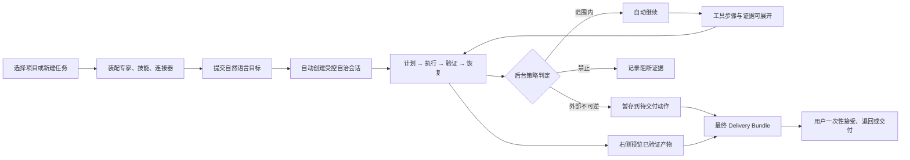

# WorkBuddy v5.2.6 实机录屏深度分析

> 状态：研究输入（DRAFT），不是产品验收、采购背书或运行时代码实施授权
> 证据：用户提供的本机录屏 `录屏2026-07-23 01.09.18.mov`
> 分析日期：2026-07-23
> 适用目标：FLAi-OS 中国国企内网智能体协作平台

## 1. 结论先行

这段录屏最值得 FLAi-OS 吸收的并不是某个按钮或配色，而是四层稳定的产品结构：

1. **项目是治理与协作容器**：项目同时容纳指令、连接器、专家、技能、自动化、成员、任务和资产，不只是聊天记录文件夹。
2. **任务是唯一的前台主线**：用户始终围绕一个输入框和一条任务时间线工作，计划、工具调用、过程状态和最终产物按需展开。
3. **能力选择使用中国用户熟悉的名词**：专家、技能、连接器、自动化都以可搜索、可勾选、可移除的对象呈现，避免先要求用户理解 MCP、上下文注入或 tool schema。
4. **产物与过程并列但不争夺注意力**：聊天在中央持续，产物、工作区文件和变量在右侧按需出现，生成期间用明确状态与轻量提示承接等待时间。

FLAi-OS 不应照搬 WorkBuddy 的“允许完全访问”模型。录屏中的一次确认会同时放宽敏感操作、文件修改和外部执行，这对于个人工作台可以是效率选项，但不足以成为国企生产平台的授权合同。用户已进一步裁决：提交任务即开启一次受控自治会话，Agent 在会话范围内自动规划、执行、纠错和验证，中途不得让用户重新填写规划结果或逐工具确认。主体、能力、对象、影响、有效期和计划摘要仍由后台策略记录；真正的用户决定集中到最终 Delivery Bundle 的接受、交付或发布。

## 2. 取证方法与边界

- 视频时长约 9 分 14 秒，画面为 3680×2142 的 WorkBuddy 桌面端实机操作。
- 先按固定间隔抽帧建立全局时间线，再对项目创建、连接器、执行轨迹、权限确认、产物预览等场景逐秒复核。
- 录屏画面显示产品版本为 **WorkBuddy v5.2.6**。
- 音轨是与界面操作无关的连续背景内容，不是产品讲解，因此完全排除，本文不引用或转录其中内容。
- 画面中包含用户名、空间名、任务历史等个人或项目线索。本文只记录产品结构，不复制截图、不记录这些标识；后续若制作评审材料，必须先脱敏。
- 本文描述“录屏中可见什么”，不据此推断后端是否真正实现强隔离、细粒度 RBAC、不可篡改审计或高可用。

## 3. 场景时间轴

| 时间 | 实机可见事实 | 产品含义 | FLAi-OS 吸收方式 |
|---|---|---|---|
| 00:08 | 左侧稳定导航包含新建任务、助理、项目、专家·技能·连接器、自动化、更多；中区为项目/空间与模板 | 用户从熟悉的工作对象进入，而非从底层技术概念进入 | 保留稳定左轨，但把治理中心、审批箱、审计作为具名入口 |
| 00:15 | 新建项目弹窗包含名称、项目说明/模板，以及可选连接器、专家、技能 | 项目创建同时完成上下文与能力装配 | 将项目建模为带版本的治理容器；保存的是引用和策略，不复制凭据 |
| 00:23 | “添加个人授权连接器”以卡片和复选框展示多种办公/研发服务 | 连接器被包装为用户可识别的业务能力 | 内网版按“系统连接器/部门连接器/个人授权”分区；个人令牌不得成为共享项目凭据 |
| 00:30 | 已选连接器和专家变成紧凑标签 | 装配结果可见且可撤销 | 标签必须同时显示授权来源、作用域和到期状态 |
| 00:45 | 用户在项目中直接提交知识整理任务 | 项目上下文对任务输入是隐式但稳定的 | 输入框附近显示当前项目、数据域和策略版本，避免隐式越权 |
| 00:55 | 助手先解释计划，再逐步显示 Native MCP 工具调用 | 计划与执行不是黑盒；进度在对话中自然展开 | 展示结构化“准备/执行/验证/待交付/完成”状态，不展示内部思维链 |
| 01:05 | 目录枚举、内容检查等步骤依次完成 | 多步骤执行被压成一条可扫描时间线 | 每一步引用真实 tool run、策略决策和证据，不用动画冒充进度 |
| 01:15 | 工具结果可以展开查看原始 JSON | 默认简洁，同时为专业用户保留可检查性 | 默认显示脱敏摘要；原始数据受角色、分级和下载审计控制 |
| 01:40 | 右侧出现“产物 / 工作空间文件 / 变量”面板，中央聊天不被替换 | 结果预览是任务上下文的一部分 | 右侧统一为“产物与证据”，变量只显示可公开键名或脱敏值 |
| 01:50 | 技能上传接受 ZIP 或带声明的 Markdown | 能力扩展有低门槛入口 | 进入隔离检疫区，经过 schema、hash、签名、依赖、危险能力和离线包检查后才可发布 |
| 02:02 | 连接器目录采用可搜索卡片网格、简短说明和添加按钮 | 国内常用系统被做成能力市场 | 内网目录只展示已批准目录；“可见”与“可安装/可调用”必须分离 |
| 03:15 | 项目主页含动态、计划、任务、资产；项目配置含指令、连接器、专家、技能、自动化 | 项目是一等协作空间 | 以项目作为人员、数据域、Agent 版本和策略的最小治理单元 |
| 03:50 | 成员/分享入口以抽屉呈现 | 协作被放在项目上下文内 | 禁止仅靠分享链接获得执行权；成员变更必须具名、可撤销、可审计 |
| 04:03 | 自动化模板面向具体中文办公场景 | 模板降低首次使用成本 | 模板必须声明触发源、最大并发、影响等级、交付策略、失败与补偿语义 |
| 04:36 | 新任务页以日常办公、代码开发、设计创意分场景，并提供建议词 | 先按用户意图分流，再选择能力 | 用“工作类型”改变推荐，不可暗中改变授权策略 |
| 04:41 | 输入框上方的技能/能力标签随选择变化 | 能力装配与输入保持同屏 | 标签显示“本次将使用什么”，并允许在提交前移除 |
| 04:46 | 弹窗“确认允许完全访问？”；说明将减少确认并可直接执行敏感操作、文件修改或外部执行，需勾选已了解风险 | 风险被明确提示，但多类高风险能力被一个总开关合并 | 只借鉴风险表达；由任务提交自动生成限范围 SessionExecutionGrant，不使用永久全开，也不逐步弹窗 |
| 05:20 | 状态文案显示并行读取两个设计技能，并解释后续工作 | 并行执行对用户可见，但没有暴露底层调度细节 | 显示并行槽位、排队原因和取消范围；不承诺无法证明的实时进度 |
| 06:10 | 右侧等待区轮换 Tips 卡片，中央持续显示执行过程 | 用轻量帮助内容消化生成等待 | 优先显示真实排队、执行、验证状态；Tips 只作次要内容 |
| 07:41 | 对话、工具轨迹和右侧产物区域同时存在 | 专业用户可追踪从意图到文件的路径 | 时间线中咬合输入摘要、后台策略、tool run、文件 hash、验证与最终交付状态 |
| 08:10 | 生成网页在右侧直接预览，带页面/缩放/查看控制 | 产物成为可检查、可继续操作的一等对象 | 预览使用隔离渲染；下载、发布、签发是不同动作和不同权限 |
| 08:45 | 项目资产区域作为后续沉淀入口 | 一次任务可进入长期项目资产 | 只有经过分级、来源和人审规则的产物才进入正式资产；草稿不自动发布 |

## 4. WorkBuddy 的核心交互语法



这条路径的优秀之处是：用户不必离开当前任务去理解系统结构，复杂度只在需要时出现。FLAi-OS 应进一步减少中断：策略决策、执行摘要和审计绑定全部留在后台，前台持续显示真实状态但不要求操作；人类在 Agent 自检完成后只处理一次 Delivery Bundle。

## 5. 信息架构拆解

### 5.1 左侧：稳定的工作对象

左轨只承担三类职责：创建、切换、查看历史。顶层名词短、中文化、不会随当前任务大幅变化。它给用户建立“我在哪个空间、正在做哪个任务”的稳定感。

推荐给 FLAi-OS 的一级导航：

- 新建任务
- 项目空间
- Agent 与能力
- 自动化
- 交付中心
- 审计与运行

“模型网关、MCP、策略引擎、Job Runner”属于管理员或专家层，不应出现在普通业务用户的一级路径。

### 5.2 中央：任务与渐进式执行轨迹

WorkBuddy 把计划、工具执行、状态说明和最终答复放在一条连续叙事里。普通用户看到的是“正在做什么”，专业用户可以展开“具体调用和结果”。这比把聊天、日志、流程图拆成多个页面更容易建立心智模型。

FLAi-OS 的时间线应只展示可验证的结构化事实：

- 用户提交的目标摘要与不可变输入版本；
- 平台生成且通过 deterministic validator 的执行计划；
- 后台策略决策码、会话范围和有效期；
- 排队、运行、恢复、验证、等待最终交付、失败等真实状态；
- tool run、model call、产物和证据引用；
- 最终是否只是生成完成，还是已经真人签发。

不得展示或声称保存模型的完整内部推理。

### 5.3 右侧：产物与证据工作台

右侧面板避免“看结果就丢失对话上下文”，非常适合工程协作。但 FLAi-OS 应把“产物”和“证据”同时设计，而不是只做文件预览：

- 产物：报告、表格、图、代码、模型文件；
- 证据：输入快照、工具运行记录、来源、hash、评测结果；
- 状态：草稿、未核、已核 REAL、人签、失败；
- 动作：预览、对比、下载、送审、发布，各自独立授权。

变量页尤其需要谨慎。生产环境默认不显示 secret value、完整环境变量、访问令牌或连接串；即使管理员可见，也应优先显示 SecretRef 和来源状态，而不是明文。

### 5.4 项目：治理的自然落点

WorkBuddy 的项目配置已经包含能力、成员和自动化，因此项目天然适合作为治理单元。FLAi-OS 可进一步明确：

```text
ProjectSpace
├── membership and roles
├── data domains and classifications
├── approved agents and immutable versions
├── skills, tools and connectors
├── execution policy and budgets
├── automation triggers
├── tasks and conversations
└── artifacts, evidence and retention
```

项目引用 Agent/技能/连接器的已批准版本。升级需要显式变更，不应让上游能力静默漂移。

## 6. 自治会话与末端授权：可借鉴与必须重构

### 6.1 可借鉴

- 最终交付中的高风险外部动作使用独立确认，不混在普通提示中；
- 标题直接说“完全访问”，正文列出敏感操作、文件修改、外部执行；
- 使用警示色和二次勾选，避免误触；
- 取消路径清楚，不把拒绝设计成异常。

### 6.2 必须重构

“完全访问”把不同影响域折叠为一个布尔值，无法回答谁、对什么、做什么、多久、基于哪个计划得到授权。国企生产环境仍需记录以下合同，但合同由平台根据任务、项目和后台策略自动生成，不要求普通用户逐项填写：

| 维度 | 示例 |
|---|---|
| 主体 | 用户、Agent、项目、服务账户 |
| 能力 | 读文件、改文件、执行程序、访问网络、调用连接器 |
| 对象 | 指定目录、工具、域名、数据分级、连接器资源 |
| 影响 | 只读、可回滚写、外部副作用、不可逆动作 |
| 有效期 | 单步骤、单任务、短时会话；默认不可永久 |
| 计划摘要 | 规范化 argv、目标、输入 hash、策略版本和执行摘要 |

任一维度缺失、对象范围漂移或策略不允许，都必须在后台拒绝该步骤或把外部效果暂存到 Delivery Bundle。Agent 在既有 SessionExecutionGrant 内重试、调整参数和重新规划时自动重新决策，不产生用户弹窗；最终交付授权只对完全匹配的 Delivery Bundle 单次消费。

### 6.3 普通用户的低摩擦呈现

细粒度不意味着把策略语言直接暴露给普通用户，更不意味着让用户填表。任务提交后前台可以用一行非阻塞摘要说明：

> 已开始：在“项目资料”工作区内自动读取、修改和运行已批准工具；不访问范围外网络；外部发布或不可逆动作将在最终交付时统一确认。

“查看详情”可展开目录、hash、策略决策码和会话范围，但不是继续执行的必经步骤。管理员可在治理中心查看完整合同。

## 7. 视觉与动效语言

录屏呈现出安静、低对比、留白充足的桌面工作台：浅色中性底、圆角卡片、少量黑色主按钮、克制图标和插画、轻量加载反馈。这种国内办公软件的亲和感值得借鉴。

FLAi-OS 应做两点差异化：

1. 保留 Codex/Claude 式更清晰的排版密度、焦点层次和短促动效，不复制任何产品的品牌视觉或像素级布局。
2. 严格服从既有信任色：绿只表示可核 REAL，teal 表示真人签发，红表示真实失败，amber 表示未核；普通完成、按钮成功或品牌装饰不能随意使用信任绿。

推荐动效只服务三件事：定位状态变化、解释面板关系、确认用户动作。队列等待、模型生成和工具运行必须以后台真实状态驱动，不使用循环动画制造“正在推进”的假象。

## 8. 面向 FLAi-OS 的页面映射

| WorkBuddy 模式 | FLAi-OS 页面/模块 | 企业化增强 |
|---|---|---|
| 新建任务首页 | 统一任务 Composer | 用户只写目标；项目、数据域、能力和会话范围自动推导，可查看但不强制填写 |
| 项目主页 | Project Space | 成员/RBAC、策略版本、预算、保留期、正式资产边界 |
| 专家·技能·连接器 | Agent & Capability Catalog | 可见、可装配、可执行三层权限；批准版本和供应链状态 |
| 自动化模板 | Automation Center | 触发器、幂等键、并发预算、交付策略、补偿/停止条件 |
| 对话执行轨迹 | Execution Timeline | 绑定 task/event/tool/model/policy/approval/evidence 引用 |
| 右侧产物面板 | Artifact & Evidence Inspector | 隔离预览、分级、hash、来源、送审与发布分权 |
| 完全访问弹窗 | Session Scope + Final Delivery | 会话范围后台自动生成；最终一次性交付，不提供生产永久全开 |
| 成员分享 | Project Membership | 具名身份、角色、最小权限、到期与撤销审计 |

## 9. 明确不照搬的设计

- 不提供可覆盖平台策略的“永久完全访问”。
- 不把用户点确认当成沙箱、RBAC 或出站控制已经成立的证据。
- 不让用户在 Agent 规划后重新手填目标、责任、输入、子任务或工具参数。
- 不用逐工具、逐文件、逐步骤权限弹窗打断会话内工作。
- 不把执行动画、自然语言进度或“已完成”当成真实工具成功。
- 不让项目成员因能看到项目就自动获得所有 Agent、文件和连接器调用权。
- 不让个人连接器凭据静默流入共享项目或后台自动化。
- 不允许技能 ZIP 上传后直接在应用进程内执行。
- 不把原始 JSON、变量、环境配置默认暴露给所有业务用户。
- 不把生成产物自动升级为正式项目资产或工程结论。

## 10. 设计验收条件

在 UI 实施前，建议用以下机械条件锁定语义：

1. 任一高风险动作都能在后台证据中回答主体、能力、对象、影响、有效期和计划摘要，而普通用户不需要填写这些字段。
2. 缺 SessionExecutionGrant、交付授权过期、Bundle 摘要漂移和越权对象都有明确拒绝态，且不会出现绿色完成。
3. 时间线每个“已执行”步骤都能反查真实 tool run 或受控平台动作。
4. 普通用户默认只看摘要；有权限的专业用户可展开脱敏证据；敏感原文不因展开自动泄露。
5. 产物“生成完成”“验证为 REAL”“真人签发”在状态与颜色上完全不同。
6. 项目能力升级、成员变化、自动化启停和策略变化都有可审计记录。
7. 生成等待页能区分排队、运行、恢复、验证、等待最终交付和卡死；无法观测时显示未知而非假进度。
8. 个人连接器授权不能被项目其他成员或后台任务继承，除非存在单独、具名、限时授权。
9. 含附件、多 Agent 和工具调用的正常任务从统一 Composer 直接进入自治执行，不经过任务创建表单，也不要求用户搬运预填参数。

## 11. 下一步建议

这份实机证据应与 WorkBuddy 官方能力资料、OpenClaw 运行时安全机制和 FLAi-OS 当前代码审计共同进入一份平台决策稿。设计原型应先覆盖一个完整的高风险任务闭环：

1. 在项目中创建任务；
2. 装配一个只读工具和一个可产生外部副作用的工具；
3. 在不弹窗的情况下展示排队、后台策略与自动执行；
4. 运行中自动恢复并产生可验证证据；
5. 右侧预览产物；
6. 真人在末端一次决定接受、退回、签发或执行待交付动作；
7. 在审计视图反查整个证据链。

只有这条闭环在交互语义和运行时证据上同时成立，WorkBuddy 风格的易用性才不会变成安全表象。
